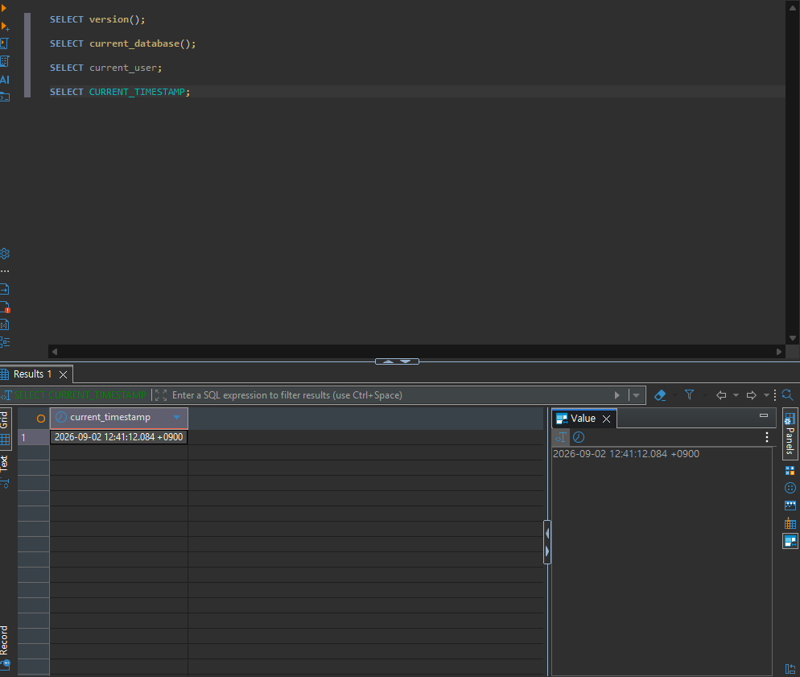
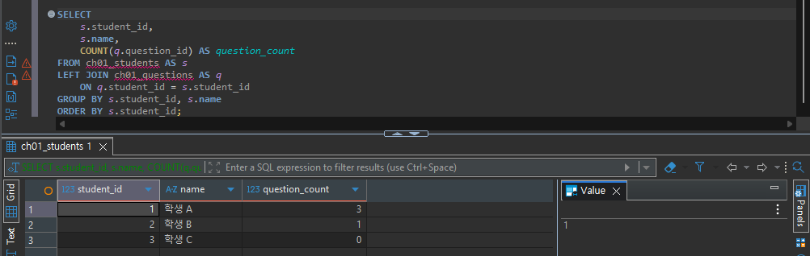
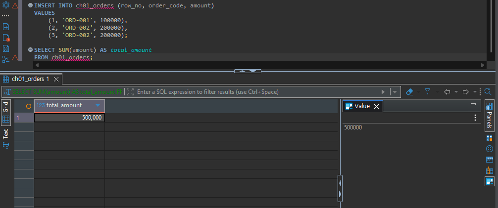
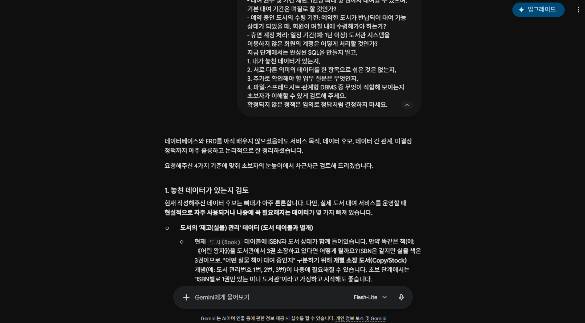

# Chapter 01 확장 실습 답안 템플릿

> **과제:** AI 시대에 데이터베이스를 왜 배워야 하는가  
> **사용 방법:** 이 파일을 내려받아 **본인의 GitHub 저장소**에 `chapter01_answer.md`라는 이름으로 저장한 뒤 답안을 작성합니다.  
> **제출 방법:** LMS에는 파일을 업로드하지 않고, **본인 GitHub 저장소의 `chapter01_answer.md` 파일 URL**을 제출합니다.

---

## 0. 학생 정보

| 항목 | 작성 내용 |
| --- | --- |
| 학번 |  |
| 이름 | 김종복 |
| GitHub 계정 | koreajjangboy |
| 과제 작성일 | 2026-09-02 |
| 사용한 AI 도구 | Gemini |

> 실제 비밀번호, API Key, 전체 DB 접속 URL, 개인정보는 이 파일이나 캡처 화면에 기록하지 않습니다.

---

# 1. PostgreSQL 실행 환경 확인

## 1-1. 실행한 SQL

```sql
SELECT version();
SELECT current_database();
SELECT current_user;
SELECT CURRENT_TIMESTAMP;
```


## 1-2. 실행 결과 기록

```text
PostgreSQL 버전:PostgreSQL 18.6 on x86_64-windows, compiled by msvc-19.44.35228, 64-bit
현재 데이터베이스:postgres
현재 사용자:postgres
현재 시각:2026-09-02 12:41:12.084 +0900
```

## 1-3. 내가 확인한 내용

1. SQL을 작성하는 프로그램과 PostgreSQL은 같은 프로그램인가요?

```text
나의 답:아니오 SQL을 작성하는 프로그램은 DBeaver 입니다.
```

2. `current_database()` 결과는 무엇을 의미하나요?

```text
나의 답:현재 접속중인 데이터베이스
```

3. SQL이 실행되었다는 사실만으로 데이터 내용도 올바르다고 할 수 있나요?

```text
나의 답:아니오
```

## 1-4. 증거 화면

아래 경로에 캡처 이미지를 저장하는 것을 권장합니다.

```text
assignments/chapter01/images/step01_environment.png
```

이미지를 저장했다면 아래 링크의 파일명을 실제 파일명에 맞게 수정합니다.

```markdown

```

**이미지 삽입 위치:**

<!-- 아래 줄의 주석을 지우고 실제 이미지 Markdown을 넣어도 됩니다. -->

`여기에 STEP 1 증거 화면을 삽입하세요.`



# 2. Chapter 01 핵심 내용 복습

교재 문장을 그대로 복사하지 말고 자신의 말로 작성합니다.

| 본문의 핵심 | 나의 설명 |
| --- | --- |
| AI가 SQL을 만들어도 DB를 배워야 한다 | 결과 검증, 분석, 의사결정 등을 위해 내용을 제대로 알아야 한다 |
| 데이터 구조가 중요하다 | 현실의 문제를 반영하여 데이터 구조를 설계해야한다 |
| SQL 결과를 검증해야 한다 | 원하는 방향에 맞게 동작하는지 확인이 필요하다 |
| 데이터 품질이 AI 답변 품질에 영향을 준다 | 데이터가 정확해야 그를 바탕으로 분석한 내용이 정확하다 |
| 저장 방식은 데이터 양만 보고 선택하지 않는다 | 사용자 수, 향후 운영 방향 등을 고려해야 한다. |

## 가장 중요하다고 생각한 한 문장

```text
결과 검증, 분석, 의사결정 등을 위해 내용을 제대로 알아야 한다
```

---

# 3. 실행 성공과 결과 정확성의 차이

## 3-1. SQL 실행 전 예상

학생 A는 질문 2개, 학생 B는 질문 1개, 학생 C는 질문이 없습니다.

```text
전체 학생 수: ___3___ 명
전체 질문 수: ___3___ 개
질문이 있는 학생 수: ___2___ 명
질문이 없는 학생 수: ___1___ 명
```

## 3-2. 임시 테이블 생성 및 데이터 입력 완료 확인

- [O] `ch01_students` 생성
- [O] `ch01_questions` 생성
- [O] 학생 3명 입력
- [O] 질문 3건 입력
- [O] 두 테이블의 데이터를 직접 조회

## 3-3. 잘못된 학생 수 SQL 실행 결과

실행한 SQL:

```sql
SELECT COUNT(*) AS student_count
FROM ch01_students AS s
INNER JOIN ch01_questions AS q
    ON q.student_id = s.student_id;
```

실행 결과:

```text
3
```

## 3-4. JOIN 상세 결과 관찰

```text
학생 A가 나타난 행 수: 1, 2
학생 B가 나타난 행 수: 3
학생 C가 나타난 행 수: 없음
```

다음 질문에 답합니다.

### Q1. 학생 C가 왜 결과에서 사라졌나요?

```text
질문이 없었기 때문에
```

### Q2. 학생 A가 왜 여러 행으로 나타났나요?

```text
여러개의 질문을 했기 때문에
```

### Q3. 위 `COUNT(*)`가 실제로 세고 있었던 것은 무엇인가요?

```text
질문한 수
```

### Q4. 결과 숫자가 우연히 실제 학생 수와 같아도 바로 믿으면 안 되는 이유는 무엇인가요?

```text
원하는 내용과 다른 내용이 될 수 있기 때문에
```

## 3-5. 질문 한 건을 추가한 뒤 다시 실행

추가한 데이터:

```text
INSERT INTO ch01_questions (question_id, student_id, question_text)
VALUES (104, 1, '네 번째 질문');
```

다시 실행한 결과:

```text
AI SQL 결과: 4
실제 학생 수: 3
```

### 결과 해석

```text
데이터가 바뀐 뒤 무엇이 달라졌는지:질문의 수가 늘어남

실제 학생 수는 왜 그대로인지:학생수가 변경되지는 않음

이 실험을 통해 알게 된 점:질문의 수에 따라 학생수가 변경 됨
```

## 3-6. 학생 테이블을 직접 센 결과

```sql
SELECT COUNT(*) AS student_count
FROM ch01_students;
```

결과:

```text
3
```

### 두 SQL의 차이를 내 말로 설명

```text
첫 번째 SQL은 __질문의 수 _____________________________________를 세고 있었다.

두 번째 SQL은 __학생의 수______________________________________를 세고 있었다.

따라서 SQL을 검토할 때는 문법보다 먼저
__________________________논리적으로 제대로 된 값_______________을 확인해야 한다.
```

## 3-7. 증거 화면

권장 경로:

```text
assignments/chapter01/images/step03_join_result.png
```

`여기에 STEP 3 핵심 증거 화면을 삽입하세요.`



# 4. 잘못된 데이터가 결과를 바꾸는 과정

## 4-1. 주문 데이터 확인

다음 데이터를 입력한 뒤 실제 결과를 확인합니다.

```text
ORD-001, 100000
ORD-002, 200000
ORD-002, 200000
```

## 4-2. 실행 전 예상

업무적으로 주문이 `ORD-001`, `ORD-002` 두 건이고 `order_code`가 주문을 고유하게 구분한다고 **가정할 경우** 예상 합계:

```text
__500000__ 원
```

> 위 가정 자체가 실제 업무 규칙인지 확인해야 한다는 점도 기억합니다.

## 4-3. SQL 합계

```sql
SELECT SUM(amount) AS total_amount
FROM ch01_orders;
```

실제 결과:

```text
__300000__ 원
```

## 4-4. 결과 해석

### `SUM` 문법 자체가 잘못된 것인가요?

```text
아니오
```

### 결과 차이의 원인은 무엇인가요?

```text
데이터가 중복된 부분을 확인하지 않았습니다.
```

### SQL이 정확하게 실행되어도 업무 숫자가 잘못될 수 있는 이유를 설명하세요.

```text
데이터의 상태에 따라 문제가 발생할 수도 있습니다.
```

## 4-5. AI에게 같은 데이터를 분석시킨 결과

AI가 계산한 합계:

```text
총 주문 금액: 500,000
```

AI가 중복 가능성을 언급했나요?

```text
네

💡 참고사항: ORD-002의 경우 동일한 금액(200,000)이 두 번 기록되어 있어, 해당 주문 번호의 합산 금액은 총 400,000입니다. 복수 품목 주문 또는 중복 입력 여부를 확인해 보시면 좋겠습니다.
```

AI가 `ORD-002` 두 행이 실제 두 주문인지 중복 입력인지 스스로 확정할 수 있나요? 이유도 적으세요.

```text
아니오. 스스로 확정하지는 못합니다. 두 방향 모두 제대로 된 값으로 볼 수 있기 때문입니다.
```

추가로 확인해야 할 업무 규칙:

```text
1. 고유 주문 번호가 중복되지 않아야 한다.
2.
3.
```

내가 최종적으로 내린 판단:

```text
고유 주문 번호가 중복되지 않도록 관리한다.
```

## 4-6. 증거 화면

권장 경로:

```text
assignments/chapter01/images/step04_duplicate_result.png
```

`여기에 STEP 4 핵심 증거 화면을 삽입하세요.`



# 5. 파일·스프레드시트·DBMS 선택 연습

각 사례에 대해 **AI에게 묻기 전에 먼저 본인의 판단을 작성**합니다.

## 사례 A. 개인 독서 기록

```text
나의 선택:파일
선택 이유:사용 빈도수가 낮고 혼자 사용하기 때문에 파일로 관리해도 충분함
어떤 조건이 추가되면 다른 방식으로 바꿀 것인지:
```

## 사례 B. 동아리 행사 신청 명단

```text
나의 선택:스프레드시트
선택 이유:주 사용자가 2~3명으로 비교적 적고, 운영기간이 길지 않아 스프레드시트로 관리
어떤 조건이 추가되면 다른 방식으로 바꿀 것인지:
```

## 사례 C. 온라인 강의 서비스

```text
나의 선택:DBMS
선택 이유:여러명이 동시에 사용하며, 권한과 복구 등 운영에 복잡함이 있어 DBMS로 관리
어떤 조건이 추가되면 다른 방식으로 바꿀 것인지:
```

## 판단 기준 체크

- [O] 데이터 증가
- [O] 여러 사용자의 동시 수정
- [O] 데이터 사이의 관계
- [O] 반복 조회와 집계
- [O] 정확성·일관성
- [O] 변경 이력
- [O] 권한 구분
- [O] 백업·복구
- [O] 웹·앱에서 지속 사용

### 데이터가 적으면 무조건 스프레드시트를 사용해야 하나요?

```text
나의 답:아니오. 데이터가 적어도 운영에 복잡함이 있거나 데이터의 무결성 등이 중요한 경우 DBMS로 사용할 수 있습니다.
```

---

# 6. 나만의 서비스 데이터 구조 초안

> 이 내용은 이후 Chapter에서 계속 확장할 수 있으므로 신중하게 작성합니다.

## 6-1. 서비스 정의

```text
서비스 이름:도서 대여

이 서비스는
이용자가 원하는 도서를 손쉽게 검색하고 대여 및 반납할 수 있도록 지원
하기 위한 서비스이다.
```

## 6-2. 관리할 데이터 후보

```text
1. 회원 (User/Member): 아이디, 비밀번호, 이름, 연락처, 이메일, 주소, 가입일 등 이용자 정보
2. 도서 (Book): 도서 번호(ISBN 등), 제목, 저자, 출판사, 출판일, 장르/카테고리, 도서 상태(대여 가능, 대여 중 등)
3. 대여/반납 이력 (Rental/Return Transaction): 대여 번호, 회원 정보, 도서 정보, 대여일, 반납 기한, 실제 반납일, 연체 여부
4. 예약 (Reservation): 대여 중인 도서에 대한 예약 정보, 회원 정보, 예약 신청일, 순번
5. 리뷰/평점 (Review/Rating): 도서별 이용자 평가 점수, 한줄평, 작성일 등 (선택 사항)
```

## 6-3. 한 행의 의미

| 데이터 후보 | 한 행의 의미 |
| 회원 (User/Member) | 시스템에 가입한 개별 이용자 1명의 고유한 계정 정보 |
| 도서 (Book) | 도서관에 등록된 개별 도서(또는 도서 종류/재고 단위) 1권의 상세 정보 및 상태 |
| 대여/반납 이력 (Rental/Return Transaction) | 특정 회원이 특정 도서를 대여하고 반납하기까지의 1건의 거래(Lifecycle) 내역 |
| 예약 (Reservation) | 대여 중인 도서에 대해 특정 회원이 대기하기 위해 신청한 1건의 예약 순번 정보 |
| 리뷰/평점 (Review/Rating) | 특정 도서에 대해 회원 1명이 남긴 1건의 평가 및 후기 |

## 6-4. 관계를 자연어로 설명

```text
1. 한 명의 회원은 여러 번의 대여/반납 이력을 가질 수 있습니다.
2. 하나의 도서는 시간에 따라 여러 번의 대여/반납 이력에 포함될 수 있습니다.
3. 한 명의 회원은 여러 건의 도서 예약을 신청할 수 있습니다.
```

## 6-5. 아직 결정하지 않은 정책

```text
Q1. 대여 권수 및 기간 제한: 1인당 최대 몇 권까지 대여할 수 있으며, 기본 대여 기간은 며칠로 할 것인가?
Q2. 예약 중인 도서의 수령 기한: 예약한 도서가 반납되어 대여 가능 상태가 되었을 때, 회원이 며칠 내에 수령해가야 하는가?
Q3. 휴면 계정 처리: 일정 기간(예: 1년 이상) 도서관 시스템을 이용하지 않은 회원의 계정은 어떻게 처리할 것인가?
```

> 확정되지 않은 정책을 AI가 임의로 결정한 경우 그대로 받아들이지 않습니다.

---

# 7. AI를 검토자로 활용하기

## 7-1. 내가 AI에게 전달한 핵심 프롬프트

개인정보나 비밀번호 등 민감한 내용은 제거한 뒤 기록합니다.

```text
나는 데이터베이스를 처음 배우는 학생입니다.
아직 ERD나 정규화를 배우기 전입니다.
내가 생각한 서비스는 다음과 같습니다.
서비스: 도서 대여
목적: 이 서비스는 이용자가 원하는 도서를 손쉽게 검색하고 대여 및 반납할 수 있도록 지원하기 위한 서비스이다.
관리할 데이터 후보:
- 회원 (User/Member): 아이디, 비밀번호, 이름, 연락처, 이메일, 주소, 가입일 등 이용자 정보
- 도서 (Book): 도서 번호(ISBN 등), 제목, 저자, 출판사, 출판일, 장르/카테고리, 도서 상태(대여 가능, 대여 중 등)
- 대여/반납 이력 (Rental/Return Transaction): 대여 번호, 회원 정보, 도서 정보, 대여일, 반납 기한, 실제 반납일, 연체 여부
- 예약 (Reservation): 대여 중인 도서에 대한 예약 정보, 회원 정보, 예약 신청일, 순번
- 리뷰/평점 (Review/Rating): 도서별 이용자 평가 점수, 한줄평, 작성일 등 (선택 사항)
내가 생각한 관계:
- 한 명의 회원은 여러 번의 대여/반납 이력을 가질 수 있습니다.
- 하나의 도서는 시간에 따라 여러 번의 대여/반납 이력에 포함될 수 있습니다.
- 한 명의 회원은 여러 건의 도서 예약을 신청할 수 있습니다.
아직 결정하지 못한 정책:
- 대여 권수 및 기간 제한: 1인당 최대 몇 권까지 대여할 수 있으며, 기본 대여 기간은 며칠로 할 것인가?
- 예약 중인 도서의 수령 기한: 예약한 도서가 반납되어 대여 가능 상태가 되었을 때, 회원이 며칠 내에 수령해가야 하는가?
- 휴면 계정 처리: 일정 기간(예: 1년 이상) 도서관 시스템을 이용하지 않은 회원의 계정은 어떻게 처리할 것인가?
지금 단계에서는 완성된 SQL을 만들지 말고,
1. 내가 놓친 데이터가 있는지,
2. 서로 다른 의미의 데이터를 한 항목으로 섞은 것은 없는지,
3. 추가로 확인해야 할 업무 질문은 무엇인지,
4. 파일·스프레드시트·관계형 DBMS 중 무엇이 적합해 보이는지
초보자가 이해할 수 있게 검토해 주세요.
확정되지 않은 정책은 임의로 정답처럼 결정하지 마세요.

```

## 7-2. AI의 주요 제안과 나의 판단

최소 5개를 작성합니다.

| AI의 제안 | 수용 / 수정 / 거절 | 나의 판단 근거 |
| --- | --- | --- |
| 도서의 '재고(실물) 관리' 데이터(개별 소장 도서 개념) 추가 제안 | 수용 | 같은 책이 여러권일 경우 관리번호 필요 |
| 연체 일수나 대여 정지 기간을 기록할 공간(연체 정보) 추가 제안 | 수용 | 연체와 관련한 정책을 위한 기준 마련 |
| 관계형 DBMS(예: SQLite, MySQL 등) 사용 추천 | 수정 | PostgreSQL 활용 |
| 소프트 딜리트(Soft Delete) 도입 검토 | 수용 | 회원 탈퇴나 도서 폐기에 활용 |
| 샘플(Dummy) 데이터 먼저 구상하기 | 수용 | 더미 데이터로 MVP 개발 |

## 7-3. AI에게 자기 답변을 다시 비판하도록 요청한 결과

첫 번째 답변과 달라진 점:

```text
초보자 단계의 프로젝트에서 구현 난이도를 높이는 기술적 기법(소프트 딜리트 등)을 정답처럼 강제하지 않고, 프로젝트 규모와 학습 단계에 맞춰 선택할 수 있도록 중립적인 관점으로 수정했습니다.
```

AI가 처음에 임의로 가정했던 내용:

```text
회원이 탈퇴할 때 무조건 데이터를 남기는 '소프트 딜리트' 방식을 써야 한다고 가정함.
상태 값을 무조건 코드로 관리해야만 한다고 단정함.
```

추가로 업무 담당자에게 확인해야 한다고 판단한 내용:

```text
회원이 탈퇴할 때, 현재 대여 중이거나 예약한 도서가 남아있을 경우 탈퇴를 허용할 것인지에 대한 예외 처리 정책.
도서 분실 또는 파손 시 데이터와 기록을 어떤 방식으로 처리해야 하는지에 대한 실무 기준.
```

## 7-4. AI 활용에 대한 나의 평가

```text
가장 유용했던 부분: 기본적인 내용에 대한 빠른 정리

수정하거나 거절한 부분: 내 환경에 맞는 DB 선택

그렇게 판단한 근거: 내가 가진 환경, 자본, 운영 계획 등에 맞춰 운영할 필요가 있다고 판단

AI가 없었다면 놓쳤을 가능성이 있는 질문: 회원 탈퇴나 도서 폐기 시 데이터를 삭제하지 않고 소프트 딜리트로 운영
```

## 7-5. AI 활용 증거 화면

권장 경로:

```text
assignments/chapter01/images/step07_ai_review.png
```

AI 대화 전체를 캡처할 필요는 없습니다. 핵심 요청과 검토 과정이 보이는 화면 1장 정도면 충분합니다.

`여기에 AI 활용 증거 화면을 삽입하세요.`



# 8. 기준 데이터·파생 데이터·AI 생성 결과 구분

내 서비스에 맞게 작성합니다.

| 구분 | 내 서비스의 예 | 판단 이유 |
| --- | --- | --- |
| 기준 데이터 | 회원정보, 도서정보, 예약정보 | 사용자가 직접 가입하거나 도서관에 실제로 등록되어 시스템의 근간이 되는 원본 데이터 |
| 파생 데이터 | 대여/반납 이력, 연체여부 | 기준 데이터인 회원과 도서의 상호작용(대여, 반납 등)에 의해 시간의 흐름에 따라 생성되고 변경되는 데이터 |
| AI 생성 결과 | - | - |

### 기준 데이터가 변경되면 파생 데이터는 어떻게 해야 하나요?

```text
기준 데이터가 변경될 때 파생 데이터는 데이터의 성격(변경의 의미)과 시스템의 목적에 따라 다음과 같은 방식으로 다르게 다루어야 합니다.
```

### AI 결과만 있고 원본 데이터가 없다면 결과를 충분히 검증할 수 있나요?

```text
아니요, AI 결과만 있고 원본 데이터가 없다면 결과를 충분히 검증할 수 없습니다.
```

---

# 9. 최종 성찰

아래 세 문장은 반드시 **본인의 말**로 작성합니다.

```text
1. SQL이 실행되어도 결과를 바로 믿으면 안 되는 이유는
   명시하지 않은 부분을 AI가 자의적으로 판단한 내용이 본래의 의도와 다를 수 있기 때문 이다.

2. AI를 데이터베이스 학습에 활용할 때 가장 중요한 것은
   충분한 이해를 바탕으로 검증을 통해 활용하는 것을 원칙으로 하는 것이다.

3. 이번 실습 이후 내가 더 확인하고 싶은 것은
   ____________________________________________________________ 이다.
```

## 이번 Chapter에서 새롭게 알게 된 점 3가지

```text
1. AI 를 통해 받은 데이터가 원래의 목적에 맞지 않을 수 있다
2. AI가 알려준 내용을 바탕으로 논리적인 오류가 없는지, 본래의 의도에 맞게 구현했는지 검증해야 한다.
3.
```

## 아직 이해가 명확하지 않은 부분

```text
1.
2.
```

---

# 10. 제출 전 자기 점검

- [O] PostgreSQL 실행 화면을 확인했다.
- [O] SQL 실행 전에 예상 결과를 먼저 작성했다.
- [O] `INNER JOIN` 예제에서 누락과 반복을 설명할 수 있다.
- [O] 숫자가 우연히 같아도 의미가 다를 수 있음을 설명했다.
- [O] 중복 데이터가 집계 결과에 미치는 영향을 확인했다.
- [O] 저장 방식을 데이터 양만으로 판단하지 않았다.
- [O] 개인 서비스 주제를 하나 정했다.
- [O] 데이터 후보와 한 행의 의미를 작성했다.
- [O] 미확정 정책을 최소 3개 작성했다.
- [O] AI 제안을 수용·수정·거절로 구분했다.
- [O] AI 제안에 대한 판단 근거를 작성했다.
- [O] 기준 데이터·파생 데이터·AI 결과를 구분했다.
- [O] 핵심 증거 이미지가 Markdown에서 정상적으로 보인다.
- [O] 비밀번호·API Key·개인정보가 노출되지 않았다.

---

# 11. LMS 제출 정보

## 내 GitHub 답안 파일 URL

아래에는 **교수자 템플릿 URL이 아니라 본인이 작성한 답안 파일의 GitHub URL**을 기록합니다.

```text
https://github.com/koreajjangboy/ai-database-study/blob/main/assignments/chapter01/chapter01_answer_template.md
```

내 실제 제출 URL:

```text
https://github.com/koreajjangboy/ai-database-study/blob/main/assignments/chapter01/chapter01_answer_template.md
```

> LMS에는 위 **본인 저장소의 `chapter01_answer.md` 파일 URL 하나**를 제출합니다.

---

## 권장 학생 저장소 구조

```text
ai-database-study/
└── assignments/
    └── chapter01/
        ├── chapter01_answer.md
        └── images/
            ├── step01_environment.png
            ├── step03_join_result.png
            ├── step04_duplicate_result.png
            └── step07_ai_review.png
```

이 구조를 사용하면 이후 Chapter 02, Chapter 03도 같은 방식으로 계속 추가할 수 있습니다.
