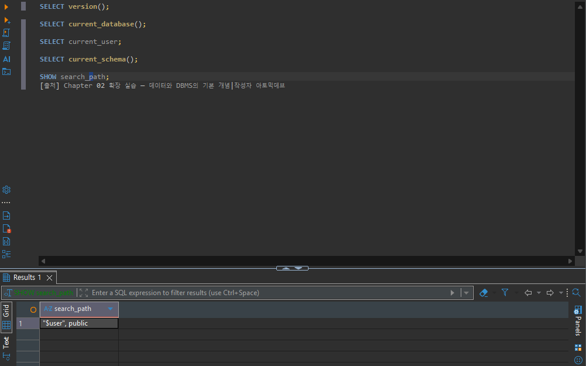
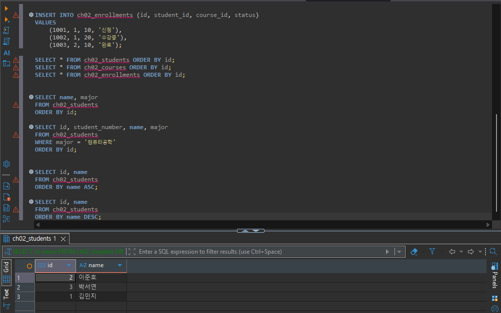
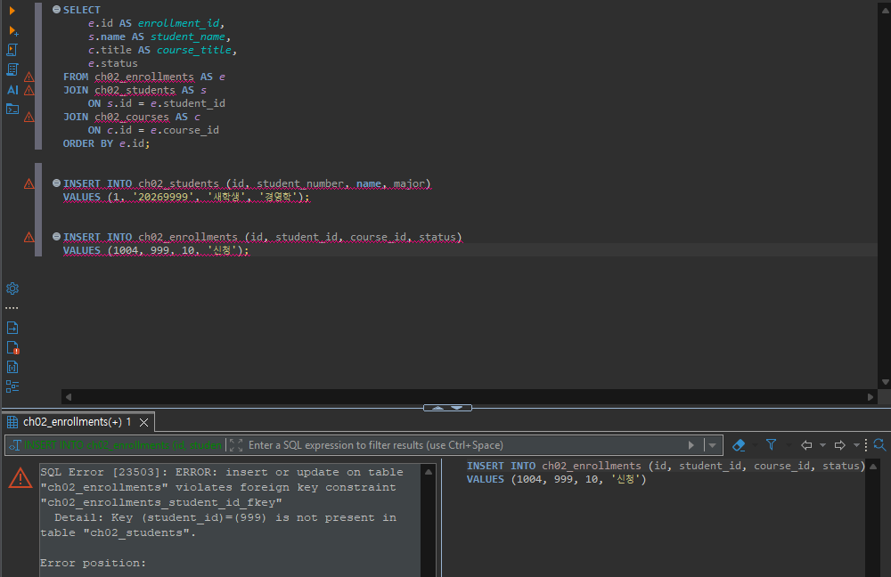
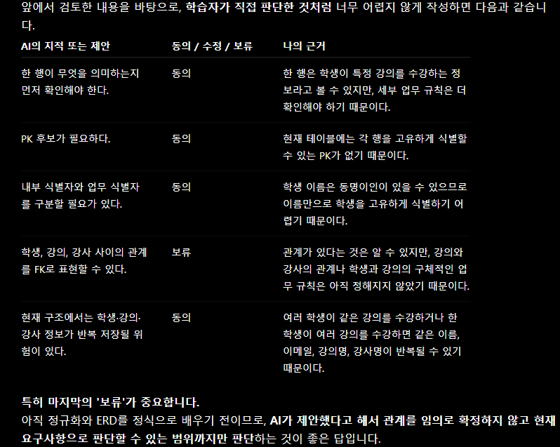

# Chapter 02 확장 실습 답안 템플릿

> **과제:** 데이터와 DBMS의 기본 개념  
> **사용 방법:** 이 파일을 내려받아 본인의 GitHub 저장소에 `chapter02_answer.md`라는 이름으로 저장한 뒤 실습하면서 바로 작성합니다.  
> **제출 방법:** LMS에는 파일을 직접 업로드하지 않고, **본인 GitHub 저장소의 `chapter02_answer.md` 파일 URL**을 제출합니다.

---

## 제출 전 개인정보 주의

LMS에서 제출자를 확인할 수 있으므로 이 공개 Markdown 파일에 학번이나 실명을 반드시 적을 필요는 없습니다.

```text
GitHub 계정 또는 별칭:
과제 작성일:
사용한 AI 도구:
```

> 실제 비밀번호, API Key, 전체 DB 접속 URL, 개인정보가 포함된 화면은 올리지 않습니다.

---

# 1. PostgreSQL에서 현재 위치 확인

## 1-1. 실행한 SQL

```sql
SELECT version();
SELECT current_database();
SELECT current_user;
SELECT current_schema();
SHOW search_path;
```

## 1-2. 실행 결과 기록

```text
PostgreSQL 버전:PostgreSQL 18.6 on x86_64-windows, compiled by msvc-19.44.35228, 64-bit
현재 데이터베이스:postgres
현재 사용자:postgres
현재 스키마:public
search_path:"$user", public
```

## 1-3. 구조를 내 말로 설명

```text
PostgreSQL은:PostgreSQL 18.6

현재 접속한 데이터베이스는:postgres

스키마는:public

DBeaver 또는 psql 같은 도구는:DBeaver
```

## 1-4. 계층 구조 완성

```text
사용자
→ ____________________
→ PostgreSQL DBMS
→ postgres 사용자
→ public 스키마
→ 테이블
→ 행 / 열
```

## 1-5. 증거 화면

권장 경로:

```text
assignments/chapter02/images/step01_environment.png
```

```markdown

```

`여기에 STEP 1 핵심 증거 화면을 삽입하세요.`

---

# 2. 데이터베이스 안의 스키마와 테이블 관찰

## 2-1. 스키마 조회 결과

실행한 SQL:

```sql
SELECT schema_name
FROM information_schema.schemata
ORDER BY schema_name;
```

관찰한 스키마 이름 중 3개 이내를 적습니다.

```text
1.cham_edu
2.expenses
3.information_schema
```

### `public`은 무엇인가요?

```text
나의 설명:스키마
```

### 데이터베이스와 스키마는 같은 것인가요?

```text
나의 설명:스키마가 모인 것이 데이터베이스
```

## 2-2. 현재 보이는 테이블 조회

```sql
SELECT table_schema, table_name
FROM information_schema.tables
WHERE table_type = 'BASE TABLE'
  AND table_schema NOT IN ('pg_catalog', 'information_schema')
ORDER BY table_schema, table_name;
```

```text
조회된 사용자 테이블 수 또는 눈에 띈 테이블:33개

아직 테이블이 거의 없어도 괜찮은 이유:운영하면서 데이터가 늘어날 것이기 때문
```

## 2-3. 관찰 정리

```text
PostgreSQL 서버 안에는 여러 데이터베이스 가 있을 수 있다.
한 데이터베이스 안에는 여러 스키마 가 있을 수 있다.
스키마 안에는 테이블과 같은 객체 가 존재한다.
```

---

# 3. TEMP TABLE로 테이블·행·열·키 직접 확인

## 3-1. 임시 테이블 생성 완료 확인

- [x] `ch02_students` 생성
- [x] `ch02_courses` 생성
- [x] `ch02_enrollments` 생성

각 테이블의 **한 행 의미**를 적습니다.

| 테이블 | 한 행의 의미 |
| --- | --- |
| `ch02_students` | 학생 한 명의 정보 |
| `ch02_courses` | 한 과정에 대한 정보 |
| `ch02_enrollments` | 수강 신청 건 별 정보 |

## 3-2. 열의 의미 확인

### `ch02_students`

| 열 | 값의 의미 | 내부 식별자 / 업무 식별자 / 일반 속성 |
| --- | --- | --- |
| `id` | ch02_students table ID | 내부 식별자 |
| `student_number` | 학번 | 업무 식별자 |
| `name` | 이름 | 일반 속성 |
| `major` | 전공 | 일반 속성 |

### `ch02_enrollments`

| 열 | 값의 의미 | PK / FK / 일반 속성 |
| --- | --- | --- |
| `id` | ch02_enrollments table ID | PK |
| `student_id` | ch02_students table ID | FK |
| `course_id` | ch02_courses table ID | FK |
| `status` | 수강 상태 | 일반 속성 |

## 3-3. 입력된 행 수

```text
students 행 수: 3
courses 행 수: 2
enrollments 행 수: 3
```

## 3-4. 내부 식별자와 업무 식별자

```text
students.id가 필요한 이유: 데이터베이스 내부에서 학생을 고유하게 식별

student_number가 필요한 이유: 실제 업무에서 학생을 구분하기 위해 사용

둘을 항상 같은 값으로 사용하지 않아도 되는 이유:
id는 데이터베이스 내부의 식별자이고,
student_number는 업무에서 사용하는 식별자이기 때문
```

## 3-5. 숫자처럼 보이는 학번을 문자열로 저장한 이유

```text
나의 설명:'00123456'처럼 앞에 0이 포함된 학번은 INTEGER로 저장하면 앞의 0이 사라질 수 있다.
```

---

# 4. 테이블과 조회 결과는 다르다

## 4-1. 원본 테이블 행 수

```text
ch02_students 전체 행 수: 3
```

## 4-2. 일부 열만 조회

실행 SQL:

```sql
SELECT name, major
FROM ch02_students
ORDER BY id;
```

```text
원본 테이블의 열 수와 조회 결과의 열 수가 다른 이유: SELECT 때 넣은 칼럼만 조회
```

## 4-3. 조건을 적용한 조회

실행 SQL:

```sql
SELECT id, student_number, name, major
FROM ch02_students
WHERE major = '컴퓨터공학'
ORDER BY id;
```

```text
원본 테이블 행 수: 3
조회 결과 행 수: 2
원본 테이블의 데이터가 삭제된 것인가?: 아니오
그렇게 판단한 이유: 조건에 따라 조회되고 WHERE 아래 없이 조회하면 3개가 나오기 때문
```

## 4-4. 정렬 결과 비교

```sql
SELECT id, name
FROM ch02_students
ORDER BY name ASC;

SELECT id, name
FROM ch02_students
ORDER BY name DESC;
```

```text
ASC 결과의 첫 학생: 김민지
DESC 결과의 첫 학생: 이준호

이 실험을 통해 ORDER BY에 대해 알게 된 점: 정렬의 순서를 확인
```

## 4-5. 증거 화면

권장 경로:

```text
assignments/chapter02/images/step04_result_set.png
```

`여기에 STEP 4 핵심 증거 화면을 삽입하세요.`

---

# 5. PK와 FK를 실제로 관찰

## 5-1. 정상 데이터의 관계 읽기

다음 SQL 결과를 보고 작성합니다.

```sql
SELECT
    e.id AS enrollment_id,
    s.name AS student_name,
    c.title AS course_title,
    e.status
FROM ch02_enrollments AS e
JOIN ch02_students AS s
    ON s.id = e.student_id
JOIN ch02_courses AS c
    ON c.id = e.course_id
ORDER BY e.id;
```

```text
한 행이 의미하는 것:수강신청 내용

같은 student_id가 여러 enrollment 행에서 반복될 수 있는 이유:한 학생의 수강신청 수가 여러개가 될 수 있기 때문

같은 course_id가 여러 enrollment 행에서 반복될 수 있는 이유:한 과목의 수강신청 학생수가 여러명이 될 수 있기 때문
```

## 5-2. 기본키 중복 오류 관찰

중복 PK 입력을 시도한 결과:
SQL Error [23505]: ERROR: duplicate key value violates unique constraint "ch02_students_pkey"
  Detail: Key (id)=(1) already exists.

```text
실행 성공 / 실패: 실패
오류 메시지에서 확인한 핵심 단어: unique
왜 실패했다고 생각하는가: id에 1이 이미 있기 때문
```

## 5-3. 존재하지 않는 학생을 참조하는 FK 오류 관찰

존재하지 않는 `student_id`를 사용한 수강신청 입력 결과:
SQL Error [23503]: ERROR: insert or update on table "ch02_enrollments" violates foreign key constraint "ch02_enrollments_student_id_fkey"
  Detail: Key (student_id)=(999) is not present in table "ch02_students".

Error position:
```text
실행 성공 / 실패: 실패
오류 메시지에서 확인한 핵심 단어: foreign key
왜 실패했다고 생각하는가: student_id가 999인 학생이 존재하지 않기 때문
```

## 5-4. PK와 FK의 차이 정리

```text
PK는 테이블에서 각 행을 고유하게 식별 하기 위한 키이다.

FK는 다른 테이블의 PK 등을 참조하여 테이블 간의 관계를 연결하고 참조 무결성을 유지 하기 위한 키이다.

FK 값이 여러 행에서 반복될 수 있는 이유는
하나의 부모 데이터가 여러 개의 자식 데이터와 관계를 가질 수 있기 때문이다.
```

## 5-5. 증거 화면

권장 경로:

```text
assignments/chapter02/images/step05_pk_fk.png
```

> 오류 메시지는 전체 화면이 아니라 테이블명·constraint·참조 오류가 보이는 정도만 캡처합니다.

`여기에 STEP 5 핵심 증거 화면을 삽입하세요.`

---

# 6. 관계와 카디널리티를 자연어로 설명

현재 임시 데이터 기준으로 작성합니다.

```text
학생 한 명은 여러 수강신청을 가질 수 있는가?: 네

강의 한 개는 여러 수강신청을 가질 수 있는가?: 네

수강신청 한 건은 학생 몇 명을 참조하는가?: 한 명

수강신청 한 건은 강의 몇 개를 참조하는가?: 한 명
```

아래 구조를 완성합니다.

```text
students 1 ── ___N___ enrollments ___M___ ── 1 courses
```

### 학생과 강의가 N:M 관계라고 볼 수 있는 이유

```text
나의 설명:
학생 한 명은 여러 강의를 수강할 수 있고,
강의 한 개도 여러 학생이 수강할 수 있기 때문이다.

따라서 학생과 강의는 직접 연결하면 N:M 관계가 되며,
이를 표현하기 위해 중간에 enrollments(수강신청) 테이블을 두어
학생과 강의의 관계를 관리한다.
```

> 아직 0개 허용 여부, 필수 관계, 삭제 정책까지 확정하지 않습니다. 그런 규칙은 Chapter 05~06에서 다룹니다.

---

# 7. AI가 만든 테이블 구조 직접 검토

## 7-1. AI에게 묻기 전에 내가 먼저 찾은 문제

다음 구조를 보고 최소 4개를 적습니다.

```sql
CREATE TABLE student_courses (
    student_name VARCHAR(50),
    student_email VARCHAR(100),
    course_title VARCHAR(100),
    instructor_name VARCHAR(50)
);
```

```text
문제 1. 테이블의 PK가 존재하지 않는다.
문제 2. 다른 테이블과 연결할 수 있는 FK가 존재하지 않는다.
문제 3. 잘못된 데이터의 입력을 방지하지 못한다.
문제 4.
```

## 7-2. AI 검토 요청 프롬프트

사용한 핵심 프롬프트를 기록합니다.

```text
1. 한 행의 의미가 명확한가?
2. PK 후보가 필요한가?
3. 내부 식별자와 업무 식별자를 구분할 필요가 있는가?
4. FK로 표현해야 할 관계 후보는 무엇인가?

```

## 7-3. AI 제안과 나의 판단

| AI의 지적 또는 제안 | 동의 / 수정 / 보류 | 나의 근거 |
| --- | --- | --- |
|  |  |  |
|  |  |  |
|  |  |  |
|  |  |  |
|  |  |  |

| AI의 지적 또는 제안 | 동의 / 수정 / 보류 | 나의 근거 |
| --- | --- | --- |
| 한 행이 무엇을 의미하는지 먼저 확인해야 한다.           | 동의           | 한 행은 학생이 특정 강의를 수강하는 정보라고 볼 수 있지만, 세부 업무 규칙은 더 확인해야 하기 때문이다.               |
| PK 후보가 필요하다.                         | 동의           | 현재 테이블에는 각 행을 고유하게 식별할 수 있는 PK가 없기 때문이다.                                   |
| 내부 식별자와 업무 식별자를 구분할 필요가 있다.          | 동의           | 학생 이름은 동명이인이 있을 수 있으므로 이름만으로 학생을 고유하게 식별하기 어렵기 때문이다.                       |
| 학생, 강의, 강사 사이의 관계를 FK로 표현할 수 있다.     | 보류           | 관계가 있다는 것은 알 수 있지만, 강의와 강사의 관계나 학생과 강의의 구체적인 업무 규칙은 아직 정해지지 않았기 때문이다.      |
| 현재 구조에서는 학생·강의·강사 정보가 반복 저장될 위험이 있다. | 동의           | 여러 학생이 같은 강의를 수강하거나 한 학생이 여러 강의를 수강하면 같은 이름, 이메일, 강의명, 강사명이 반복될 수 있기 때문이다. |


## 7-4. 본문과 대조한 항목

AI 설명 중 최소 하나를 `chapter02.md`와 비교합니다.

```text
AI가 설명한 내용:

본문에서 확인한 내용:

일치 / 부분 일치 / 수정 필요:

내가 최종적으로 이해한 내용:
```

## 7-5. 증거 화면

권장 경로:

```text
assignments/chapter02/images/step07_ai_review.png
```

`여기에 AI 검토 과정의 핵심 화면을 삽입하세요.`

---

# 8. Chapter 01의 개인 서비스 아이디어를 DB 용어로 다시 표현

Chapter 01에서 정한 개인 서비스 주제를 그대로 사용하거나 새 주제를 정해도 됩니다.

## 8-1. 서비스 기본 정보

```text
서비스 이름: 도서 대여 관리 서비스
서비스 목적: 회원이 도서를 검색하고 대여 및 반납할 수 있도록 도서와 회원, 대여 정보를 관리하는 서비스
```

## 8-2. PostgreSQL 구조 후보

```text
데이터베이스 이름 후보: library_db
스키마 이름 후보: library
```

> 아직 실제 데이터베이스나 스키마를 생성하지 않아도 됩니다.

## 8-3. 테이블 후보와 한 행 의미

최소 3개를 작성합니다.

| 테이블 후보 | 한 행의 의미 | 내부 ID 후보 | 업무 식별자 후보 |
| --- | --- | --- | --- |
| members | 회원 한 명의 정보             | member_id | 회원 이메일          |
| books   | 도서 한 권 또는 관리 대상 도서의 정보 | book_id   | ISBN 또는 도서 관리번호 |
| loans   | 회원의 도서 대여 한 건          | loan_id   | 대여번호            |


## 8-4. FK 후보

```text
1. loans.member_id → members.member_id
   이유: 하나의 대여 기록이 어떤 회원의 대여인지 연결하기 위해서이다.

2. loans.book_id → books.book_id
   이유: 하나의 대여 기록이 어떤 도서와 관련된 것인지 연결하기 위해서이다.
```

## 8-5. 자연어 관계 문장

```text
1. 회원 한 명은 여러 건의 대여 기록을 가질 수 있다.
2. 도서 한 권은 여러 번 대여될 수 있다.
3. 대여 기록 한 건은 한 명의 회원과 한 개의 도서와 연결된다.
```

## 8-6. 아직 확정하지 않을 정책

```text
Q1. 회원이 현재 대여 중인 도서가 있어도 탈퇴할 수 있는가?
Q2. 도서가 분실되거나 파손되었을 때 기존 대여 기록을 어떻게 처리할 것인가?
Q3. 같은 도서가 여러 권 있을 경우 각각의 실물 도서를 관리번호로 구분할 것인가?
```

---

# 9. AI를 개인 구조의 검토자로 사용

## 9-1. 사용한 프롬프트

```text
나는 PostgreSQL과 데이터베이스를 처음 배우는 학생입니다.
아직 정규화와 ERD를 정식으로 배우기 전입니다.

내가 구상한 도서 대여 관리 서비스의 DB 구조를 검토해주세요.

정답 설계를 바로 만들어 주지 말고 다음 질문 중심으로 검토해주세요.

1. 각 테이블의 한 행은 무엇을 의미하는가?
2. 각 테이블에 PK 후보가 필요한가?
3. 내부 식별자와 업무 식별자를 구분할 필요가 있는가?
4. FK로 표현할 관계 후보는 무엇인가?
5. 중복 저장 위험이 있는가?
6. 현재 요구사항만으로 결정할 수 없는 업무 정책은 무엇인가?

확정되지 않은 업무 규칙은 임의로 결정하지 말아주세요.
```

## 9-2. AI가 질문한 내용 중 유용했던 것

```text
1. 한 행이 정확히 무엇을 의미하는지 먼저 정의해야 한다는 점
2. 내부 식별자와 업무 식별자를 구분해서 생각해야 한다는 점
3. 현재 요구사항만으로 결정할 수 없는 업무 정책을 따로 구분해야 한다는 점
```

## 9-3. AI가 너무 빨리 결정한 내용 또는 내가 보류한 내용

```text
1. 회원 탈퇴 시 무조건 소프트 딜리트를 사용해야 한다는 제안은 보류했다.
2. 도서와 회원의 관계 및 도서 실물 관리 방식을 업무 규칙 확인 없이 확정하는 것은 보류했다.
```

## 9-4. 검토 후 수정한 구조

| 수정 전 | 수정 후 | 수정 이유 |
| --- | --- | --- |
| 회원 정보와 대여 정보를 하나의 구조로 생각함 | `members`와 `loans`를 구분하여 생각함 | 회원 정보와 대여 기록은 의미가 다르기 때문               |
| 도서를 단순히 책 제목으로 관리         | `books` 테이블을 별도로 검토          | 같은 도서 정보가 여러 대여 기록에서 반복될 수 있기 때문       |
| 회원과 도서를 직접 연결한다고 생각함      | `loans`를 통해 회원과 도서의 관계를 표현   | 한 회원이 여러 도서를 대여하고 도서도 여러 번 대여될 수 있기 때문 |


---

# 10. 최종 개념 정리

아래 문장을 본인의 말로 완성합니다.

```text
PostgreSQL은 DBMS 이다.

DBeaver 또는 psql은 접속 소프트웨어 이다.

데이터베이스와 스키마의 차이는 스키마의 집합이 데이터베이스 이다.

테이블 한 행은 entity 이다.

조회 결과가 원본 테이블과 다른 이유는 조건에 따라 다르기 때문 이다.

내부 식별자와 업무 식별자의 차이는 데이터베이스 내부에서 데이터를 구분하기 위한 값과 실제 업무에서 사용하는 식별 값의 차이 이다.

PK는 테이블의 각 행을 고유하게 식별하기 위한 키 이다.

FK는 다른 테이블의 PK 등을 참조하여 테이블 간의 관계를 연결하고 참조 무결성을 유지하기 위한 키 이다.
```

---

# 11. 이번 Chapter에서 새롭게 알게 된 점

최소 3개를 작성합니다.

```text
1. 데이터베이스 안에는 스키마와 여러 데이터베이스 객체가 존재
2. PK는 테이블의 각 행을 고유하게 식별하고, FK는 다른 테이블과의 관계를 연결하는 역할
3. 내부, 업무 식별자의 차이는 데이터베이스 내부에서 데이터를 구분하기 위한 값과 실제 업무에서 사용하는 식별 값의 차이
```

## 아직 헷갈리는 내용

```text
1.
2.
```

## AI에게 다시 질문하고 싶은 내용

```text

```

---

# 12. 제출 전 자기 점검

- [x] PostgreSQL에서 현재 database / schema / search_path를 확인했다.
- [x] DBMS, database, schema, table을 구분해서 설명할 수 있다.
- [x] TEMP TABLE 3개를 생성하고 직접 데이터를 조회했다.
- [x] 각 테이블의 한 행 의미를 작성했다.
- [x] 테이블과 조회 결과가 다르다는 것을 실제 SQL로 확인했다.
- [x] `ORDER BY`를 사용하지 않으면 업무 순서를 가정하면 안 된다는 점을 이해했다.
- [x] 내부 식별자와 업무 식별자의 차이를 설명할 수 있다.
- [x] PK 중복 입력 실패를 직접 확인했다.
- [x] 존재하지 않는 FK 참조 실패를 직접 확인했다.
- [x] FK 값이 반복될 수 있는 이유를 설명할 수 있다.
- [x] AI가 만든 테이블을 내가 먼저 검토했다.
- [x] AI 설명 중 최소 하나를 본문과 대조했다.
- [x] 개인 서비스의 테이블 후보를 3개 이상 작성했다.
- [x] 개인 서비스의 FK 후보와 미확정 정책을 기록했다.
- [x] 실제 비밀번호·API Key·민감한 접속 정보가 포함되지 않았는지 확인했다.
- [x] 이미지 링크가 GitHub에서 정상적으로 보이는지 확인했다.

---

# 13. GitHub 제출 정보

답안 파일 권장 위치:

```text
assignments/chapter02/chapter02_answer.md
```

이미지 권장 위치:

```text
assignments/chapter02/images/
```

LMS 제출 URL 형식:

```text
https://github.com/<본인-GitHub-ID>/<본인-저장소>/blob/main/assignments/chapter02/chapter02_answer.md
```

## 최종 확인

- [ ] 위 URL을 로그아웃 상태 또는 다른 브라우저에서 열어도 확인 가능하다.
- [ ] Markdown이 정상 렌더링된다.
- [ ] 이미지가 깨지지 않는다.
- [ ] LMS에 교수자 템플릿 URL이 아니라 **내 답안 파일 URL**을 제출했다.