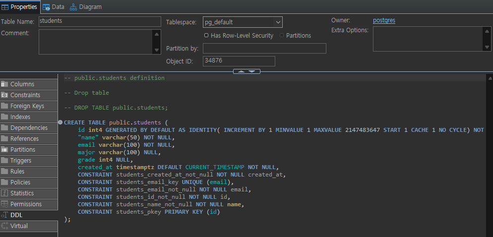
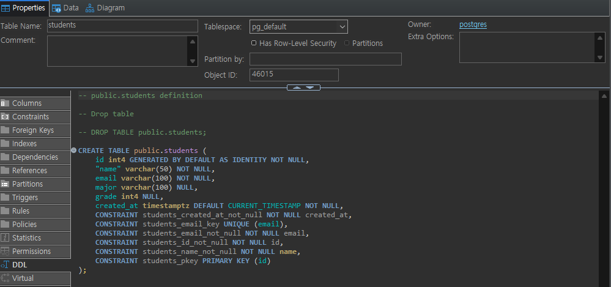
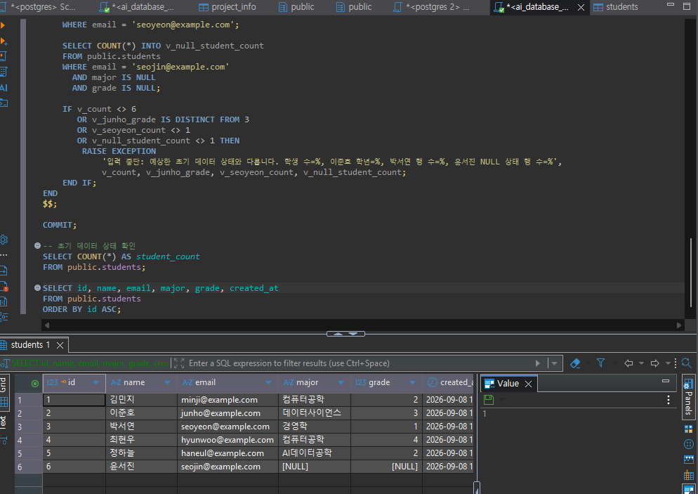
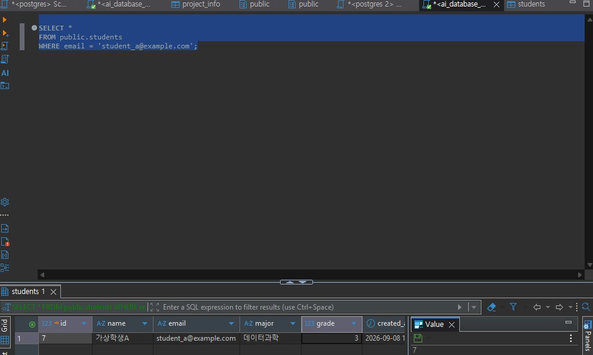
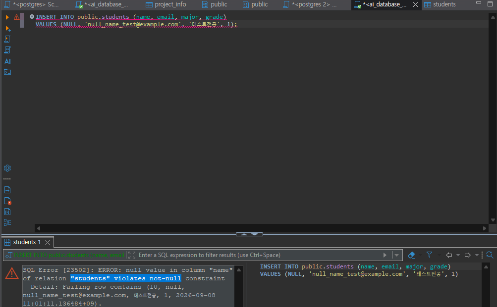

# Chapter 04 확장 실습 답안 템플릿

> **과제:** 관계형 데이터베이스와 SQL 시작하기  
> **사용 방법:** 이 파일을 내려받아 본인의 GitHub 저장소에 `chapter04_answer.md`라는 이름으로 저장한 뒤 실습하면서 바로 작성합니다.  
> **제출 방법:** LMS에는 파일을 직접 업로드하지 않고, **본인 GitHub 저장소의 `chapter04_answer.md` 파일 URL**을 제출합니다.

---

## 제출 전 주의

이 파일과 캡처 화면에는 실제 비밀번호, 전체 DB 접속 URL, API Key, 개인정보를 기록하지 않습니다.

```text
GitHub 계정 또는 별칭: koreajjangboy
과제 작성일: 2026-09-08
사용한 AI 도구: gemini
```

---

# 1. 실습 환경과 시작 상태 확인

다음을 실행합니다.

```sql
SELECT current_database();
SELECT current_user;
SELECT current_schema();
SHOW search_path;
SHOW transaction_read_only;
```

| 확인 항목 | 실제 결과 | 의미 |
| --- | --- | --- |
| current_database() | ai_database_book | 현재 연결된 DB |
| current_user | postgres | 현재 접속한 계정 |
| current_schema() | public | 현재 스키마 |
| search_path | "$user", public | 스키마를 생략하고 테이블을 조회하는 순서 |
| transaction_read_only | off | 트랜젝션 읽기 쓰기 가능 |

- [x] 현재 DB가 `ai_database_book`이다.
- [x] 변경 가능한 연결인지 확인했다.
- [x] 실행할 SQL 범위를 확인했다.
- [x] Auto-commit 상태를 확인했다.

### 변경 SQL을 실행하기 전에 현재 DB와 실행 범위를 확인해야 하는 이유

```text
내가 하려는 작업과 해당 위치가 맞는지 확인하여 실수를 방지하기 위해
```

---

# 2. `public.students` 구조 생성

## 2-1. 실행 전 예상

```text
테이블 이름:students
한 행의 의미:학생
예상 행 수:
기본키:id
필수 열: name, email
중복을 막는 열: email
자동 생성 열: id, create_at
```

## 2-2. 실행 파일

```text
code/chapter04/01_create_students.sql
```

## 2-3. 실행 후 확인

```text
테이블 생성 성공 여부:실패(이미 존재)
실제 행 수:7
DBeaver에서 확인한 위치:ai_database_book.public.students
```

### 각 열의 역할

| 열 | 타입 | NULL 가능? | 역할 |
| --- | --- | --- | --- |
| id | int4 | 불가 | ID |
| name | varchar | 불가 | 이름 |
| email | varchar | 불가 | 이메일 |
| major | varchar | 가능 | 전공 |
| grade | int4 | 가능 | 학년 |
| created_at | timestamptz | 불가 | 가입시간 |

### `id`를 학번이나 학생 수로 해석하면 안 되는 이유

```text
INSERT, UPDATE, DELETE의 상황에 따라 학생 수와 일치하지 않을 수 있음
```

### 증거 화면

권장 경로:

```text
assignments/chapter04/images/step02_table.png
```

`여기에 테이블 구조 확인 화면을 삽입하세요.`


DROP 후 재생성

---

# 3. 샘플 데이터 6명 입력

## 3-1. 실행 전 예상

```text
현재 행 수:0
실행 후 예상 행 수:6
예상되는 NULL 포함 학생:윤서진
```

## 3-2. 실행 파일

```text
code/chapter04/02_insert_students.sql
```

## 3-3. 실제 결과

```text
실제 행 수:6
이준호 grade:3
박서연 존재 여부:유
윤서진 major:null
윤서진 grade:null
```

### 예상과 실제 비교

```text
예상과 실제가 일치했는가:네
다르다면 이유:
```

### `created_at` 값이 여러 행에서 같을 수 있는 이유

```text
중복 제약이 없고, 같은 시간에 생성했기 때문
```

---

# 4. SELECT 복습과 결과 검증

각 문제는 **SQL 실행 전에 예상 행 수를 먼저 작성**합니다.

| 번호 | 조회 문제 | 예상 행 수 | 실제 행 수 | 일치? | 다르면 이유 |
| ---: | --- | ---: | ---: | --- | --- |
| 1 | 전체 학생 | 6 | 6 | 일치 |  |
| 2 | 이름·이메일만 조회 | 6 | 6 | 일치 |  |
| 3 | 특정 전공(컴퓨터공학) | 2 | 2 | 일치 |  |
| 4 | 특정 학년 이상(>=2) | 2 | 2 | 일치 |  |
| 5 | 두 전공 중 하나(컴퓨터공학, 경영학) | 2 | 2 | 일치 |  |
| 6 | `grade IS NULL` | 1 | 1 | 일치 |  |
| 7 | 전공 `DISTINCT` | 5 | 5 | 일치 |  |
| 8 | 정렬 후 상위 3명 | 3 | 3 | 일치 |  |

## 4-1. 내가 직접 작성한 SQL 2개

```sql
-- SQL 1
SELECT name, major 
FROM student 
WHERE major = '컴퓨터공학';
```

```text
이 SQL의 한 행 의미:컴퓨터공학 전공 학생의 이름과 전공 정보
예상 행 수:2
실제 행 수:2
```

```sql
-- SQL 2
SELECT COUNT(*) 
FROM student 
WHERE grade IS NOT NULL;
```

```text
이 SQL의 한 행 의미:학년 정보가 누락되지 않은(NULL이 아닌) 학생의 총 인원 수
예상 행 수:5
실제 행 수:5
```

## 4-2. `= NULL` 대신 `IS NULL`을 사용하는 이유

```text
참 거짓의 결과로 나타나지 않기 때문
```

## 4-3. `ORDER BY` 없이 결과 순서를 믿으면 안 되는 이유

```text
일정한 순서대로 결과를 보장받을 수 없기 때문
```

## 4-4. `DISTINCT`가 원본 데이터를 삭제하는 기능인가요?

```text
아니오 원본은 삭제하지 않습니다.
```

### 증거 화면

권장 경로:

```text
assignments/chapter04/images/step04_select.png
```

`여기에 SELECT 핵심 결과 화면을 삽입하세요.`

---

# 5. 내 가상 학생 2명 추가

실명·실제 이메일 대신 가상 데이터를 사용합니다.

## 5-1. 실행 전 계획

```text
학생 A
이름:가상학생A
이메일:student_a@example.com
전공:데이터과학
학년:2

학생 B
이름:가상학생B
이메일:student_b@example.com
전공:인공지능
학년 또는 NULL:NULL

현재 행 수:6
추가 후 예상 행 수:8
```

## 5-2. 내가 실행한 INSERT

```sql
INSERT INTO public.students (name, email, major, grade)
VALUES
    ('가상학생A', 'student_a@example.com', '데이터과학', 2),
    ('가상학생B', 'student_b@example.com', '인공지능', NULL)
RETURNING id, name, email, major, grade;
```

## 5-3. 실제 결과

```text
RETURNING 또는 확인 SELECT 결과:
id	name	email	major	grade
7	가상학생A	student_a@example.com	데이터과학	2
8	가상학생B	student_b@example.com	인공지능	[NULL]
실제 전체 행 수:8
예상과 일치 여부:일치
```

### 내가 일부 값을 NULL로 둔 이유 또는 NULL을 사용하지 않은 이유

```text
null의 특성을 이해
```

---

# 6. 안전한 UPDATE

내가 추가한 가상 학생 한 명만 수정합니다.

## 6-1. 먼저 대상 확인 SELECT

```sql
SELECT *
FROM public.students
WHERE email = 'student_a@example.com';
```

```text
예상 대상 행 수:1
실제 대상 행 수:1
```

## 6-2. UPDATE

```sql
UPDATE public.students
SET grade = 3
WHERE email = 'student_a@example.com'
RETURNING id, name, email, grade;
```

```text
예상 영향 행 수:1
실제 영향 행 수:1
RETURNING 결과:
id	name	email	grade
7	가상학생A	student_a@example.com	3
```

## 6-3. UPDATE 후 재조회

```sql
SELECT *
FROM public.students
WHERE email = 'student_a@example.com';

```

### `WHERE` 없는 UPDATE를 실행하면 위험한 이유

```text
테이블에 있는 모든 행에 적용
```

### 증거 화면

권장 경로:

```text
assignments/chapter04/images/step06_update.png
```

`여기에 UPDATE 전/후 결과 화면을 삽입하세요.`

---

# 7. 안전한 DELETE

내가 추가한 가상 학생 한 명을 삭제합니다.

## 7-1. 삭제 전 확인

```sql
SELECT *
FROM public.students
WHERE email = 'student_b@example.com';
```

```text
예상 대상 행 수:1
실제 대상 행 수:1
```

## 7-2. DELETE

```sql
DELETE FROM public.students
WHERE email = 'student_b@example.com'
RETURNING id, name, email;
```

```text
예상 영향 행 수:1
실제 영향 행 수:1
RETURNING 결과:
```

## 7-3. 삭제 후 재조회

```sql
id	name	email
8	가상학생B	student_b@example.com
```

```text
삭제 후 같은 조건의 SELECT 결과 행 수:0
```

### `DELETE` 성공 메시지만 보고 끝내지 않고 다시 SELECT해야 하는 이유

```text
데이터가 제대로 삭제되었는지 확인하기 위해
```

---

# 8. 본문 기준 UPDATE·DELETE 상태 검증

`04_update_delete_students.sql`을 본문 시작 상태에서 실행했다면 다음을 확인합니다.

```text
최종 학생 수:7
이준호 grade:3
박서연 존재 여부:1
```

본문 기준 기대 상태와 비교합니다.

```text
학생 수 = 5
이준호 grade = 4
박서연 = 0행
```

### 내 실제 결과가 기준과 다르다면 원인

```text
학생 수 : 6(가상학생A 포함)
```

---

# 9. 의도한 실패 2개 관찰

> 실패 테스트는 데이터베이스 규칙이 실제로 데이터를 보호하는지 확인하는 실험입니다.

## 9-1. 중복 이메일 `UNIQUE` 오류

내가 사용한 SQL:

```sql
INSERT INTO public.students (name, email, major, grade)
VALUES ('중복테스트', 'minji@example.com', '테스트전공', 1);
```

```text
오류 메시지 핵심 단서:unique
왜 실패해야 맞는가:email이 중복되기 때문
어떤 규칙이 작동했는가:email NOT NULL
실패 후 기존 데이터가 어떻게 유지되었는가:그대로 유지
```

## 9-2. 이름 `NULL` 입력 `NOT NULL` 오류

내가 사용한 SQL:

```sql
INSERT INTO public.students (name, email, major, grade)
VALUES (NULL, 'null_name_test@example.com', '테스트전공', 1);
```

```text
오류 메시지 핵심 단서:null
왜 실패해야 맞는가:이름은 null일수 없기 때문
어떤 규칙이 작동했는가:"students" violates not-null
```

### 실패한 INSERT 뒤 자동 생성 `id` 번호에 빈 구간이 생길 수 있어도 문제라고 단정할 수 없는 이유

```text
실패한 INSERT가 번호만 소모하고 사라지는 것은 정상적인 동작
```

### 증거 화면

권장 경로:

```text
assignments/chapter04/images/step09_constraint_error.png
```

`여기에 제약조건 오류 화면을 삽입하세요.`

---

# 10. `verify_students.sql`로 최종 상태 확인

실행 파일:

```text
code/chapter04/verify_students.sql
```

```text
현재 전체 학생 수:6
NULL 개수:1
이준호 grade:4
박서연 존재 여부:없음
현재 데이터 상태에서 예상과 다른 부분:
```

### 검증 SQL을 따로 두면 좋은 이유

```text
데이터의 정확성을 높일 수 있음
```

---

# 11. AI를 SQL 작성자가 아니라 검토자로 활용

먼저 본인이 SQL을 작성한 뒤 AI에게 검토를 요청합니다.

## 11-1. 내가 작성한 SQL

```sql
UPDATE student 
SET grade = 3 
WHERE major = '컴퓨터공학';
```

## 11-2. AI에게 전달한 핵심 요청

```text
나는 PostgreSQL 초보자입니다.
아래 SQL을 바로 다시 작성하지 말고 먼저 안전성을 검토해 주세요.
다음 순서로 답해 주세요.
1. 이 SQL이 영향을 줄 것으로 예상되는 행
2. WHERE 조건이 너무 넓거나 모호하지 않은지
3. NULL 처리에서 주의할 점
4. 실행 전에 같은 조건으로 확인할 SELECT
5. 실행 후 결과를 확인할 SELECT
6. 내가 놓친 위험이 있다면 질문 형태로 제시

UPDATE student 
SET grade = 3 
WHERE major = '컴퓨터공학';
```

## 11-3. AI 검토 결과

| AI 제안 | 수용 / 수정 / 거절 | 실제 검증 결과 | 나의 이유 |
| --- | --- | --- | --- |
| 변경 전 SELECT로 대상 미리 확인 권장 | 수용 | 컴퓨터공학 전공자 2명이 정확히 조회됨 | 의도하지 않은 데이터 변경을 사전에 방지하기 위해 |
| major 컬럼에 NULL 값이 포함될 가능성 검토 | 수용 | major IS NULL인 데이터는 영향받지 않음을 확인 | 명시적 조건 외의 데이터 유실 방지 |
| 트랜잭션 블록(BEGIN ... ROLLBACK) 사용 제안 | 수용 | 실수 시 즉시 롤백 가능함을 확인 | 안전한 실습과 에러 복구를 위해 |

### AI가 예상한 영향 행 수와 실제 결과가 같았나요?

```text
네
```

### AI 답변을 실행 전에 검토해야 하는 이유

```text
문법적인 오류를 검토받을 수 있고, 특히 크리티컬한 작업에 대해 안정성을 담보할 수 있음
```

---

# 12. 내 서비스 테이블 하나 확장 설계

Chapter 01~03에서 정한 개인 서비스에서 **테이블 하나**를 선택합니다.

```text
서비스 이름: 도서 대여 서비스
테이블 이름: books
한 행의 의미: 도서관이나 서점에 등록된 개별 도서 1권
```

| 열 이름 | 저장할 값 | 타입 후보 | NULL 가능? | UNIQUE 후보? | 이유 |
| --- | --- | --- | --- | --- | --- |
| id | 도서 고유 번호 | SERIAL | 불가능 (NOT NULL) | 가능 (UNIQUE, PK) | 도서를 중복 없이 식별하기 위한 대리 키 |
| title | 책 제목 | VARCHAR(200) | 불가능 (NOT NULL) | 불가능 | 도서 검색 및 식별을 위한 기본 정보 |
| author | 저자 | VARCHAR(100) | 불가능 (NOT NULL) | 불가능 | 도서를 집필한 작가 이름 |
| isbn | 국제 표준 도서번호 | VARCHAR(20) | 가능 (NULL) | 가능 (UNIQUE) | 전 세계 도서 고유 식별 번호 (미등록 도서 고려) |
| stock | 대여 가능 재고 수량 | INTEGER | 불가능 (NOT NULL) | 불가능 | 현재 대여할 수 있는 남은 책 권수 |
| published_date | 출판일 | DATE | 가능 (NULL) | 불가능 | 책이 세상에 나온 날짜 |
| created_at | 시스템 등록 일시 | TIMESTAMPTZ | 불가능 (NOT NULL) | 불가능 | 도서 정보가 시스템에 처음 등록된 시각 |

```text
PK 후보: id
업무 식별자 후보: isbn
아직 미확정인 규칙: ISBN이 없는 독립 출판물이나 구 도서의 등록 허용 여부, 동일 도서 복본(여러 권) 관리 방식을 단일 행의 수량(`stock`)으로 관리할지 개별 자산 번호로 쪼갤지 여부
```

## 선택: CREATE TABLE 초안

> 아직 확정되지 않은 업무 규칙은 억지로 제약조건으로 만들지 않습니다.

```sql
CREATE TABLE books (
    id SERIAL PRIMARY KEY,
    title VARCHAR(200) NOT NULL,
    author VARCHAR(100) NOT NULL,
    isbn VARCHAR(20) UNIQUE,
    stock INTEGER NOT NULL DEFAULT 1,
    published_date DATE,
    created_at TIMESTAMP WITH TIME ZONE DEFAULT CURRENT_TIMESTAMP
);
```

### AI에게 검토받은 뒤 수정한 부분

```text
- 신규 도서를 등록할 때 수량은 최소 1권을 기본으로 함
- isbn에 UNIQUE 제약 조건을 부여
```

---

# 13. 최종 성찰

아래 문장은 본인의 말로 작성합니다.

```text
1. SQL 실행 성공과 올바른 대상 선택이 다른 이유는
   에러 메시지가 없다고 원서는 작업을 제대로 한것이 아니기때문 이다.

2. UPDATE와 DELETE 전에 SELECT를 먼저 해야 하는 이유는
   데이터를 다시 확인하고 수정 범위를 검토하기 위해서 이다.

3. 영향받은 행 수를 확인해야 하는 이유는
   전체에 반영되어 데이터 손실을 방지하기 위해서 이다.

4. UNIQUE 또는 NOT NULL 오류를 '보호 장치가 정상 동작한 결과'라고 볼 수 있는 이유는
   에러 코드에 메세지가 나오기 때문 이다.

5. AI가 SQL을 만들어 주더라도 내가 반드시 확인해야 하는 것은
   데이터의 정합성 확인 이다.
```

---

# 14. 제출 체크리스트

- [x] `chapter04_answer.md`를 본인 저장소에 만들었다.
- [x] 현재 DB와 실행 환경을 확인했다.
- [x] `public.students`를 생성했다.
- [x] 샘플 6명 입력 결과를 검증했다.
- [x] SELECT 문제에서 실행 전 예상 행 수를 작성했다.
- [x] 가상 학생 2명을 추가했다.
- [x] UPDATE 전후를 SELECT로 확인했다.
- [x] DELETE 전후를 SELECT로 확인했다.
- [x] UNIQUE 오류를 관찰했다.
- [x] NOT NULL 오류를 관찰했다.
- [x] `verify_students.sql`로 상태를 확인했다.
- [x] AI 제안을 실제 SQL 결과와 비교했다.
- [x] 개인 서비스 테이블 하나를 확장 설계했다.
- [x] 핵심 캡처는 3~4장 정도로 제한했다.
- [x] 비밀번호·개인정보가 캡처에 없다.
- [x] Markdown 이미지가 GitHub 웹 화면에서 정상 표시된다.
- [x] commit/push를 완료했다.

---

# 15. LMS 제출 URL

아래 형식의 **본인 GitHub 파일 URL**을 LMS에 제출합니다.

```text
https://github.com/<본인-GitHub-ID>/<본인-저장소>/blob/main/assignments/chapter04/chapter04_answer.md
```

내 제출 URL:

```text

```

> 교수자 템플릿 URL이나 저장소 메인 URL이 아니라 **작성 완료된 본인 `chapter04_answer.md` 파일 화면 URL**을 제출합니다.