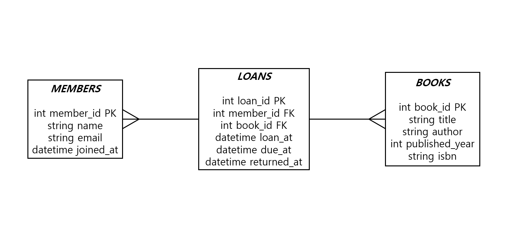
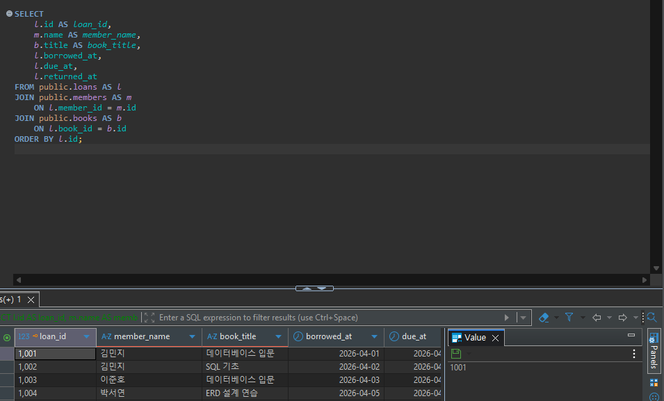
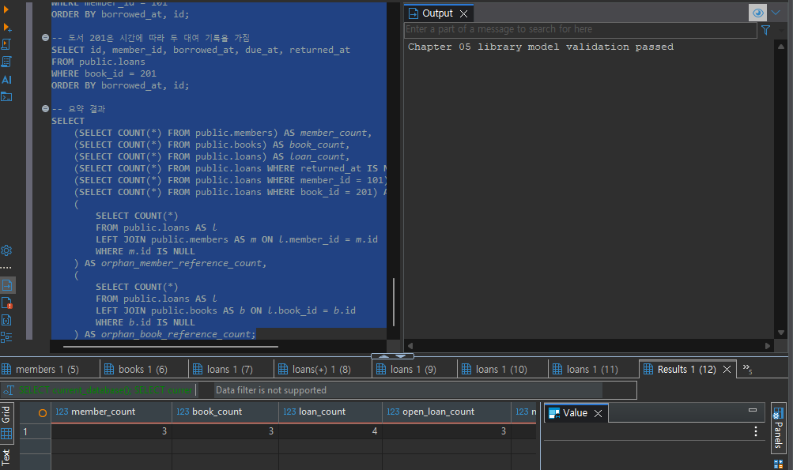
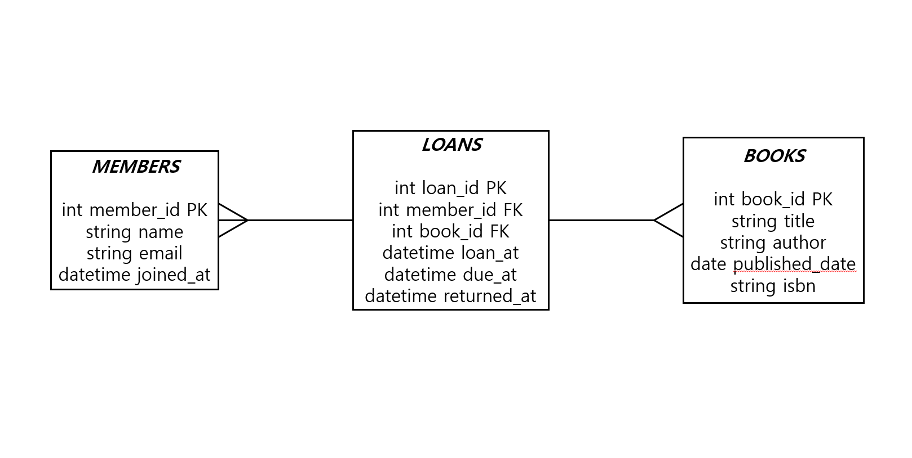

# Chapter 05 확장 실습 답안 템플릿

> **과제:** 요구사항에서 데이터 모델과 ERD 만들기  
> **사용 방법:** 이 파일을 내려받아 본인의 GitHub 저장소에 `chapter05_answer.md`라는 이름으로 저장한 뒤 실습하면서 바로 작성합니다.  
> **제출 방법:** LMS에는 파일을 직접 업로드하지 않고, **본인 GitHub 저장소의 `chapter05_answer.md` 파일 URL**을 제출합니다.

---

## 제출 전 주의

이 파일과 캡처 화면에는 실제 비밀번호, 전체 DB 접속 URL, API Key, 개인정보를 기록하지 않습니다.

```text
GitHub 계정 또는 별칭:koreajjangboy
과제 작성일: 2026-09-10
사용한 AI 도구: Gemini
```

---

# 1. Chapter 05 핵심 개념 복습

본문을 보지 않고 먼저 작성합니다.

```text
요구사항에서 바로 테이블부터 만들면 위험한 이유: 테이블 사이의 관계나 각 속성들에 대해 충분한 검토없이 진행

한 행의 의미를 먼저 정해야 하는 이유: 어떤 속성으로 어떤 값을 넣을지에 따라 방향이 달라지기 때문

확정 요구사항과 미확정 정책을 구분해야 하는 이유: 테이블 생성에 반영하기 위해

PK와 업무상 고유값 후보의 차이: 다른 테이블과의 관계 유무

N:M 관계를 그대로 두지 않고 연결 테이블을 검토하는 이유: 연결테이블을 통해 관계를 이어주기 위해
```

---

# 2. 도서 대여 요구사항 R-01~R-07 다시 분해

| 요구사항 | 관리 대상 / 사건 | 속성 후보 | 관계 / 규칙 후보 | 미확정 질문 |
| --- | --- | --- | --- | --- |
| R-01 | 도서관, 회원 |  | 도서관은 회원을 관리함 (1:N) | 회원을 식별하는 고유 번호(ID) 정의가 누락되어 있는지? |
| R-02 | 회원 | 이름, 이메일, 가입일 |  | 이메일의 중복 허용 여부 및 형식 제약이 있는지? |
| R-03 | 도서 | 제목, 저자, 출판연도(선택), ISBN(선택) |  | ISBN이 도서의 고유 식별자(PK) 역할을 하는지, 동일 도서(복본)가 여러 권 존재할 수 있는지? |
| R-04 | 대여 (행위) |  | 회원과 도서의 N:M(다대다) 관계, 대여 행위 발생 | 1인이 동시에 대여할 수 있는 최대 도서 권수에 제한이 있는지? |
| R-05 | 대여 이력 |  | 도서와 대여 기록 간의 1:N 관계 (시간 흐름에 따른 누적) |  |
| R-06 | 대여 기록 | 대여일, 반납예정일, 실제반납일 |  | 반납예정일은 대여일을 기준으로 자동 산정되는지? |
| R-07 | 대여 기록 (미반납) | 실제반납일 (Null 허용) |  | 연체 상태나 반납 기한 연장 규칙이 존재하는지? |

### 본문과 비교한 뒤 수정한 내용

```text
처음에 놓친 부분: R-04 대여에 대한 이벤트를 관계로 분리

처음에 잘못 분류한 부분: 대여기록 테이블을 통해서 관리 필요 

수정한 이유: 대여는 반복해서 일어나는 사건으로 별도의 테이블로 관리가 필요함
```

---

# 3. 확정 규칙과 미확정 정책 구분

## 3-1. 확정된 규칙

```text
1. 도서관은 회원과 도서를 관리한다.
2. 대여 기록은 회원과 도서를 연결한다.
3. 대여일과 반납예정일을 저장한다.
4. 실제반납일은 비어 있을 수 있다.
5. 한 회원과 한 도서는 시간에 따라 여러 대여 기록을 가질 수 있다.
```

## 3-2. 미확정 질문

최소 5개를 작성합니다.

```text
Q1. 회원 이메일은 반드시 고유한가?
Q2. ISBN은 반드시 고유한가?
Q3. 한 도서에 저자가 여러 명일 수 있는가?
Q4. 회원 한 명의 최대 대여 권수는?
Q5. 회원 삭제 후 대여 이력은 유지할 것인가?
```

### 미확정 정책을 바로 `UNIQUE`, `CHECK`, 삭제 규칙으로 구현하면 위험한 이유

```text
데이터 손실등 치명적인 문제가 발생할 가능성이 있음
```

---

# 4. 엔터티·속성·사건 후보 구분

| 후보 | 대상 엔터티 / 사건 엔터티 / 속성 | 판단 근거 | 독립 식별 필요? |
| --- | --- | --- | --- |
| 회원 | 대상 엔터티 | 고유한 주체로서 이름, 이메일, 가입일 등 여러 속성을 가지며 지속적으로 관리됨 | 회원 ID |
| 도서 | 대상 엔터티 | 도서 고유의 정보(제목, 저자, 출판연도, ISBN)를 가지며 독립적으로 관리됨 | 도서 ID 또는 ISBN |
| 대여 기록 | 사건 엔터티 | 회원과 도서 간에 시간에 따라 반복적으로 발생하는 행위(이벤트)이며, 대여일과 반납예정일 등의 속성을 가짐 | 대여 번호 |
| 이메일 | 속성 | '회원' 엔터티의 세부 정보를 구성하는 단일 값이며, 독립적인 생명주기가 없음 | 불필요 |
| ISBN | 속성 | '도서' 엔터티의 속성이자 도서를 식별하는 값으로 사용됨 | 불필요 |
| 반납예정일 | 속성 | '대여 기록' 사건이 발생할 때 종속적으로 생성되는 날짜 값임 | 불필요 |

### “명사가 보이면 무조건 테이블”이 아닌 이유

```text
테이블의 속성으로 관리할지 테이블로 만들어 관리할지 판단해야하기 때문
```

---

# 5. 테이블별 한 행의 의미와 키 후보

| 테이블 | 한 행의 의미 | PK 후보 | 업무상 고유값 후보 | FK 후보 |
| --- | --- | --- | --- | --- |
| `members` | 회원 한 명 | member_id | email |  |
| `books` | 이 장에서 대여 대상으로 취급하는 간소화된 도서 항목 한 건 | book_id | isbn |  |
| `loans` | 특정 회원이 특정 도서를 대여한 사건 한 건 | loan_id |  | member_id, book_id |

### `members.email`을 지금 바로 UNIQUE라고 확정하지 않는 이유

```text
시스템에서 어떻게 동작할지를 생각해 이메일이 unique한 값이어야 하는지에 대한 정책 확정 필요
```

### `books.isbn`을 지금 바로 NOT NULL + UNIQUE라고 확정하지 않는 이유

```text
ISBN이 없는 도서도 있을 수 있기 때문
```

---

# 6. 관계를 양방향 문장으로 작성

## 6-1. `members ↔ loans`

```text
회원 한 명은 여러 대여 기록을 가질 수 있다

대여 기록 한 건은 한 회원이 대출한 한 권의 책을 의미한다

카디널리티: members 1 ── N loans
선택성에서 확인할 점: 새로 가입한 회원 등 대여 이력이 전혀 없는 회원이 존재할 수 있으므로, 회원 입장에서 대여 기록의 최소 개수는 0일 수 있다
```

## 6-2. `books ↔ loans`

```text
도서 한 건은 시간에 따라 여러 대여 기록을 가질 수 있다.

대여 기록 한 건은 정확히 한 도서를 참조한다.

카디널리티: books 1 ── N loans
선택성에서 확인할 점: 도서관에 새로 입고되어 아직 한 번도 대여되지 않은 도서가 존재할 수 있으므로, 도서 입장에서 대여 기록의 최소 개수는 0일 수 있다.
```

## 6-3. `members ↔ books`를 직접 N:M으로 저장하지 않고 `loans`를 두는 이유

```text
대여일, 반납예정일, 실제반납일 등에 대한 속성을 함께 작성해야하기 때문
```

### `loans`가 단순 연결표가 아니라 사건 엔터티라고 볼 수 있는 이유

```text
대여한 시점, 반납기한, 반납한 시점 등 사건에 대한 정보를 담고 있기 때문
```

---

# 7. 도서 대여 ERD 초안

아래 항목이 보이도록 ERD를 작성합니다.

```text
members
books
loans
PK
FK
주요 속성
1:N 관계
```

권장 이미지 경로:

```text
assignments/chapter05/images/step07_library_erd.png
```

Markdown 예시:

```markdown

```

`여기에 ERD 이미지를 삽입하세요.`


### ERD를 그린 뒤 수정한 부분

```text
없습니다
```

---

# 8. PostgreSQL로 도서 대여 모델 구현 확인

## 8-1. 현재 환경 확인

```sql
SELECT current_database();
SELECT current_user;
SELECT current_schema();
SHOW search_path;
SHOW transaction_read_only;
```

```text
현재 DB: ai_database_book
현재 사용자: postgres
현재 스키마: public
search_path: "$user", public
읽기 전용 여부: off
```

- [x] 현재 DB가 `ai_database_book`이다.
- [x] 실행 범위를 확인했다.
- [x] Auto-commit 상태를 확인했다.

## 8-2. 스키마 생성 SQL 실행

사용 파일:

```text
code/chapter05/01_library_schema.sql
```

실행 전 예상:

```text
생성될 테이블 수: 3
생성 순서: members, books, loans
각 테이블 예상 행 수: 0, 0, 0
```

실행 후 실제:

```text
members 존재: O
books 존재: O
loans 존재: O
각 테이블 행 수: 0
```

### `loans`를 마지막에 만드는 이유

```text
FK로 members 테이블의 member_id, books 테이블의 book_id 를 참조하기 때문
```

---

# 9. 샘플 데이터 입력과 관계 관찰

사용 파일:

```text
code/chapter05/02_library_seed.sql
```

## 9-1. 실행 전 예상

```text
members 예상 행 수:3
books 예상 행 수:3
loans 예상 행 수:4
미반납 예상 건수:3
회원 101 대여 예상 건수:2
도서 201 대여 예상 건수:2
```

## 9-2. 실제 결과

```text
members 실제 행 수:3
books 실제 행 수:3
loans 실제 행 수:4
미반납 실제 건수:3
회원 101 대여 실제 건수:2
도서 201 대여 실제 건수:2
```

### 샘플 데이터에서 확인한 1:N 관계

```text
김민지가 데이터베이스 입문, SQL 기초를 대여함
```

### `returned_at = NULL`이 의미하는 것

```text
현재 대여중인 상태(반납전)
```

### 증거 화면

권장 경로:

```text
assignments/chapter05/images/step09_seed_result.png
```

`여기에 샘플 데이터 또는 관계 확인 화면을 삽입하세요.`

---

# 10. 검증 SQL 실행

사용 파일:

```text
code/chapter05/03_library_validation.sql
```

## 10-1. 결과 기록

```text
members = 3
books = 3
loans = 4
미반납 건수 = 3
회원 101 대여 이력 = 2
도서 201 대여 이력 = 2
회원 참조 고아 행 = 0
도서 참조 고아 행 = 0
loans FK 개수 = 2
검증 최종 메시지 = Chapter 05 library model validation passed
```

### 단순히 테이블 3개가 생성되었다고 설계 검증이 끝난 것이 아닌 이유

```text
제대로 되었는지 확인 필요
```

### 증거 화면

권장 경로:

```text
assignments/chapter05/images/step10_validation.png
```

`여기에 검증 PASS 화면을 삽입하세요.`

---

# 11. 작은 시나리오로 모델 검증

아래 시나리오를 현재 모델이 표현할 수 있는지 판단합니다.

| 시나리오 | 표현 가능? | 이유 | 추가 확인할 정책 |
| --- | --- | --- | --- |
| 회원 A가 서로 다른 책 2권을 대여 | 가능 | loans 테이블에 동일한 member_id로 서로 다른 book_id를 가진 행 2개가 각각 생성될 수 있음 | 1인당 최대 동시 대여 가능 권수 제한 여부 |
| 같은 책을 시간 차를 두고 다시 대여 |가능 | loans는 사건 테이블이므로, 대여일과 반납일이 다른 새로운 대여 행위(행)가 추가로 쌓일 수 있음 | 반납 직후 재대여 제한 기간이나 조건 존재 여부 |
| 아직 반납하지 않은 대여 | 가능 | 요구사항에 따라 loans.returned_at 컬럼에 NULL을 허용하므로 미반납 상태 표현 가능 | 연체 판정 기준일 산정 방식 및 반납 기한 연장 정책 |
| 회원은 있지만 대여 기록이 없음 | 가능 | members와 loans는 1:N 관계이며 최소 카디널리티가 0이므로 대여 이력이 없는 회원 존재 가능 | 장기 미이용 회원 탈퇴 또는 휴면 처리 정책 |
| ISBN이 없는 도서 | 가능 | books.isbn 컬럼에 NULL을 허용하도록 설계하면 ISBN이 없는 구형 도서도 등록 가능 | ISBN이 없을 경우 도서를 식별할 수 있는 대체 수단 여부 |
| 같은 ISBN의 실물 복본 2권 | 불가능 | 현재 books 테이블은 개별 실물 책이 아니라 '도서 종류'를 나타내므로, 동일한 ISBN을 가진 복본 2권을 각각 구분하여 관리할 수 없음 | 복본별 자산 번호(Barocde/Accession Number) 부여 여부 |
| 한 도서에 저자 2명 | 불가능 | books 테이블의 author 속성이 단일 문자열 구조로 되어 있어 다수의 저자를 구조화하여 저장하기 어려움 | 저자 정보를 별도 엔터티로 분리할지 여부 |
| 같은 도서를 두 명이 동시에 대여 | 불가능 | 실물 책(복본) 개념이 없어 동일한 book_id에 대해 여러 대여가 발생할 때 실제로 어떤 실물이 대여되는지 매핑할 수 없음 | 도서별 총 보유 수량 및 현재 대여 가능 재고 수량 관리 방식 |

### 현재 Chapter 05 모델의 한계 3가지

```text
1. 같은 책이 여러권 있는 경우
2. 저자가 여러명인경우
3. 예약 대출 불가
```

---

# 12. Chapter 01~04 개인 서비스 요구사항 작성

지금까지 선택한 개인 서비스 아이디어를 사용합니다.

```text
서비스 이름: 도서 대여 관리 서비스
서비스 목적: 회원이 도서를 검색하고 대여 및 반납할 수 있도록 도서와 회원, 대여 정보를 관리하는 서비스
```

## 12-1. 요구사항

최소 8개를 작성합니다.

```text
P05-R01. 회원은 이름, 이메일, 가입일 등의 정보를 입력하여 회원으로 가입할 수 있다.
P05-R02. 시스템은 도서의 제목, 저자, 출판연도, ISBN 등의 정보를 관리하고 등록할 수 있다.
P05-R03. 회원은 도서 제목이나 저자 등의 검색 조건을 통해 원하는 도서를 찾을 수 있다.
P05-R04. 회원은 도서를 대여할 수 있으며, 시스템은 이때의 대여일과 반납예정일을 기록한다.
P05-R05. 회원은 대여 중인 도서를 반납할 수 있으며, 시스템은 실제반납일을 기록하여 반납 처리를 완료한다.
P05-R06. 회원은 자신의 현재 대여 목록 및 과거 대여 이력을 조회할 수 있다.
P05-R07. 시스템은 아직 반납되지 않은 대여 기록(실제반납일이 비어 있는 상태)을 식별하고 관리할 수 있다.
P05-R08. 한 회원은 시간에 따라 여러 권의 도서를 여러 번 대여할 수 있고, 도서 역시 시간에 따라 여러 번 대여될 수 있다.
```

> 화면 기능보다 **저장해야 할 사실, 반복 사건, 상태와 관계**를 중심으로 작성합니다.

## 12-2. 미확정 질문

최소 3개를 작성합니다.

```text
P05-Q01. 한 명의 회원이 동시에 대여할 수 있는 최대 도서 권수와 기본 대여 기간은 어떻게 설정할 것인가?
P05-Q02. 동일한 ISBN을 가진 실물 책이 도서관에 여러 권(복본) 입고될 경우, 개별 실물 책을 어떻게 식별하고 관리할 것인가?
P05-Q03. 회원 가입 시 이메일 주소의 중복을 허용하지 않고 고유 식별자로 활용할 것인가?
```

---

# 13. 개인 서비스 모델 초안

## 13-1. 엔터티·사건 후보표

| 후보 | 대상 / 사건 | 한 행의 의미 | 주요 속성 | PK 후보 | 업무 식별자 후보 |
| --- | --- | --- | --- | --- | --- |
| members | 대상 엔터티 | 회원 한 명 | member_id, name, email, joined_at | member_id | email |
| books | 대상 엔터티 | 도서 한 건 | book_id, title, author, published_date, isbn | book_id | isbn |
| loans | 사건 엔터티 | 회원의 도서 대여 | loan_id, member_id, book_id, borrowed_at, due_at, returned_at | loan_id |  |

## 13-2. 관계 문장

최소 3쌍을 양방향으로 작성합니다.

```text
관계 1: members ↔ loans
- 회원 한 명은 여러 대여 기록을 가질 수 있다.
- 대여 기록 한 건은 정확히 한 회원을 참조한다.

관계 2: books ↔ loans
- 도서 한 건은 시간에 따라 여러 대여 기록을 가질 수 있다.
- 대여 기록 한 건은 정확히 한 도서를 참조한다.

관계 3: members ↔ books (N:M 관계 구조)
- 회원 한 명은 여러 도서를 대여할 수 있다.
- 도서 한 건은 시간에 따라 여러 회원에게 대여될 수 있다.
```

## 13-3. N:M 관계 검토

```text
N:M 관계 후보: 회원(members)과 도서(books)
연결 테이블 후보: 대여 기록(loans)
연결 테이블 한 행의 의미: 특정 회원이 특정 도서를 대여한 사건 한 건
연결 테이블 자체에 필요한 사건 속성: 대여일(borrowed_at), 반납예정일(due_at), 실제반납일(returned_at)
```

---

# 14. 개인 서비스 ERD 초안

ERD에 최소 다음을 표시합니다.

```text
테이블 3개 이상
각 테이블 PK
주요 속성
필요한 FK
관계선
카디널리티
```

권장 이미지 경로:

```text
assignments/chapter05/images/step14_my_erd.png
```

`여기에 개인 서비스 ERD 이미지를 삽입하세요.`



### ERD의 각 테이블이 어떤 요구사항에서 나왔는지 설명

| 테이블 | 근거 요구사항 ID | 한 행의 의미 |
| --- | --- | --- |
| members | P05-R01, P05-R06 | 회원 한 명 |
| books | P05-R02, P05-R03 | 도서 메타데이터 및 항목 한 건 |
| loans | P05-R04, P05-R05, P05-R07, P05-R08 | 특정 회원이 특정 도서를 대여한 사건 한 건 |

---

# 15. 요구사항 추적표

| 요구사항 ID | 데이터 모델 반영 위치 | 검증 방법 | 상태 |
| --- | --- | --- | --- |
| P05-R01 | members | 회원 가입 API 호출 후 members 테이블에 데이터 적재 확인 | 반영 |
| P05-R02 | books | 도서 등록 기능 실행 후 books 테이블에 정보 저장 확인 | 반영 |
| P05-R03 | books | 도서 검색 화면에서 제목 또는 저자 키워드로 조회 테스트 | 반영 |
| P05-R04 | loans | 도서 대여 처리 시 loans에 대여일과 반납예정일 생성 확인 | 반영 |
| P05-R05 | loans | 도서 반납 처리 시 returned_at에 실제 반납일 기록 확인 | 반영 |
| P05-R06 | members, loans | 마이페이지에서 현재 대여 목록 및 과거 대여 이력 조회 테스트 | 반영 |
| P05-R07 | loans | 반납되지 않은 대여 건(returned_at IS NULL) 필터링 조회 테스트 | 반영 |
| P05-R08 | members, loans, books | 한 회원이 여러 책을 시간 차를 두고 대여하는 시나리오 테스트 | 반영 |

### ERD 그림만으로 요구사항 누락을 발견하기 어려운 이유

```text
1. 비즈니스 로직과 제약 조건의 부재: ERD는 데이터의 구조(테이블, 속성, 관계)만 시각적으로 보여줄 뿐, "1인당 최대 3권까지만 대여할 수 있다"거나 "연체된 회원은 대여가 제한된다" 같은 구체적인 업무 규칙(Business Rule)을 표현하지 못합니다.
2. 예외 케이스 및 상태 변화 확인 불가: "ISBN이 없는 도서는 어떻게 처리할 것인가"나 "반납 기한 연장은 몇 회까지 가능한가" 같은 정책적 모호함은 구조적 그림만으로는 드러나지 않기 때문에, 요구사항 추적표나 시나리오 검증이 병행되지 않으면 누락을 쉽게 알아채기 어렵습니다.
```

---

# 16. 개인 서비스 작은 데이터 시나리오 검증

가상 데이터만 사용합니다.

```text
사용자/대상 A: 회원 '김철수' (member_id: 1)
사용자/대상 B: 회원 '이영희' (member_id: 2)
대상 X: 도서 '클린 코드' (book_id: 1)
대상 Y: 도서 '해커와 화가' (book_id: 2)
사건 1: 회원 A가 도서 X를 대여함 (대여일: 2026-09-01, 반납예정일: 2026-09-15, 실제반납일: NULL)
사건 2: 회원 A가 도서 X를 반납함 (실제반납일 업데이트: 2026-09-10)
사건 3: 회원 B가 도서 X를 대여함 (대여일: 2026-09-11, 반납예정일: 2026-09-25, 실제반납일: NULL)
사건 4: 회원 A가 도서 Y를 대여함 (대여일: 2026-09-11, 반납예정일: 2026-09-25, 실제반납일: NULL)
```

### 이 시나리오를 현재 ERD로 저장할 수 있는가?

```text
네
```

### 저장하기 어려운 상황 또는 모호한 부분

```text
같은 책이 여러권 있는 경우 등
```

### 시나리오 검증 후 수정한 ERD 내용

```text
없습니다 
```

---

# 17. AI를 설계자가 아니라 리뷰어로 활용

## 17-1. AI에게 전달한 핵심 자료

```text
요구사항:
- P05-R01. 회원은 이름, 이메일, 가입일 등의 정보를 입력하여 회원으로 가입할 수 있다.
- P05-R02. 시스템은 도서의 제목, 저자, 출판연도, ISBN 등의 정보를 관리하고 등록할 수 있다.
- P05-R03. 회원은 도서 제목이나 저자 등의 검색 조건을 통해 원하는 도서를 찾을 수 있다.
- P05-R04. 회원은 도서를 대여할 수 있으며, 시스템은 이때의 대여일과 반납예정일을 기록한다.
- P05-R05. 회원은 대여 중인 도서를 반납할 수 있으며, 시스템은 실제반납일을 기록하여 반납 처리를 완료한다.
- P05-R06. 회원은 자신의 현재 대여 목록 및 과거 대여 이력을 조회할 수 있다.
- P05-R07. 시스템은 아직 반납되지 않은 대여 기록(실제반납일이 비어 있는 상태)을 식별하고 관리할 수 있다.
- P05-R08. 한 회원은 시간에 따라 여러 권의 도서를 여러 번 대여할 수 있고, 도서 역시 시간에 따라 여러 번 대여될 수 있다.

미확정 질문:
- P05-Q01. 한 명의 회원이 동시에 대여할 수 있는 최대 도서 권수와 기본 대여 기간은 어떻게 설정할 것인가?
- P05-Q02. 동일한 ISBN을 가진 실물 책이 도서관에 여러 권(복본) 입고될 경우, 개별 실물 책을 어떻게 식별하고 관리할 것인가?
- P05-Q03. 회원 가입 시 이메일 주소의 중복을 허용하지 않고 고유 식별자로 활용할 것인가?

테이블별 한 행 의미:
- members 한 행: 회원 한 명
- books 한 행: 이 장에서 대여 대상으로 취급하는 간소화된 도서 항목(메타데이터) 한 건
- loans 한 행: 특정 회원이 특정 도서를 대여한 사건 한 건

관계 문장:
- 회원 한 명은 여러 대여 기록을 가질 수 있고, 대여 기록 한 건은 정확히 한 회원을 참조한다. (members 1 ── N loans)
- 도서 한 건은 시간에 따라 여러 대여 기록을 가질 수 있고, 대여 기록 한 건은 정확히 한 도서를 참조한다. (books 1 ── N loans)
- 회원과 도서의 N:M 관계는 `loans` 교차 엔터티(사건 테이블)를 통해 해소한다.

ERD 설명:
- `members`(PK: member_id), `books`(PK: book_id), `loans`(PK: loan_id, FK: member_id, book_id)의 3개 테이블 구조로 구성됨.
- `loans` 테이블은 대여일(borrowed_at), 반납예정일(due_at), 실제반납일(returned_at) 속성을 가져 시간에 따른 대여/반납 이력과 미반납 상태를 완벽히 표현할 수 있음.
```

## 17-2. AI 검토 요청

실제로 사용한 프롬프트 또는 핵심 내용을 기록합니다.

```text
작성해주신 요구사항과 데이터 모델을 초보자의 눈높이에서 꼼꼼히 리뷰해 보았습니다. 전체적으로 핵심을 잘 짚어 뼈대를 튼튼하게 설계하셨지만, 몇 가지 세부적인 부분에서 점검해 보면 좋을 포인트들이 있습니다.

완성된 정답을 바로 알려드리기보다, 직접 고민해 보실 수 있도록 확인해야 할 질문과 검토 의견을 제시해 드립니다.

1. 요구사항에 없는 정책을 임의로 확정했는지
검토 질문: 모델 내부의 member_id, book_id, loan_id처럼 숫자형 인조 식별자(Surrogate Key)를 PK로 사용하겠다고 설정하셨는데, 이것이 원본 요구사항(P05-R01~R08)에 명시되어 있었나요? 아니면 설계 과정에서 임의로 추가한 규칙인가요?

의견: 시스템 구현상 인조 키를 쓰는 것은 일반적이지만, 요구사항의 범위와 비교해 내가 어떤 가정을 추가했는지 인지하고 있는지 점검해보세요.

2. 테이블 한 행의 의미가 모호한 곳
검토 질문: books 테이블 한 행의 의미를 "간소화된 도서 항목(메타데이터) 한 건"이라고 정의하셨습니다. 그렇다면 현실에서 도서관에 똑같은 책(ISBN이 같은 책)이 3권 진열되어 있다면, books 테이블에는 1행만 생길까요, 3행이 생길까요?

의견: 메타데이터 기준이라면 1행만 생겨야 맞지만, 이 경우 나중에 미확정 질문인 '복본 관리'를 할 때 어떤 한계가 생길지 연결 지어 생각해 보세요.

3. 대상과 사건을 섞은 곳
검토 질문: members와 books는 지속해서 유지되는 '대상(Entity)'이고, loans는 일어난 행위인 '사건(Event/Transaction)'입니다. 혹시 loans 테이블 안에 대여와 관련 없는 회원 정보(예: 가입일)나 도서 정보(예: 저자)가 섞여 들어가지는 않았나요?

의견: 현재 구조는 대상과 사건이 깔끔하게 분리되어 있습니다.

4. PK와 업무 식별자를 혼동한 곳
검토 질문: members 테이블의 PK는 member_id이지만, 실무에서 회원을 고유하게 판별하는 업무상 값(업무 식별자)은 무엇인가요? 이메일(email)인가요?

의견: 만약 이메일을 업무 식별자로 보려 했다면, 아직 이메일 중복 여부가 확정되지 않았을 때(P05-Q03) PK나 유니크 제약 조건을 어떻게 다뤄야 할지 고민해 보아야 합니다.

5. N:M인데 연결 엔터티가 빠진 곳
검토 질문: 회원과 도서의 관계에서 N:M 구조를 풀기 위해 loans라는 연결(교차) 엔터티를 아주 잘 도출하셨습니다. 그렇다면 loans 외에 또 다른 N:M 관계(예: 저자와 도서의 관계)에서 빠진 연결 엔터티는 없을까요? (요구사항 P05-R02에서 저자를 관리한다고 했는데, 현재 구조에서는 저자가 books의 단순 속성으로만 들어있습니다.)

6. FK 방향이나 카디널리티가 이상한 곳
검토 질문: loans 테이블이 members와 books를 바라보는 FK(member_id, book_id)를 가지고 있습니다. "대여 기록 한 건은 정확히 한 명의 회원을 참조한다"는 문장에 비춰볼 때, FK가 loans에 있는 것이 맞을까요, 아니면 members 쪽에 대여 기록 컬럼이 들어가야 할까요?

의견: 방향 자체는 올바르게 설정하셨으나, 카디널리티(1:N)의 최소값(선택성) 관점에서 회원이 가입하자마자 대여 기록이 0개일 수 있다는 점을 다이어그램이나 문장으로 명확히 표현했는지 점검해 보세요.

7. 미확정 질문으로 남겨야 할 부분
검토 질문: 작성해주신 미확정 질문(P05-Q01 ~ Q03) 외에도, "반납예정일은 대여일을 기준으로 자동으로 며칠 뒤로 계산되는가?"나 "회원이 탈퇴할 때 기존 대여 이력을 지울 것인가, 남길 것인가?" 같은 정책들이 현재 모델에 반영되어 있나요, 아니면 미확정 상태인가요?

의견: 날짜 자동 계산 로직이나 삭제 룰 등 추가로 숨겨진 미확정 정책이 없는지 살펴보세요.

8. 작은 데이터 예제로 검증하면 좋을 상황
검토 질문: 앞서 다룬 시나리오 중 "같은 ISBN의 실물 책이 2권 있을 때, 회원 A와 회원 B가 그 책을 동시에 빌리는 상황"을 현재의 3개 테이블 모델에 직접 데이터를 넣는다고 상상해 보세요. loans 테이블에 어떤 값이 들어가게 되나요?

의견: 이 시나리오를 머릿속으로 시뮬레이션해 볼 때, 현재 모델에서 막히거나 모호해지는 지점이 정확히 어디인지 찾아보시면 모델의 한계를 명확히 이해할 수 있습니다.

위 8가지 관점을 바탕으로 본인의 설계를 다시 한번 점검해 보시고, 생각해보신 점이나 추가로 궁금한 점이 있다면 편하게 이야기해 주세요!
```

## 17-3. AI 제안 검토

| AI 제안 또는 질문 | 수용 / 수정 / 보류 / 거절 | 실제 근거 요구사항 | 나의 판단 이유 |
| --- | --- | --- | --- |
| 인조 키(member_id, book_id, loan_id) 도입의 타당성 검토 | 수용 | P05-R01, P05-R02, P05-R04 | 원본 요구사항에 ID 컬럼이 명시되진 않았으나, 시스템 고유 식별 및 관계 연결을 위해 설계상 필수적이므로 수용함. |
| 복본(동일 ISBN 실물 책 여러 권) 관리 한계점 인지 | 보류 | P05-R02, P05-R08 | 현재 요구사항 범위(Chapter 05 간소화 모델)에서는 '도서 메타데이터' 관리로 충분하며, 복본 관리는 향후 확장 과제로 미루는 것이 적절함. |
| 저자 정보(author)의 정규화 필요성 검토 | 보류 | P05-R02 | 요구사항에서 저자를 관리하라고 했으나, 현재 단계에서는 단순 속성(author)으로도 검색 조건을 충족할 수 있어 추후 확장으로 보류함. |
| PK와 업무 식별자(email, isbn)의 분리 및 유니크 제약 조건 검토 | 수용 | P05-R01, P05-R02, P05-Q02, P05-Q03 | 내부 조인용 PK와 외부 비즈니스 식별자(이메일, ISBN)를 구분하여 설계하는 것이 데이터 무결성에 유리하므로 수용함. |
| 삭제 룰 및 회원 탈퇴 시 이력 처리 정책 미확정 점검 | 수용 | P05-R06, P05-R07 | 대여 이력 관리가 핵심이므로, 회원 탈퇴나 도서 삭제 시 연쇄 삭제(Cascade) 여부 등의 정책이 추후 반드시 정의되어야 함에 동의함. |

### AI가 요구사항에 없는 정책을 임의로 확정한 부분이 있었나요?

```text
없습니다
```

### AI 검토를 받고도 채택하지 않은 제안 하나와 그 이유

```text
- 채택하지 않은 제안: 저자(`author`) 속성을 별도의 `authors` 테이블로 분리하여 다중 저자를 정규화하자는 제안.
- 이유: 현재 요구사항(P05-R02, P05-R03)은 복잡한 저자 관리나 저자별 상세 프로필 조회가 아니라 "도서의 제목, 저자 등의 검색 조건"을 다루는 수준입니다. 초보자 단계의 간소화된 모델에서는 단순 문자열 속성으로도 목적을 충분히 달성할 수 있으며, 과도한 정규화는 학습 단계에서 모델을 불필요하게 복잡하게 만들기 때문에 현재는 채택하지 않고 한계점으로만 기록해 둡니다.
```

---

# 18. 선택 — PostgreSQL DDL 초안

> 이 단계는 완성된 구현이 아니라 **현재 데이터 모델을 SQL 구조로 옮겨 보는 연습**입니다. Chapter 06에서 정규화와 제약조건을 더 엄격하게 검토합니다.

```sql
-- 개인 서비스 DDL 초안
-- 1. members (회원 테이블)
CREATE TABLE members (
    member_id INTEGER GENERATED BY DEFAULT AS IDENTITY PRIMARY KEY,
    name VARCHAR(50) NOT NULL,
    email VARCHAR(100),
    joined_at TIMESTAMP DEFAULT CURRENT_TIMESTAMP
);

-- 2. books (도서 테이블) - published_year -> published_date 변경
CREATE TABLE books (
    book_id INTEGER GENERATED BY DEFAULT AS IDENTITY PRIMARY KEY,
    title VARCHAR(200) NOT NULL,
    author VARCHAR(100) NOT NULL,
    published_date DATE,
    isbn VARCHAR(20)
);

-- 3. loans (대여 기록 테이블 / 교차 엔터티)
CREATE TABLE loans (
    loan_id INTEGER GENERATED BY DEFAULT AS IDENTITY PRIMARY KEY,
    member_id INTEGER NOT NULL,
    book_id INTEGER NOT NULL,
    borrowed_at TIMESTAMP NOT NULL DEFAULT CURRENT_TIMESTAMP,
    due_at TIMESTAMP NOT NULL,
    returned_at TIMESTAMP,
    
    -- 외래 키(FK) 설정
    CONSTRAINT fk_loans_member 
        FOREIGN KEY (member_id) 
        REFERENCES members(member_id),
        
    CONSTRAINT fk_loans_book 
        FOREIGN KEY (book_id) 
        REFERENCES books(book_id)
);
```

### 아직 구현하지 않은 미확정 정책

```text
1. 회원 가입 시 이메일 주소의 중복 허용 여부 및 고유 식별자 활용 방안
2. 동일한 ISBN을 가진 복본(실물 책)의 개별 식별 및 관리 방식
3. 한 회원이 동시에 대여할 수 있는 최대 도서 권수 및 기본 대여 기간, 연체 정책
```

---

# 19. 최종 성찰

아래 문장은 반드시 본인의 말로 작성합니다.

```text
1. 요구사항에서 바로 테이블을 만들지 않고 중간 설계 과정을 거쳐야 하는 이유는
   나중에 수정할 부분을 만들지 않기 위해서 이다.

2. 테이블의 한 행 의미가 중요한 이유는
   데이터의 의미를 알고 모델링 해야하기 때문이다.

3. 미확정 정책을 그대로 남겨 두는 것이 좋은 설계 활동일 수 있는 이유는
   필요한 부분에 대해서만 제약하기 위해서 이다.

4. N:M 관계에서 연결 엔터티가 필요한 이유는
   테이블의 연결 관계가 복잡하지 않게 구현하기 위해서 이다.

5. AI가 ERD를 만들어 주더라도 사람이 반드시 확인해야 하는 것은
   제대로 했는지 확인이 필요하기 때문이다.
```

---

# 20. 제출 체크리스트

- [x] `chapter05_answer.md`를 본인 저장소에 만들었다.
- [x] R-01~R-07을 직접 재분해했다.
- [x] 확정 규칙과 미확정 질문을 구분했다.
- [x] `members/books/loans`의 한 행 의미를 설명했다.
- [x] 관계를 양방향 문장으로 작성했다.
- [x] 도서 대여 ERD를 작성했다.
- [x] `01_library_schema.sql`을 실행했다.
- [x] `02_library_seed.sql`을 실행했다.
- [x] `03_library_validation.sql` 결과를 확인했다.
- [x] 작은 시나리오로 모델의 한계를 확인했다.
- [x] 개인 서비스 요구사항을 8개 이상 작성했다.
- [x] 개인 서비스 미확정 질문을 3개 이상 작성했다.
- [x] 개인 서비스 ERD를 작성했다.
- [x] 요구사항 추적표를 작성했다.
- [x] 개인 서비스 작은 데이터 시나리오를 검증했다.
- [x] AI 제안을 수용/수정/보류/거절로 판단했다.
- [x] 핵심 캡처 또는 ERD 이미지 3~4장 이내로 정리했다.
- [x] 이미지가 GitHub 웹 화면에서 실제로 보인다.
- [x] 답안 파일을 commit/push했다.

---

# 21. LMS 제출 URL

아래 형식의 **본인 GitHub 파일 URL**을 LMS에 제출합니다.

```text
https://github.com/<본인-GitHub-ID>/<본인-저장소>/blob/main/assignments/chapter05/chapter05_answer.md
```

내 제출 URL:

```text

```

> 저장소 메인 URL, 교수자 템플릿 URL, Raw URL이 아니라 **작성 완료된 본인 `chapter05_answer.md` 파일 화면 URL**을 제출합니다.
