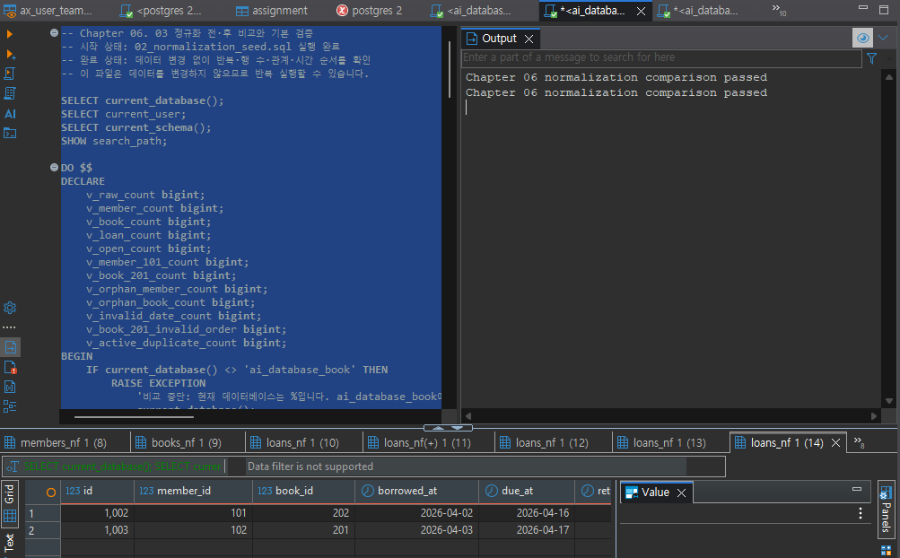
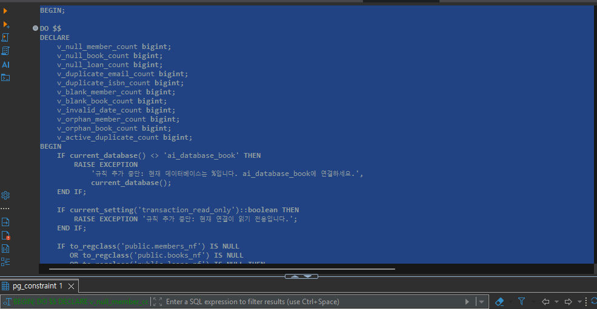
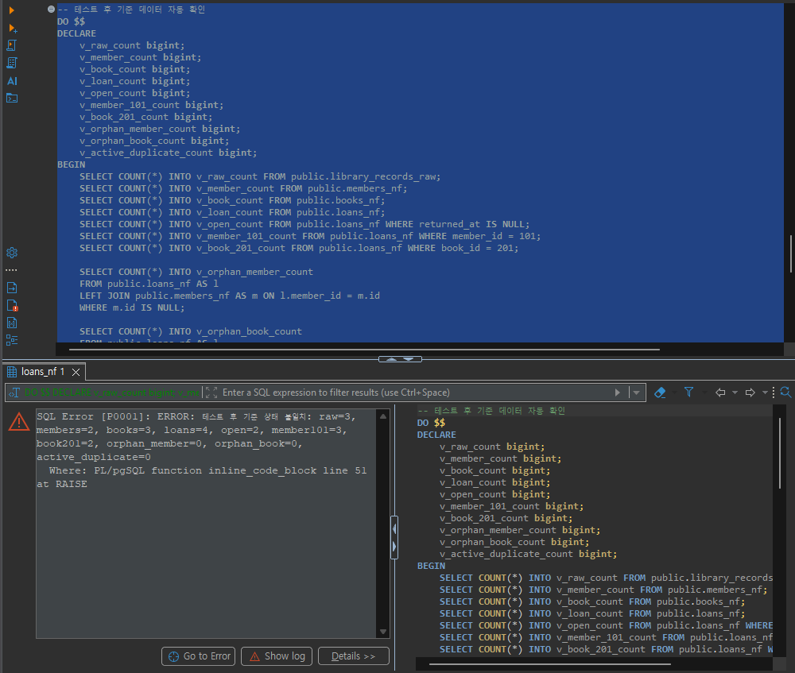
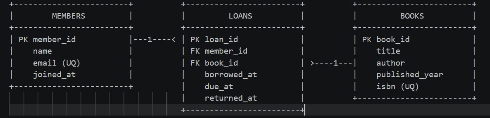

# Chapter 06 확장 실습 답안 템플릿

> **과제:** 정규화와 데이터 무결성으로 좋은 테이블 만들기  
> **사용 방법:** 이 파일을 내려받아 본인의 GitHub 저장소에 `chapter06_answer.md`라는 이름으로 저장한 뒤 실습하면서 바로 작성합니다.  
> **제출 방법:** LMS에는 파일을 직접 업로드하지 않고, **본인 GitHub 저장소의 `chapter06_answer.md` 파일 URL**을 제출합니다.

---

## 제출 전 주의

이 파일과 캡처 화면에는 실제 비밀번호, 전체 DB 접속 URL, API Key, 개인정보를 기록하지 않습니다.

```text
GitHub 계정 또는 별칭: koreajjangboy
과제 작성일: 2026-09-15
사용한 AI 도구: Gemini
```

---

# 1. 실습 환경과 시작 상태 확인

다음을 실행합니다.

```sql
SELECT current_database();
SELECT current_user;
SELECT current_schema();
SHOW search_path;
SHOW transaction_read_only;
```

| 확인 항목 | 실제 결과 | 의미 |
| --- | --- | --- |
| `current_database()` | ai_database_book | 연결된 DB |
| `current_user` | postgres | 사용자 |
| `current_schema()` | public | 스키마 |
| `search_path` | "$user", public | 조회 우선순위 |
| `transaction_read_only` | off | 트랜잭션 읽기쓰기 가능 |

- [x] 현재 DB가 `ai_database_book`이다.
- [x] 변경 가능한 연결인지 확인했다.
- [x] Auto-commit 상태를 확인했다.
- [x] Chapter 06 번호형 SQL 파일을 사용한다.

---

# 2. 정규화 전 큰 테이블의 문제 찾기

본문의 `library_records_raw` 구조를 기준으로 생각합니다.

```text
library_records_raw 한 행
→ 대여 사건 한 건이지만 회원·도서의 현재 사실까지 함께 저장된 구조
```

## 2-1. 위험한 중복과 의미 있는 반복 구분

| 반복되는 값/상황 | 위험한 중복 / 의미 있는 반복 | 판단 이유 |
| --- | --- | --- |
| 회원 이메일이 여러 대여 행에 반복 | 위험한 중복 | 동일 회원의 정보가 여러 행에 중복 저장 |
| 도서 제목이 여러 대여 행에 반복 | 위험한 중복 | 도서 정보가 대여 기록마다 반복 저장 |
| `loans_nf.member_id = 101` 반복 | 의미 있는 반복 | 1:N 관계를 표현하기 위해 외래키 사용 |
| 사건 당시 가격 같은 이력값 반복 | 의미 있는 반복 | 각 사건마다 독립적으로 기록 |

## 2-2. 이상 현상 설명

### 삽입 이상

```text
아직 한 번도 대여되지 않은 새 도서를 등록하려 할 때 생기는 문제: 대여 기록 없이는 새 도서만 단독으로 등록할 수 없음
```

### 수정 이상

```text
회원 이메일이 변경될 때 생기는 문제: 모든 행의 이메일을 빠짐없이 수정하지 않으면 데이터 불일치
```

### 삭제 이상

```text
마지막 대여 기록을 삭제할 때 생길 수 있는 문제: 함께 저장되어 있던 회원이나 도서의 기본 정보까지 통째로 사라져버려 원본 데이터가 유실
```

### 왜 이것이 SQL 문법 문제가 아니라 구조 문제인가요?

```text
데이터베이스를 설계할 때 연관된 데이터를 거대한 테이블로 뭉쳐놓았기 때문에 발생하는 구조적 한계
```

---

# 3. 1NF·2NF·3NF 핵심 질문 복습

정규형 이름만 외우지 말고 **왜 분리하는지** 설명합니다.

## 3-1. 제1정규형(1NF)

```text
한 셀에 쉼표로 여러 독립 값을 넣거나 book1/book2/book3처럼 반복 열을 만들면 왜 문제가 되는가:
데이터 조회가 매우 복잡해지고, 특정 값만 검색하거나 수정, 집계(COUNT, SUM 등)할 때 SQL문이 비효율적이거나 불가능해지며, 반복 열의 개수가 고정되는 한계가 생김
```

내 서비스에서 비슷한 위험이 있는 예:
한 사용자의 관심 태그를 'tag1, tag2, tag3' 형태로 하나의 컬럼에 쉼표로 묶어 저장하거나, 최근 본 상품 5개를 고정 컬럼(item1 ~ item5)으로 관리하는 경우
```text

```

## 3-2. 제2정규형(2NF)

다음 관계를 설명합니다.

```text
(student_id, course_id) → grade
student_id → student_name
course_id → course_name
```

```text
복합키 전체가 아니라 일부에만 의존하는 열을 분리해야 하는 이유: 학생 정보가 바뀔 때 여러 행을 중복 수정해야 하기 때문
```

## 3-3. 제3정규형(3NF)

```text
member_id → zip_code
zip_code → city
```

```text
일반 열이 다른 일반 열을 결정하는 구조를 검토해야 하는 이유: 우편번호에 해당하는 도시 이름이 바뀔 때 해당 우편번호를 가진 모든 회원의 행을 찾아 수정
```

### 정규화는 값이 반복되기만 하면 무조건 분리하는 것인가요?

```text
종속성과 이상 현상 발생 여부를 기준으로 판단
```

---

# 4. 각 열의 '사실의 주인' 찾기

| 열 | 어떤 사실을 설명하는가 | 주인 테이블 | 이유 |
| --- | --- | --- | --- |
| `member_name` | 회원의 이름 | members_nf | 회원의 속성 |
| `member_email` | 이메일 주소 | members_nf | 회원의 속성 |
| `book_title` | 책 제목 | books_nf | 책의 속성 |
| `author` | 저자 이름 | books_nf | 책의 속성 |
| `borrowed_at` | 빌린 시간 | loans_nf | 대여하는 사건의 시점을 기록 |
| `due_at` | 반납 기한 | loans_nf | 대여에 대해 개별적으로 부여 |
| `returned_at` | 반납 시간 | loans_nf | 대여 사건의 종료 |
| `member_id` | 회원 ID | loans_nf | 대여자에 대한 FK 참조 |
| `book_id` | 책 ID | loans_nf | 책의 FK 참조 |

정규화 후 한 행의 의미:

```text
members_nf 한 행 = 서비스에 가입한 고유한 회원 한 명의 정보
books_nf 한 행 = 도서관에 등록된 고유한 도서 한 권의 정보
loans_nf 한 행 = 회원이 도서 책 한 권을 대여 한 기록
```

### 현재 사실과 사건 당시 이력을 구분하는 기준

```text
- 현재 사실(Current Fact): 대상(회원, 도서 등)의 속성이 변경되면 최신 상태로 덮어씌워져야 하는 정보 (예: 회원의 현재 이메일, 도서의 현재 가격 등)
- 사건 당시 이력(Historical Fact): 특정 시점에 발생한 거래나 행위의 결과로, 대상의 속성이 나중에 변하더라도 과거 기록은 절대 바뀌지 않고 고정되어야 하는 정보 (예: 대여일, 주문 당시의 상품 가격 및 배송 주소 등)
```

---

# 5. PostgreSQL로 정규화 전·후 구조 재현

Public 저장소의 다음 파일을 순서대로 사용합니다.

```text
code/chapter06/01_normalization_schema.sql
code/chapter06/02_normalization_seed.sql
code/chapter06/03_normalization_compare.sql
```

## 5-1. `01_normalization_schema.sql`

실행 전 예상:

```text
생성될 테이블 수: 4
각 테이블 예상 행 수: 0
```

실행 후:

```text
실제로 생성된 테이블: 4
각 테이블 실제 행 수: 0
```

## 5-2. `02_normalization_seed.sql`

실행 전 예상 기준:

```text
raw = 3
members = 2
books = 2
loans = 3
미반납 = 2
회원 101 대여 = 2
도서 201 대여 = 2
```

실제 결과:

```text
raw: 3
members: 2
books: 2
loans: 3
미반납: 2
회원 101 대여: 2
도서 201 대여: 2
```

예상과 다른 값이 있다면 이유: 예상과 다른 값은 없었습니다

```text

```

## 5-3. `03_normalization_compare.sql`

```text
검증 메시지: Chapter 06 normalization comparison passed
PASS / FAIL: PASS
```

다음 항목을 확인합니다.

```text
회원 고아 참조: 0
도서 고아 참조: 0
날짜 순서 오류: 0
활성 대여 중복: 0
```

### 정규화 후에도 JOIN으로 원래 업무 정보를 다시 볼 수 있는 이유

```text
각 테이블간에 연결된 PK와 FK를 통해 JOIN 하여 정보를 확인할 수 있기 때문
```

### 증거 화면

권장 경로:

```text
assignments/chapter06/images/step05_normalization.png
```

`여기에 정규화 전후 및 검증 결과 화면을 삽입하세요.`

---

# 6. Chapter 06에서 확정한 C-01~C-08 정책 해석

| ID | 확정 규칙 | 구현 방법 | 왜 필요한가 | Chapter 05에서는 왜 미확정이었나 |
| --- | --- | --- | --- | --- |
| C-01 | 이메일 문자열 중복 금지 | `UNIQUE` | 이메일 중복 방지 | 고유성을 보장할 수 있는 기준이 없음 |
| C-02 | ISBN 필수·중복 금지 | `NOT NULL + UNIQUE` | 책을 고유하게 식별 | 도서 단위의 제약을 걸 수 없음 |
| C-03 | 이름·제목 공백 금지 | `CHECK` | 데이터 품질 저하 방지 | 구조 및 규칙이 정립되기 전 |
| C-04 | `due_at >= borrowed_at` | `CHECK` | 시간적 모순 데이터 입력 차단 | 규칙에 대한 기준 확립 전 |
| C-05 | `returned_at`은 NULL 또는 대여일 이상 | `CHECK` | 시간적 모순 데이터 입력 차단 | 규칙에 대한 기준 확립 전 |
| C-06 | 존재하는 회원·도서만 참조 | `FOREIGN KEY` | 고아데이터 방지 | 테이블이 하나로 되어 있어서 |
| C-07 | 대여 이력이 있는 부모 삭제 금지 | `ON DELETE RESTRICT` | 데이터 신뢰성 확보 | 참조 무결성 정책 수립 전 |
| C-08 | 도서당 미반납 대여 최대 한 건 | 부분 고유 인덱스 | 중복 대여 방지 | 데이터 구조 정규화 전 |

### 확정되지 않은 정책을 제약조건으로 먼저 만들면 위험한 이유

```text
구조나 정책 변경이 반복되면서 시스템 장애나 예외가 발생할 수 있기 때문
```

---

# 7. 기존 데이터 검사 후 무결성 규칙 적용

실행 파일: /04_add_integrity_rules.sql

```text
code/chapter06/04_add_integrity_rules.sql
```

## 7-1. 규칙을 추가하기 전에 기존 데이터를 먼저 검사해야 하는 이유

```text
사전에 기존 데이터를 검사하고 정제해야 안전하게 무결성 규칙을 적용
```

## 7-2. 실행 결과

```text
명명된 제약조건 개수: 8
NOT NULL 적용 열 개수: 10 
부분 고유 인덱스 존재 여부: 정상생성 됨
COMMIT 성공 여부: SUCCESS
```

### 메타데이터를 확인하는 이유

```text
현재 세션이 제대로 연결되어 있는지 확인이 필요
```

### 증거 화면

권장 경로:

```text
assignments/chapter06/images/step07_constraints.png
```

`여기에 제약조건/인덱스 적용 확인 화면을 삽입하세요.`

---

# 8. 정상·경계·실패 테스트

실행 파일: /05_integrity_tests.sql

```text
code/chapter06/05_integrity_tests.sql
```

> **중요:** 오류 테스트는 한 번에 하나씩 실행하고, 각 테스트가 끝난 뒤 기준 데이터가 유지되는지 확인합니다.

## 8-1. 허용되어야 하는 경계값

최소 3개를 실행·관찰합니다.

| 테스트 | 예상 | 실제 | 왜 허용되어야 하는가 |
| --- | --- | --- | --- |
| `due_at = borrowed_at` | 성공 | 성공 | 당일 대여 당일 반납 |
| `returned_at = borrowed_at` | 성공 | 성공 | 당일 대여 당일 반납 |
| `returned_at = NULL` | 성공 | 성공 | 대여 중인 상태 |
| `published_year = NULL` | 성공 | 성공 | 출판년도 미상 도서 |
| 공백이 아닌 한 글자 이름 | 성공 | 성공 | 이름이 한글자도 가능 |

## 8-2. 실패해야 하는 오류값

최소 6개를 실행합니다.

| 오류 테스트 | 기대 규칙 | 실제 결과 | 오류 메시지 핵심 | 실패해야 하는 이유 |
| --- | --- | --- | --- | --- |
| 필수값 NULL | `NOT NULL` | 실패 | not-null constraint | 이름이 null일 수 없음 |
| ISBN NULL | `NOT NULL` | 실패 | not-null constraint | ISBN이 null일 수 없음 |
| 이메일 중복 | `UNIQUE` | 실패 | unique constraint | 이메일 중복될 수 없음 |
| ISBN 중복 | `UNIQUE` | 실패 | unique constraint | ISBN이 중복될 수 없음 |
| 공백 이름/제목 | `CHECK` | 실패 | chk_members_nf_name_not_blank | 이름이 빈 칸일 수 없음 |
| 존재하지 않는 회원 | `FOREIGN KEY` | 실패 | foreign key constraint | member_id가 없음 |
| 존재하지 않는 도서 | `FOREIGN KEY` | 실패 | foreign key constraint | book_id가 없음 |
| 날짜 순서 위반 | `CHECK` | 실패 | violates check constraint | due_at이 borrowed_at 보다 앞설 수 없음 |
| 두 번째 미반납 대여 | 부분 고유 인덱스 | 실패 | unique constraint | 같은 도서가 미반납 일 수 없음 |
| 참조 중 부모 삭제 | `RESTRICT/FK` | 실패 | foreign key constraint | FK로 참조 중인 레코드를 삭제 할 수 없음 |

## 8-3. 테스트 후 기준 상태 재검증

```text
raw: 3
members: 2
books: 3
loans: 4
미반납: 2
회원 고아 참조: 0
도서 고아 참조: 0
활성 대여 중복: 0
```

### 실패 테스트 후 기준 데이터가 유지되어야 하는 이유

```text
무결성 제약조건 위반시 DB에 반영되지 않음
```

### 증거 화면

권장 경로:

```text
assignments/chapter06/images/step08_integrity_error.png
```

`여기에 대표 실패 테스트와 오류 메시지 화면을 삽입하세요.`

---

# 9. 정규화와 무결성 제약조건 역할 비교

| 질문 | 나의 설명 |
| --- | --- |
| 정규화가 해결하는 문제 | 데이터 불일치 및 저장 공간 낭비 해소 |
| `NOT NULL`이 해결하는 문제 | 부실한 데이터가 저장 방지 |
| `UNIQUE`가 해결하는 문제 | 고유값을 통한 객체 식별 |
| `CHECK`가 해결하는 문제 | 규칙 위반 금지 |
| `FOREIGN KEY`가 해결하는 문제 | 참조 무결성 유지 |
| 부분 고유 인덱스가 해결하는 문제 | 논리적 문제 해결 |

### 정규화만 잘하면 잘못된 데이터가 모두 차단되나요?

```text
아니오
```

### 제약조건만 많이 넣으면 나쁜 구조가 좋은 구조가 되나요?

```text
아니오
```

---

# 10. Chapter 05 개인 ERD 개선

Chapter 05에서 만든 개인 서비스 ERD를 다시 엽니다.

## 10-1. 수정 전 점검

- [x] 같은 현재 사실을 여러 테이블에 복사한 부분이 있는가?
- [x] 한 셀에 여러 독립 값을 넣으려 한 부분이 있는가?
- [x] 사건과 현재 상태가 한 테이블에 섞였는가?
- [x] 복합키 일부에만 의존하는 속성이 있는가?
- [x] 일반 열이 다른 일반 열을 결정하는 부분이 있는가?
- [x] 확정 업무 규칙인데 DB가 막지 못하는 부분이 있는가?
- [x] 아직 미확정인데 제약조건으로 너무 강하게 정한 부분이 있는가?

## 10-2. 수정 전·후 비교

| 항목 | 수정 전 | 수정 후 | 변경 근거 | 관련 요구사항 ID |
| --- | --- | --- | --- | --- |
| 회원·도서 정보 관리 | 반복 저장됨 | 각 고유 사실을 1회만 저장 | 중복 제거 | P06-C01, P06-C02 |
| 대여 제어 및 상태 관리 | 미반납 도서 제어가 어려움 | 도서별 미반납 상태 | 미반납 대여 건수 제한 | P06-C04 |
| 데이터 무결성 보장 | 제약조건 적용이 힘든 구조 | 강력한 제약 적용 | 고아 데이터 원천 차단 | P06-C05 |

## 10-3. 개인 프로젝트 무결성 규칙 후보

| 규칙 ID | 업무 규칙 | 제약조건 후보 | 확정 / 미확정 | 근거 |
| --- | --- | --- | --- | --- |
| P06-C01 | 이메일은 중복될 수 없음 | UNIQUE | 확정 | 회원 식별 및 연락 오류 방지 |
| P06-C02 | ISBN은 필수이며 중복될 수 없음 | NOT NULL + UNIQUE | 확정 | 도서의 고유성 및 정확한 식별 보장 |
| P06-C03 | 대여 기한은 대여일과 같거나 이후여야 함 | CHECK (due_at >= borrowed_at) | 확정 | 시간적 논리 모순 방지 |
| P06-C04 | 미반납 대여는 최대 1건만 허용 | WHERE returned_at IS NULL | 확정 | 중복 대여 사고 방지 |
| P06-C05 | 대여 기록이 존재하는 회원은 임의 삭제 불가 | ON DELETE RESTRICT | 확정 | 대여 이력의 신뢰성 유지를 위함 |

> 미확정 규칙은 `확인 필요`로 남겨도 됩니다. 억지로 제약조건을 만들지 않습니다.

## 10-4. 수정한 ERD

권장 이미지 경로:

```text
assignments/chapter06/images/step10_my_erd_after.png
```

`여기에 수정한 개인 ERD 이미지를 삽입하세요.`

---

# 11. AI를 정규화·무결성 리뷰어로 활용

## 11-1. 내가 먼저 작성한 구조와 규칙

```text
내 서비스: 도서 대여 서비스
검토할 테이블: members, books, loans
한 행의 의미:
 - members: 가입한 회원 한 명의 고유 정보
 - books: 도서관에 등록된 도서 한 권의 고유 정보
 - loans: 회원이 도서를 빌리고 반납하는 대여 사건 한 건의 기록
중복으로 의심되는 열:없음
확정 업무 규칙: 이메일 고유성(P06-C01), ISBN 고유성(P06-C02), 대여 기간 순서 검증(P06-C03), 외래키 참조 무결성 및 삭제 제한(P06-C05), 동시 중복 대여 방지(P06-C04)
미확정 정책: 휴면 회원 전환 정책, 장기 연체 시 자동 제재 여부
```

## 11-2. AI에게 전달한 핵심 프롬프트

```text
당신은는 초급 데이터베이스 관리자입니다. 
우리가 설계한 도서 대여 서비스의 정규화 상태와 무결성 제약조건을 검토해 주세요.
```

## 11-3. AI 제안 검토

| AI 제안 | 수용 / 수정 / 보류 / 거절 | 요구사항 근거 | 실제 검증 방법 | 나의 판단 |
| --- | --- | --- | --- | --- |
| ON DELETE CASCADE | 거절 | 대여 이력의 신뢰성 유지 | 삭제 테스트 | 대여 기록이 있는 회원 데이터 유지 |
| 반납일이 없는 경우를 위한 별도 상태 테이블 분리 | 거절 | 불필요한 조인 증가 및 복잡성 상승 | 쿼리 성능 및 구조 단순성 확인 | NULL을 허용하는 형태가 더 직관적 |
| 연체 횟수 누적 컬럼 추가 | 보류 | 아직 연체 정책이 기획되지 않음 | 비즈니스 요구사항 문서 대조 | 제약조건을 걸지 않고 추후 검토 |
|  |  |  |  |  |

특히 AI가 다음을 제안했다면 근거를 다시 확인합니다.

```text
UNIQUE
NOT NULL
CHECK
ON DELETE CASCADE
ON DELETE RESTRICT
새로운 테이블 분리
```

### AI가 단순히 값이 반복된다는 이유만으로 분리를 제안한 부분이 있었나요?

```text
아니오
```

### AI가 미확정 정책을 확정 규칙처럼 만든 부분이 있었나요?

```text
아니오. 제안만 있었습니다.
```

---

# 12. 최종 성찰

아래 문장은 본인의 말로 작성합니다.

```text
1. 정규화에서 가장 중요한 질문은
   어느 테이블의 속성으로 볼 것 인가 이다.

2. 위험한 중복과 의미 있는 반복의 차이는
   필요에 따라 다르다 이다.

3. 정규화와 제약조건의 역할이 다른 이유는
   데이터의 구조적인 부분과 무결성에 대한 부분 이다.

4. 실패해야 하는 SQL을 일부러 실행해 보는 이유는
   비정상적인 데이터를 제대로 차단하는지 확인하기 위해서 이다.

5. AI가 제안한 UNIQUE/CHECK/FK를 그대로 적용하면 안 되는 이유는
   사용자의 불편을 가중할 수 있기 때문 이다.
```

---

# 13. 제출 체크리스트

- [x] `chapter06_answer.md`를 본인 저장소에 만들었다.
- [x] 위험한 중복과 의미 있는 반복을 구분했다.
- [x] 삽입·수정·삭제 이상을 설명했다.
- [ ] 1NF·2NF·3NF 핵심 질문을 자신의 말로 설명했다.
- [x] 열의 사실의 주인을 분류했다.
- [x] `01_normalization_schema.sql`을 실행했다.
- [x] `02_normalization_seed.sql` 기준 상태를 확인했다.
- [x] `03_normalization_compare.sql` 검증 결과를 확인했다.
- [x] C-01~C-08의 업무 근거를 설명했다.
- [x] `04_add_integrity_rules.sql`로 규칙을 적용했다.
- [x] 허용 경계값을 최소 3개 확인했다.
- [x] 실패 테스트를 최소 6개 한 번에 하나씩 실행했다.
- [x] 실패 후 기준 데이터가 유지되는지 확인했다.
- [x] Chapter 05 개인 ERD를 수정했다.
- [x] 개인 프로젝트 제약조건 후보를 확정/미확정으로 구분했다.
- [x] AI 제안을 요구사항 근거와 실행 결과로 검토했다.
- [x] 핵심 화면 3~4장만 첨부했다.
- [x] 캡처에 비밀번호나 개인정보가 없다.
- [x] GitHub에서 Markdown 이미지가 정상적으로 보인다.
- [x] 최종 답안을 commit/push했다.

---

# 14. LMS 제출 URL

아래 형식의 **본인 GitHub 파일 URL**을 LMS에 제출합니다.

```text
https://github.com/<본인-GitHub-ID>/<본인-저장소>/blob/main/assignments/chapter06/chapter06_answer.md
```

내 제출 URL:

```text

```

> 저장소 메인 URL, 교수자 템플릿 URL, Raw URL이 아니라 **작성 완료된 본인 `chapter06_answer.md` 파일 화면 URL**을 제출합니다.
