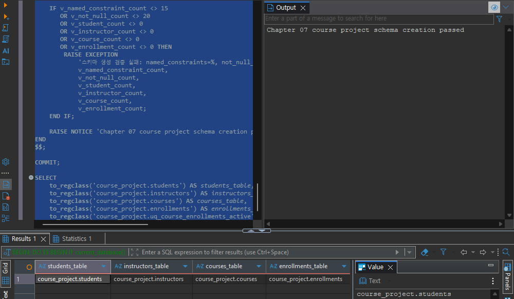
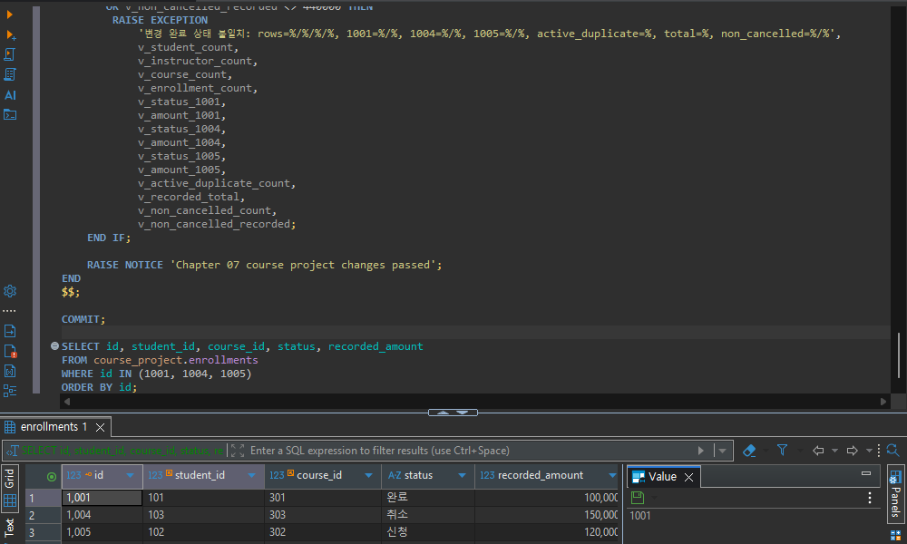
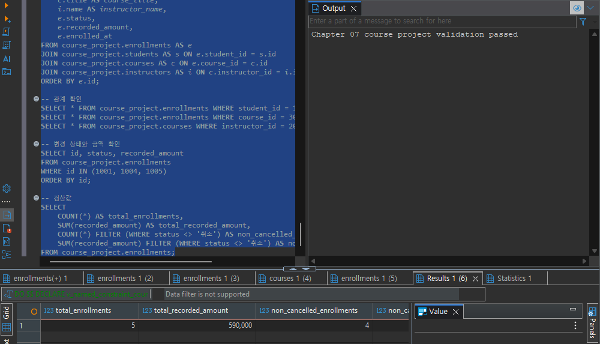
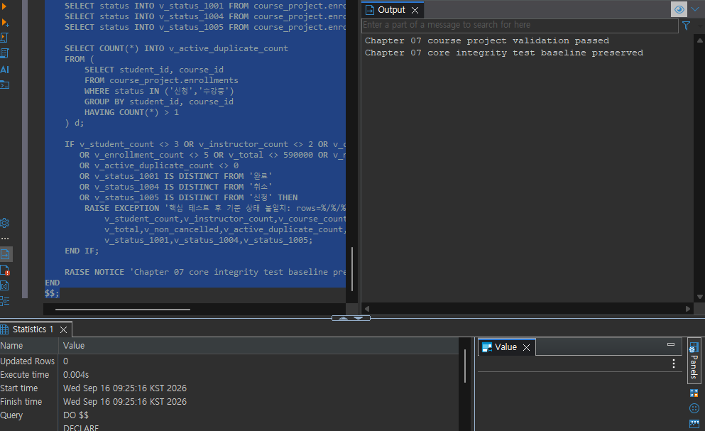
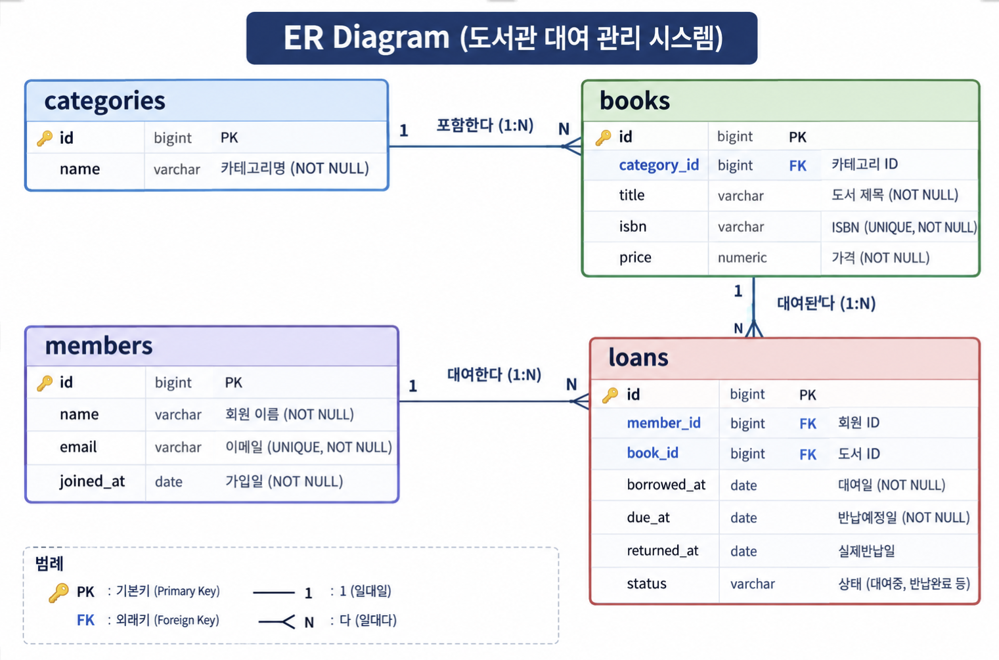

# Chapter 07 확장 실습 답안 템플릿

> **과제:** 실전 프로젝트 1 — 온라인 강의 수강신청 DB 완성하기  
> **사용 방법:** 이 파일을 내려받아 본인의 GitHub 저장소에 `chapter07_answer.md`라는 이름으로 저장한 뒤 실습하면서 바로 작성합니다.  
> **제출 방법:** LMS에는 파일을 직접 업로드하지 않고, **본인 GitHub 저장소의 `chapter07_answer.md` 파일 URL**을 제출합니다.

---

## 제출 전 주의

이 파일과 캡처 화면에는 실제 비밀번호, 전체 DB 접속 URL, API Key, 개인정보를 기록하지 않습니다.

```text
GitHub 계정 또는 별칭: koreajjangboy
과제 작성일: 2026-09-16
사용한 AI 도구: gemini
```

---

# 1. 시작 환경 확인

다음을 실행합니다.

```sql
SELECT current_database();
SELECT current_user;
SELECT current_schema();
SHOW search_path;
SHOW transaction_read_only;
```

| 확인 항목 | 실제 결과 | 의미 |
| --- | --- | --- |
| `current_database()` | ai_database_book | 연결된 DB |
| `current_user` | postgres | 사용자 |
| `current_schema()` | public | 스키마 |
| `search_path` | "$user", public | 조회 우선순위 |
| `transaction_read_only` | off | 트랜잭션 읽기쓰기 가능 |

- [x] 현재 DB가 `ai_database_book`이다.
- [x] 변경 가능한 연결인지 확인했다.
- [x] 실행할 SQL 범위를 확인했다.
- [x] Auto-commit 상태를 확인했다.

### 변경 SQL을 실행하기 전에 현재 DB와 실행 범위를 확인해야 하는 이유

```text
내가 하려는 작업과 해당 위치가 맞는지 확인하여 실수를 방지하기 위해
```

---

# 2. 프로젝트 범위와 요구사항 읽기

## 2-1. 포함 범위

본문을 그대로 복사하지 말고 자신의 말로 정리합니다.

```text
1. 학생, 강사, 강의, 수강신청 테이블을 생성한다
2. 신청 상태는 수강신청 테이블의 속성으로 한다. 
3. 강의 기준 가격은 강의 테이블의 속성으로 한다.
4. 신청 당시 기록 금액은 신청 상태의 속성으로 한다.
```

## 2-2. 제외 범위

```text
1. 실제 결제 승인·실패·환불에 대해서는 제외한다.
2. 강의 정원·대기열에 대한 부분은 제외한다.
3. 전체 상태 변경이력에 대한 내용은 제외한다.
4. 진도·수료·콘텐츠에 대한 내용은 제외한다.
5. 쿠폰·할인 이력에 대해서는 제외한다.
```

### 범위를 명확하게 정해야 하는 이유

```text
범위를 명확히 해야 구현할 범위를 정할 수 있기 때문
```

## 2-3. 요구사항 / 프로젝트 결정 / 미확정 질문 구분

아래 항목 중 대표 항목을 정리합니다.

| ID | 종류 | 내용 요약 | DB 구조/규칙에 미치는 영향 |
| --- | --- | --- | --- |
| P07-R01 | 요구사항 | 학생 및 강사, 강의, 수강신청 핵심 엔티티(테이블) 구성 | course_project 스키마 내 4개 기본 테이블 생성 및 외래키(FK) 관계 설정 필요 |
| P07-R05 | 요구사항 | 강의의 기준 가격과 수강신청 시점의 실제 결제(기록) 금액 분리 관리 | courses에 기준 가격 컬럼, enrollments에 신청 당시 기록 금액 컬럼 각각 배치 |
| P07-R07 | 요구사항 | 수강신청 시점의 상태(신청/수강중/완료/취소 등) 속성 필수 관리 | enrollments 테이블에 상태값 컬럼(status)을 두어 진행 단계 추적 |
| P07-D02 | 프로젝트 결정 | 이번 버전에서는 복잡한 결제 연동 및 쿠폰·할인 정책 제외 | payments나 discounts 테이블 생략 및 관련 제약조건 미적용으로 단순화 |
| P07-D03 | 프로젝트 결정 | 동일 강의에 대한 진행 중(신청/수강중) 중복 수강신청 허용 안 함 | 학생 ID와 강의 ID 조합에 대한 유니크(Unique) 제약 또는 상태 조건부 복합 인덱스 고려 |
| P07-Q01 | 미확정 질문 | 학생과 강사 간의 이메일 주소를 전역적으로 고유하게(Global Unique) 제한 | students와 instructors가 별도 테이블이므로 DB 레벨의 단일 UNIQUE 제약 적용 불가 |

### 미확정 질문을 바로 제약조건으로 만들면 안 되는 이유

```text
비즈니스 정책이나 요구사항이 명확하게 합의된 이후에 진행해야하기 때문
```

---

# 3. 네 테이블의 한 행 의미와 관계

## 3-1. 한 행 의미

```text
course_project.students 한 행 = 시스템에 등록된 학생 한 명의 개인 정보 및 식별 데이터

course_project.instructors 한 행 = 시스템에 등록된 강사 한 명의 정보 및 담당 강의 개설 자격을 가진 주체

course_project.courses 한 행 = 강사가 개설하여 운영하는 강의 한 개에 대한 정보 (기준 가격, 강의명 등 포함)

course_project.enrollments 한 행 = 특정 학생이 특정 강의를 대상으로 발생시킨 '수강신청' 사건 한 건 (신청 시점, 상태, 기록 금액 포함)
```

## 3-2. 키와 중요 규칙

| 테이블 | PK | FK | 중요 규칙 |
| --- | --- | --- | --- |
| students | student_id |  | 이메일 유일성(UNIQUE) 보장 |
| instructors | instructor_id |  | 이메일 유일성(UNIQUE) 보장 |
| courses | course_id | instructor_id | 기준 가격(price) 필수 설정, 담당 강사 지정 |
| enrollments | enrollment_id | student_id, course_id | 신청 상태(status), 신청 시각(enrolled_at), 당시 기록 금액(recorded_amount) 관리 |

## 3-3. 관계를 양방향 문장으로 작성

```text
instructors ↔ courses:
한 명의 강사는 여러 개의 강의를 개설할 수 있고(1:N), 하나의 강의는 정확히 한 명의 담당 강사를 가집니다(N:1).

students ↔ enrollments:
한 명의 학생은 여러 건의 수강신청을 할 수 있고(1:N), 하나의 수강신청 사건은 정확히 한 명의 학생에 의해 이루어집니다(N:1).

courses ↔ enrollments:
하나의 강의는 여러 건의 수강신청을 받을 수 있고(1:N), 하나의 수강신청 사건은 정확히 하나의 강의를 대상으로 합니다(N:1).
```

### 학생과 강의의 N:M 관계가 `enrollments`를 통해 어떻게 바뀌는지 설명

```text
N:M 관계를 수강신청 테이블을 통해 [학생 1 : N 수강신청]과 [강의 1 : N 수강신청]이라는 두 개의 1:N 관계로 처리
```

### `enrollments`가 단순 연결 테이블이 아니라 사건 테이블이라고 볼 수 있는 이유

```text
수강 신청하는 사건이 발생되는 순간 레코드가 생성되어 당시의 기준을 보존해야하기 때문
```

---

# 4. `recorded_amount`의 의미 이해

```text
courses.price = 현재 기준이 되는 가격으로 향후 가격이 변경될 때 수정될 수 있는 속성

enrollments.recorded_amount = 특정 학생이 수강신청을 완료한 바로 그 시점의 금액을 해당 행에 고정하여 기록
```

### 두 값이 처음에는 같아도 같은 의미가 아닌 이유

```text
courses.price가 변경되는 경우 enrollments.recorded_amount는 변경되지 않아 다른 값을 가질 수 있기 때문
```

### `recorded_amount`를 실제 결제 성공액이나 회계 매출로 해석하면 안 되는 이유

```text
결재 유무나 환불 등에 따라 달라질 수 있기 때문
```

---

# 5. STEP 01 — 스키마와 테이블 생성

실행 파일:

```text
code/chapter07/01_course_project_schema.sql
```

## 5-1. 실행 전 예상

```text
course_project 스키마 존재 여부: 없음
예상 테이블 수: 4개
예상 데이터 행 수: 0개
예상되는 명명 제약조건 수: 15개
예상되는 NOT NULL 열 수: 20개
부분 고유 인덱스 존재 여부: 있음
```

## 5-2. 실행 결과

```text
실제 테이블 수: 4개
실제 명명 제약조건 수: 15개
실제 NOT NULL 열 수: 20개
부분 고유 인덱스: 있음
네 테이블의 실제 행 수: 0개
통과 메시지: Chapter 07 course project schema creation passed
```

### 예상과 실제 비교

```text
예상대로 실행
```

### 증거 화면

권장 경로:

```text
assignments/chapter07/images/step05_schema.png
```

`여기에 스키마/테이블 생성 검증 화면을 삽입하세요.`

---

# 6. STEP 02 — Seed 데이터 입력

실행 파일:

```text
code/chapter07/02_course_project_seed.sql
```

## 6-1. 실행 전 예상

```text
students: 3명
instructors: 2명
courses: 3과목
enrollments: 4건
recorded_amount 합계: 470000원
학생 101 신청 건수: 2건
강의 301 신청 건수: 2건
강사 201 담당 강의 수: 2과목
활성 중복 신청: 0
```

## 6-2. 실제 결과

```text
students: 3
instructors: 2
courses: 3
enrollments: 4
recorded_amount 합계: 470000
학생 101 신청 건수: 2
강의 301 신청 건수: 2
강사 201 담당 강의 수: 2
활성 중복 신청: 0
1001 상태: 수강중
1004 상태: 신청
1005 존재 여부: 없음
통과 메시지: Chapter 07 course project seed passed
```

### Seed 데이터를 단순 예제가 아니라 검증 데이터라고 볼 수 있는 이유

```text
제약 조건이 제대로 동작하는지 확인된 테스트 케이스 이기 때문
```

---

# 7. STEP 03 — 변경 시나리오 실행

실행 파일:

```text
code/chapter07/03_course_project_changes.sql
```

## 7-1. 실행 전에 상태 변화를 예상

| 신청 ID | 변경 전 예상 상태 | 변경 후 예상 상태 | 예상 recorded_amount |
| ---: | --- | --- | ---: |
| 1001 | 수강중 | 완료 | 100000 |
| 1004 | 신청 | 취소 | 150000 |
| 1005 | 없음 | 신청 | 120000 |

```text
변경 후 예상 enrollments 행 수: 5건
변경 후 예상 전체 recorded_amount 합계: 590000원
변경 후 예상 취소 제외 건수: 4건
변경 후 예상 취소 제외 recorded_amount 합계: 440000원
```

## 7-2. 실제 결과

```text
1001 상태 / recorded_amount: 완료 / 100000
1004 상태 / recorded_amount: 취소 / 150000
1005 상태 / recorded_amount: 신청 / 120000
최종 enrollments 행 수: 5
전체 recorded_amount 합계: 590000
취소 제외 건수: 4
취소 제외 recorded_amount 합계: 440000
활성 중복 신청: 0
통과 메시지: Chapter 07 course project changes passed
```

### 조건부 UPDATE에서 예상 이전 상태를 확인해야 하는 이유

```text
예상치 못한 데이터 UPDATE를 방지하기 위해
```

### 증거 화면

권장 경로:

```text
assignments/chapter07/images/step07_changes.png
```

`여기에 주요 변경 전/후 결과를 삽입하세요.`

---

# 8. STEP 04 — 최종 완료 게이트 실행

실행 파일:

```text
code/chapter07/04_course_project_validation.sql
```

## 8-1. 최종 검증 결과

```text
최종 행 수 students/instructors/courses/enrollments: 3 / 2 / 3 / 5
서비스 JOIN 결과 행 수: 5
학생 101 신청 수: 2
강의 301 신청 수: 2
강사 201 강의 수: 2
고아 관계 수: 0 (학생/강의/강사 모두 고아 레코드 없음)
활성 중복 신청 수: 0
전체 recorded_amount: 590000
취소 제외 recorded_amount: 440000
통과 메시지: Chapter 07 course project validation passed
```

### SQL 파일 4개가 모두 실행되었다는 사실과 프로젝트 검증 PASS가 다른 이유

```text
제약 조건과 무결성 검증이 되지 않았을 수 있기 때문
```

### 증거 화면

권장 경로:

```text
assignments/chapter07/images/step08_validation.png
```

`여기에 최종 validation PASS 화면을 삽입하세요.`

---

# 9. 무결성 테스트

실행 파일:

```text
code/chapter07/05_course_project_integrity_tests.sql
```

> 오류 테스트는 파일 전체를 무작정 실행하지 않고 **한 테스트 구간씩** 실행합니다.

## 9-1. 허용되어야 하는 경계값 1개

```text
테스트 내용: 무료 강의(price=0, description=NULL) 개설 및 해당 강의에 대한 무료 신청(recorded_amount=0) 데이터 삽입 테스트
기대 결과: 에러 없이 정상적으로 INSERT가 수행되고 임시 행 삭제(DELETE)가 성공함
실제 결과: 정상적으로 실행 완료 및 제약조건 위반 없이 통과
왜 허용되어야 하는가: 
비즈니스 정책상 유료 강의뿐만 아니라 가격이 0원인 무료 강의와 무료 신청도 허용되어야 합니다. 
또한 `price >= 0` 및 `recorded_amount >= 0` 조건과 `NULL` 허용 설정을 두었으므로, 
경계값인 0원과 필수값이 아닌 필드의 NULL 입력이 데이터베이스 설계상 정상적으로 수용되는지 검증해야 합니다.
```

## 9-2. 실패해야 하는 테스트 1 — 잘못된 참조 또는 값

```text
테스트 내용: 이미 존재하는 학생 이메일('minji@example.com')을 가진 새로운 학생 레코드 삽입 시도
기대 결과: 유니크 제약조건 위반으로 인해 INSERT 실패
실제 오류 핵심: ERROR: duplicate key value violates unique constraint "uq_course_students_email"
동작한 제약조건/규칙: `uq_course_students_email` (UNIQUE 제약조건)
왜 허용되어야 하는가(실패해야 하는 이유): 
학생의 이메일은 시스템 내에서 개인을 식별하고 중복 가입을 막는 핵심 고유값이므로, 
동일한 이메일로 중복 등록되는 것을 원천 차단하여 데이터의 무결성을 유지해야 합니다.
```

## 9-3. 실패해야 하는 테스트 2 — 활성 중복 신청

```text
테스트 내용: 이미 '신청' 또는 '수강중' 상태인 활성 수강신청이 존재하는 학생-강의 조합(학생 101, 강의 302)에 대해 추가로 활성 상태('수강중')의 수강신청 삽입 시도
기대 결과: 부분 고유 인덱스 위반으로 인해 INSERT 실패
실제 오류 핵심: ERROR: duplicate key value violates unique constraint "uq_course_enrollments_active"
동작한 제약조건/규칙: `uq_course_enrollments_active` (WHERE status IN ('신청', '수강중') 조건이 걸린 부분 고유 인덱스)
왜 허용되어야 하는가(실패해야 하는 이유): 
프로젝트 정책(P07-D03)에 따라 동일한 강의에 대해 진행 중(신청/수강중)인 중복 수강신청은 허용되지 않습니다. 
일반 UNIQUE 제약은 취소된 건까지 막아버리므로, 활성 상태인 건에 대해서만 중복을 정확히 차단하는지 검증해야 합니다.
```

## 9-4. 실패 후 기준 상태 재검증

```text
04 validation 재실행 결과: Chapter 07 course project validation passed (에러 없이 통과)
기준 데이터가 유지되었는가: 예 (실패한 INSERT/DELETE 시도가 트랜잭션 롤백 또는 오류로 차단되어 기존 3/2/3/5 행 및 금액 상태가 완벽하게 보존됨)
```

### 실패 테스트가 프로젝트 품질 검증에 필요한 이유

```text
성공 케이스만 테스트하는 것은 시스템이 '정상적인 상황'에서만 동작하는지 보는 것일 뿐, 데이터베이스의 진정한 안전장치가 작동하는지 증명하지 못합니다. 
잘못된 데이터, 중복 신청, 무결성을 깨는 삭제 시도 등 '실패해야 마땅한 상황'에서 제약조건이 예외를 발생시키고 데이터를 안전하게 거부하는지 확인해야만, 
실제 서비스 환경에서 발생할 수 있는 잠재적 오작동과 데이터 오염으로부터 프로젝트의 품질과 신뢰성을 완벽하게 보장할 수 있습니다.
```

### 증거 화면

권장 경로:

```text
assignments/chapter07/images/step09_integrity.png
```

`여기에 대표 실패 테스트와 기준 상태 유지 결과를 삽입하세요.`

---

# 10. 재현성 실험

> 이 단계는 본인의 실습 환경이며 보존할 데이터가 없을 때만 수행합니다.

실행 순서:

```text
reset_course_project.sql
→ 01_course_project_schema.sql
→ 02_course_project_seed.sql
→ 03_course_project_changes.sql
→ 04_course_project_validation.sql
```

```text
처음 실행의 최종 결과: Chapter 07 course project reset passed
재실행의 최종 결과: 초기화할 course_project 스키마가 존재하지 않습니다. Chapter 07 course project reset passed
두 결과가 일치했는가: 일치
중간에 수동 수정이 필요했는가: 아니오
```

### 다른 사람이 같은 순서로 실행해 같은 결과를 얻는 것이 중요한 이유

```text
시스템의 설계가 일관되고 신뢰할 수 있기 때문
```

---

# 11. Chapter 01~06 개인 프로젝트를 중간 프로젝트 초안으로 확장

온라인 강의 예제를 이름만 바꾸지 않고 본인의 아이디어를 사용합니다.

## 11-1. 프로젝트 기본 정보

```text
프로젝트 이름: 도서 대여 서비스

해결하려는 문제: 회원이 도서를 검색하고 대여 및 반납할 수 있도록 도서와 회원, 대여 정보를 관리하기 위한 데이터 베이스다

주요 사용자: 도서 대여하는 사람들
```

## 11-2. 포함 범위 / 제외 범위

```text
[포함]
1. 회원 정보 관리 (가입, 이메일 고유성, 필수값 검증)
2. 도서 및 카테고리 정보 관리 (도서명, ISBN, 장르 분류)
3. 도서 대여 및 반납 사건 기록 (대여일, 반납예정일, 실제반납일, 상태)
4. 대여 무결성 및 동시 중복 대여 방지 규칙

[제외]
1. 연체료 계산 및 결제/환불 처리 시스템
2. 도서 예약 및 대기열 관리
3. 도서 리뷰 및 평점 시스템
4. 전자책(E-Book) 콘텐츠 파일 관리 및 스트리밍
```

## 11-3. 요구사항

최소 8개를 작성합니다.

| ID | 요구사항 | 관련 테이블/관계 | 검증 방법 후보 |
| --- | --- | --- | --- |
| P07-MR01 | 회원은 고유한 이메일과 이름을 가져야 한다. | members | UNIQUE 제약 및 NOT NULL 검증 |
| P07-MR02 | 도서는 고유한 ISBN과 제목을 가져야 한다. | books | ISBN UNIQUE 및 NOT NULL 검증 |
| P07-MR03 | 도서는 반드시 하나의 카테고리에 속해야 한다. | books ↔ categories | 외래키(FK) 및 NOT NULL 검증 |
| P07-MR04 | 대여 기록은 회원과 도서를 각각 참조해야 한다. | loans ↔ members, books | 외래키 제약 및 고아 데이터 조회 쿼리 |
| P07-MR05 | 대여 상태는 '대여중', '반납완료', '취소' 중 하나여야 한다. | loans | CHECK 제약조건 검증 |
| P07-MR06 | 반납예정일(due_at)은 대여일(borrowed_at)과 같거나 이후여야 한다. | loans | CHECK 제약조건 검증 |
| P07-MR07 | 대여 이력이 존재하는 회원은 임의로 삭제할 수 없다. | members ↔ loans | ON DELETE RESTRICT 테스트 |
| P07-MR08 | 동일한 도서에 대해 이미 '대여중'인 상태에서는 중복 대여할 수 없다. | loans | 부분 고유 인덱스 테스트 |

## 11-4. 프로젝트 결정

최소 3개를 작성합니다.

| ID | 이번 프로젝트에서 내린 결정 | 이유 | 구현 후보 |
| --- | --- | --- | --- |
| P07-MD01 | 연체료 및 결제 관련 기능은 이번 버전에서 제외 | 핵심 대여 및 반납 라이프사이클 설계에 집중하여 무결성 완성도를 높이기 위함 | 관련 테이블 생성 생략 |
| P07-MD02 | 도서 대여 시 '대여중' 상태인 도서에 대한 중복 대여를 DB 레벨에서 원천 차단 | 동시 대여 사고나 데이터 모순을 방지하기 위함 | WHERE status = '대여중' |
| P07-MD03 | 회원이 탈퇴할 때 기존 대여 이력이 존재하면 삭제를 제한 | 대여 이력의 신뢰성과 감사(Audit) 추적을 보장하기 위함 | ON DELETE RESTRICT |

## 11-5. 미확정 질문

최소 3개를 작성합니다.

```text
P07-MQ01. 한 회원이 동시에 대여할 수 있는 최대 도서 권수를 제한할 것인가?
P07-MQ02. 연체 발생 시 자동으로 연체 횟수를 누적하는 컬럼이나 트리거를 도입할 것인가?
P07-MQ03. 탈퇴한 회원의 개인 정보를 완전히 삭제할 것인가, 아니면 익명화 처리(Soft Delete)할 것인가?
```

---

# 12. 개인 프로젝트 ERD와 한 행 의미

## 12-1. 테이블 후보

최소 4개를 권장합니다.

| 테이블 | 한 행의 의미 | PK 후보 | FK 후보 | 주요 규칙 |
| --- | --- | --- | --- | --- |
| members | 도서관에 가입한 회원 한 명의 정보 | id | 없음 | 이메일 고유성, 이름 필수 |
| categories | 도서가 속한 장르 또는 카테고리 정보 | id | 없음 | 카테고리명 필수 |
| books | 도서관에 등록된 도서 한 권의 정보 | id | category_id | ISBN 고유성, 제목 필수 |
| loans | 회원이 도서를 빌리고 반납하는 대여 사건 한 건 | id | member_id, book_id | 상태값 제한, 대여일 순서 검증 |

## 12-2. 관계 문장

```text
1. categories ↔ books: 하나의 카테고리는 여러 도서를 가질 수 있고(1:N), 하나의 도서는 정확히 하나의 카테고리에 속합니다(N:1).
2. members ↔ loans: 한 명의 회원은 여러 건의 대여 기록을 가질 수 있고(1:N), 하나의 대여 기록은 정확히 한 명의 회원에 의해 발생합니다(N:1).
3. books ↔ loans: 하나의 도서는 여러 번 대여될 수 있고(1:N), 하나의 대여 기록은 정확히 하나의 도서와 연결됩니다(N:1).
```

## 12-3. ERD

권장 이미지 경로:

```text
assignments/chapter07/images/personal_project_erd.png
```

`여기에 본인의 ERD 이미지를 삽입하세요.`



### Chapter 05~06 ERD에서 이번에 바꾼 점

```text
- 도서 관리의 확장성과 분류 체계를 체계화하기 위해 기존 구조를 개선하여 `categories` 테이블을 독립시키고 정규화를 적용했습니다.
- 단순히 테이블을 연결하는 것을 넘어 `loans` 테이블에 대여 상태(`status`)와 날짜 정합성 검증 규칙을 부여해 '사건 테이블'의 성격을 명확히 했습니다.
- 활성 대여 상태에 대한 중복 방지 규칙을 데이터베이스 인덱스 수준에서 제어할 수 있도록 구조를 보완했습니다.
```

---

# 13. 개인 프로젝트 완료 기준 만들기

“잘 동작한다”처럼 모호하게 쓰지 말고 검증 가능한 기준을 최소 6개 작성합니다.

| 번호 | 완료 기준 | 자동 SQL 검증 가능? | 검증 방법 |
| ---: | --- | --- | --- |
| 1 | Seed 데이터 실행 후 각 테이블(members, categories, books, loans)의 행 수가 예상치와 정확히 일치한다. | 가능 | SELECT COUNT(*) 검증 쿼리 실행 |
| 2 | 존재하지 않는 부모 레코드를 참조하는 고아 데이터(Orphan Record)는 존재하지 않는다. | 가능 | LEFT JOIN 및 IS NULL 검증 쿼리 실행 |
| 3 | 허용되지 않은 대여 상태 값이나 음수 가격 등 잘못된 값은 DB 제약조건에 의해 거부된다. | 가능 | 예외 테스트 INSERT/UPDATE 실행 |
| 4 | 동일 도서에 대해 이미 '대여중'인 상태에서 추가 대여 시도 시 부분 인덱스에 의해 차단된다. | 가능 | 중복 대여 INSERT 테스트 및 에러 발생 확인 |
| 5 | 대여 이력이 존재하는 회원을 삭제하려고 할 때 RESTRICT 규칙에 의해 차단된다. | 가능 | DELETE 테스트 및 에러 발생 확인 |
| 6 | 최종 검증 스크립트가 모든 무결성 규칙을 통과하고 성공 메시지를 출력한다. | 가능 | 전체 검증 DO $$ 블록 실행 |

예시 형식:

```text
Seed 실행 후 A/B/C/D 테이블의 행 수가 각각 5/3/8/12다.
존재하지 않는 부모를 참조하는 행은 0건이다.
허용되지 않은 상태 입력은 DB가 거부한다.
검증 SQL이 예상 결과를 반환한다.
```

---

# 14. AI를 프로젝트 리뷰어로 사용

AI에게 프로젝트를 대신 완성시키지 않고 누락과 위험을 찾게 합니다.

## 14-1. AI에게 전달한 핵심 자료

```text
요구사항: DB 비지니스 정책과 규칙 등

테이블/ERD 설명:


프로젝트 결정:
| ID | 이번 프로젝트에서 내린 결정 | 이유 | 구현 후보 |
| --- | --- | --- | --- |
| P07-MD01 | 연체료 및 결제 관련 기능은 이번 버전에서 제외 | 핵심 대여 및 반납 라이프사이클 설계에 집중하여 무결성 완성도를 높이기 위함 | 관련 테이블 생성 생략 |
| P07-MD02 | 도서 대여 시 '대여중' 상태인 도서에 대한 중복 대여를 DB 레벨에서 원천 차단 | 동시 대여 사고나 데이터 모순을 방지하기 위함 | WHERE status = '대여중' |
| P07-MD03 | 회원이 탈퇴할 때 기존 대여 이력이 존재하면 삭제를 제한 | 대여 이력의 신뢰성과 감사(Audit) 추적을 보장하기 위함 | ON DELETE RESTRICT |

미확정 질문:
P07-MQ01. 한 회원이 동시에 대여할 수 있는 최대 도서 권수를 제한할 것인가?
P07-MQ02. 연체 발생 시 자동으로 연체 횟수를 누적하는 컬럼이나 트리거를 도입할 것인가?
P07-MQ03. 탈퇴한 회원의 개인 정보를 완전히 삭제할 것인가, 아니면 익명화 처리(Soft Delete)할 것인가?

완료 기준:
| 번호 | 완료 기준 | 자동 SQL 검증 가능? | 검증 방법 |
| ---: | --- | --- | --- |
| 1 | Seed 데이터 실행 후 각 테이블(members, categories, books, loans)의 행 수가 예상치와 정확히 일치한다. | 가능 | SELECT COUNT(*) 검증 쿼리 실행 |
| 2 | 존재하지 않는 부모 레코드를 참조하는 고아 데이터(Orphan Record)는 존재하지 않는다. | 가능 | LEFT JOIN 및 IS NULL 검증 쿼리 실행 |
| 3 | 허용되지 않은 대여 상태 값이나 음수 가격 등 잘못된 값은 DB 제약조건에 의해 거부된다. | 가능 | 예외 테스트 INSERT/UPDATE 실행 |
| 4 | 동일 도서에 대해 이미 '대여중'인 상태에서 추가 대여 시도 시 부분 인덱스에 의해 차단된다. | 가능 | 중복 대여 INSERT 테스트 및 에러 발생 확인 |
| 5 | 대여 이력이 존재하는 회원을 삭제하려고 할 때 RESTRICT 규칙에 의해 차단된다. | 가능 | DELETE 테스트 및 에러 발생 확인 |
| 6 | 최종 검증 스크립트가 모든 무결성 규칙을 통과하고 성공 메시지를 출력한다. | 가능 | 전체 검증 DO $$ 블록 실행 |
```

## 14-2. 내가 사용한 프롬프트

```text
위 내용을 바탕으로 도서 대여 시스템의 비지니스 정책과 규칙에 대해 제안해주세요.
```

## 14-3. AI 제안 검토

| AI 제안 | 수용 / 수정 / 보류 / 거절 | 실제 근거 | 반영 내용 |
| --- | --- | --- | --- |
| 회원 삭제 시 ON DELETE CASCADE 적용 | 거절 | 대여 이력의 신뢰성과 감사(Audit) 추적 보장 | 기존 결정대로 ON DELETE RESTRICT 유지 |
| 연체료 및 결제 관리를 위한 payments 테이블 분리 | 보류 | 이번 프로젝트의 핵심 범위는 대여/반납 라이프사이클 중심임 | 향후 서비스 고도화 단계에서 추가 검토 |
| 회원 탈퇴 처리를 위한 Soft Delete (is_active 컬럼) 도입 | 수용 | 물리 삭제 시 발생하는 이력 유실 문제 방지 | 추후 스키마 확장 시 반영 후보로 메모 |
| 자동 상태 변경을 위한 데이터베이스 트리거(Trigger) 활용 | 보류 | 아직 학습하지 않은 고급 기능이며 복잡성 증가 | 현재는 기본 제약조건과 인덱스 위주로 구현 |

### AI가 미확정 정책을 임의로 확정하려 한 부분이 있었나요?

```text
연체료 부과 정책을 당연히 포함해야 한다는 식으로 임의로 방향을 정해 코드를 제안
```

### AI가 제안한 규칙 중 아직 배우지 않은 기능이라 보류한 것이 있나요?

```text
복잡한 사용자 정의 함수를 이용해 대여 상태 변경 시 자동으로 날짜를 갱신
```

### AI 활용 후 실제로 좋아진 부분

```text
데이터베이스 설계의 완성도와 논리적 타당성 향상
```

---

# 15. 최종 성찰

아래 문장은 반드시 본인의 말로 작성합니다.

```text
1. 데이터베이스 프로젝트가 완료되었다고 판단하려면
   SQL 파일의 존재보다 비즈니스 정합성과 데이터 무결성 검증을 완벽히 통과하는 것이 중요하다.

2. Seed 데이터의 목적은 단순히 화면을 채우는 것이 아니라
   데이터베이스의 무결성 제약조건이 올바르게 작동하는지 확인하는 기준 데이터셋을 제공하는 것이다.

3. 실패 테스트가 필요한 이유는
   잘못된 입력이나 예외 상황에서도 제약조건이 데이터 오염을 완벽히 차단하는지 증명하기 때문이다.

4. 요구사항과 프로젝트 결정을 구분해야 하는 이유는
   요구사항은 해결해야 할 비즈니스적 본질과 목표인 반면, 프로젝트 결정은 현실적인 범위와 한계 속에서 우리가 선택한 구체적인 구현 방향이기 때문이다.

5. 내가 만든 개인 프로젝트에서 가장 먼저 추가 확인해야 할 정책은
   미확정 질문으로 남겨둔 회원 탈퇴 시 기존 대여 이력 처리 방식(익명화 및 Soft Delete 도입 여부)과 동시 대여 권수 제한 정책이다.
```

---

# 16. 제출 체크리스트

- [x] `chapter07_answer.md`를 본인 저장소에 만들었다.
- [x] 시작 환경과 현재 DB를 확인했다.
- [x] 프로젝트 포함/제외 범위를 설명했다.
- [x] 요구사항/결정/미확정 질문을 구분했다.
- [x] 네 테이블의 한 행 의미와 관계를 설명했다.
- [x] `01_course_project_schema.sql`을 실행하고 결과를 확인했다.
- [x] `02_course_project_seed.sql`의 기준 상태를 확인했다.
- [x] `03_course_project_changes.sql` 전후 상태를 비교했다.
- [x] `04_course_project_validation.sql` PASS를 확인했다.
- [x] 허용 경계값 1개 이상을 확인했다.
- [x] 실패 테스트 2개 이상을 한 구간씩 실행했다.
- [x] 실패 후 validation을 다시 실행했다.
- [x] 개인 프로젝트 요구사항 8개 이상을 작성했다.
- [x] 프로젝트 결정 3개 이상과 미확정 질문 3개 이상을 작성했다.
- [x] 개인 프로젝트 ERD를 작성했다.
- [x] 검증 가능한 완료 기준 6개 이상을 작성했다.
- [x] AI 제안을 수용/수정/보류/거절로 구분했다.
- [x] 핵심 캡처는 3~4장 정도로 정리했다.
- [x] 캡처에 비밀번호나 개인정보가 없다.
- [x] GitHub 웹에서 Markdown과 이미지가 정상적으로 보인다.
- [x] 최종 파일을 commit/push했다.

---

# 17. LMS 제출 URL

아래 형식의 **본인 GitHub 파일 URL**을 LMS에 제출합니다.

```text
https://github.com/koreajjangboy/ai-database-study/blob/1d5d2936ec96f5772ee02bf963fdede34cc88137/assignments/chapter07/chapter07_answer.md
```

내 제출 URL:

```text

```

> 저장소 메인 URL, 교수자 템플릿 URL, Raw URL이 아니라 **작성 완료된 본인 `chapter07_answer.md` 파일 화면 URL**을 제출합니다.