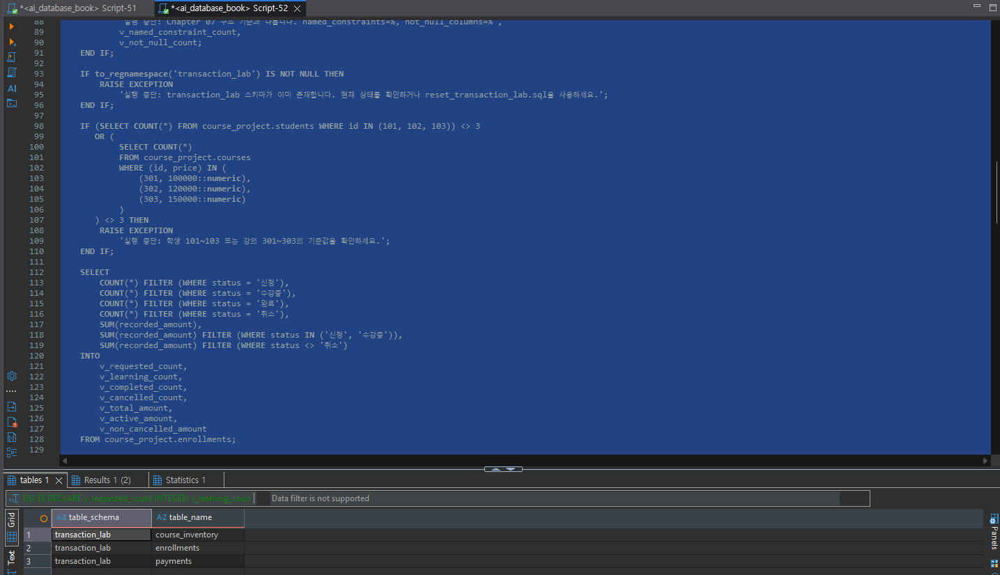
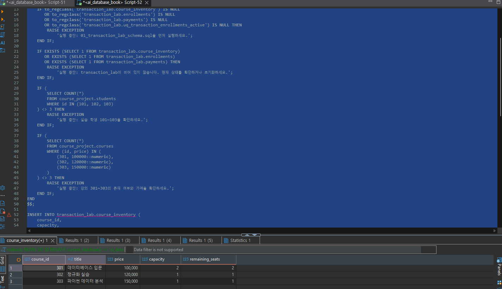
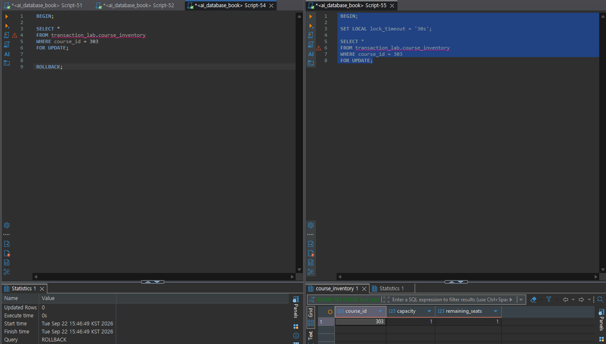

# Chapter 09 확장 실습 답안 템플릿

> **과제:** 트랜잭션으로 데이터 정합성 지키기  
> **사용 방법:** 이 파일을 내려받아 본인의 GitHub 저장소에 `chapter09_answer.md`라는 이름으로 저장한 뒤 실습하면서 바로 작성합니다.  
> **제출 방법:** LMS에는 파일을 직접 업로드하지 않고, **본인 GitHub 저장소의 `chapter09_answer.md` 파일 URL**을 제출합니다.

---

## 제출 전 주의

이 파일과 캡처 화면에는 실제 비밀번호, 전체 DB 접속 URL, API Key, 개인정보를 기록하지 않습니다.

```text
GitHub 계정 또는 별칭:
과제 작성일:
사용한 AI 도구:
```

---

# 1. 시작 환경과 Chapter 07·08 기준 상태 확인

다음을 실행하거나 Chapter 09의 `01_transaction_lab_schema.sql` 사전 검사를 확인합니다.

```sql
SELECT current_database();
SELECT current_user;
SELECT current_schema();
SHOW search_path;
SHOW transaction_read_only;
```

| 확인 항목 | 실제 결과 | 의미 |
| --- | --- | --- |
| `current_database()` | ai_database_book | 현재 연결된 데이터베이스 이름이 실습용 DB로 정확히 선택되어 있음 |
| `current_user` | postgres | 현재 접속하여 실습 SQL 명령어를 실행 중인 사용자 계정 권한 |
| `current_schema()` | transaction_lab | 스키마명을 명시하지 않았을 때 기본으로 참조되는 기본(Default) 스키마 |
| `search_path` | transaction_lab, course_project, postgres | 테이블 조회 시 스키마 이름을 생략했을 때 검색하는 스키마 순서 |
| `transaction_read_only` | off | 현재 트랜잭션이 읽기 전용이 아니며, 데이터 수정(`INSERT`, `UPDATE`, `DELETE`)이 가능한 상태임 |

Chapter 07·08 기준값:

```text
students = 3
instructors = 2
courses = 3
enrollments = 5
전체 recorded_amount = 590000
활성 = 3 / 340000
취소 제외 = 4 / 440000
```

### 기준 상태가 다르면 Chapter 09를 계속 진행하면 안 되는 이유

```text
실습 결과가 달라질 수 있고 실패가 트랜잭션 문제인지 이전 Chapter 상태 문제인지 구분하기 어려워지기 때문
```

---

# 2. `transaction_lab` 스키마 생성

실행 파일:

```text
code/chapter09/01_transaction_lab_schema.sql
```

## 2-1. 생성 전 예상

```text
생성될 스키마: transaction_lab
생성될 테이블 3개: course_inventory, enrollments, payments

course_inventory 한 행의 의미: 각 강의별 전체 수강 정원(capacity)과 현재 남은 잔여석 수량(remaining_seats) 정보
enrollments 한 행의 의미: 학생의 강의 수강 신청 기록 (신청 학생 ID, 강의 ID, 신청 시각, 상태['수강중'/'취소'], 결제 당시 수강료)
payments 한 행의 의미: 수강 신청 건(enrollment_id)에 대한 결제 완료 상세 내역 (결제 ID, 결제 금액, 결제 완료 시각)
```

## 2-2. 생성 결과

```text
통과 메시지: Chapter 09 transaction lab schema validation passed
```

기대 메시지: Chapter 09 transaction lab schema validation passed

```text
Chapter 09 transaction lab schema validation passed
```

### Chapter 07·08의 `course_project`와 별도 `transaction_lab`을 사용하는 이유

```text
실습 데이터를 안정성있게 사용하기 위해
```

### 증거 화면

권장 경로:

```text
assignments/chapter09/images/step02_schema.png
```

`여기에 transaction_lab 구조가 보이는 핵심 화면을 삽입하세요.`

---

# 3. 초기 좌석과 기준 데이터 입력

실행 파일:

```text
code/chapter09/02_transaction_lab_seed.sql
```

## 3-1. 실행 전 예상

```text
course 301 remaining_seats 예상: 2
course 302 remaining_seats 예상: 1
course 303 remaining_seats 예상: 1
lab enrollments 예상 행 수: 0
payments 예상 행 수: 0
```

## 3-2. 실제 결과

```text
course 301 remaining_seats: 2
course 302 remaining_seats: 1
course 303 remaining_seats: 1
lab enrollments 행 수: 0
payments 행 수: 0
통과 메시지: Chapter 09 transaction lab seed validation passed
```

기대 초기 상태:

```text
course 301 / 302 / 303 remaining_seats = 2 / 1 / 1
lab enrollments = 0
payments = 0
```

### 예상과 실제가 다른 경우 원인

```text

```

---

# 4. 첫 번째 정상 COMMIT 추적

실행 파일:

```text
code/chapter09/03_commit_transaction.sql
```

이 실습은 학생 101이 강의 301을 신청하는 하나의 업무 단위를 추적합니다.

## 4-1. 업무 단위 정의

```text
이 트랜잭션에서 함께 성공해야 하는 변경 1: course_inventory 테이블의 강의 301 잔여 좌석(remaining_seats) 1개 차감 (2 -> 1)
변경 2: enrollments 테이블에 학생 101의 강의 301 수강 신청 내역 생성 (id: 9001, status: '수강중', amount: 100000)
변경 3: payments 테이블에 수강 신청(9001)에 대한 결제 내역 생성 (id: 9901, amount: 100000)

하나라도 실패하면 전체를 취소해야 하는 이유:
수강 신청 과정에서 좌석만 차감되고 결제가 안 되거나, 결제는 이루어졌는데 수강 신청 내역이 누락되면 데이터 불일치(정합성 깨짐)가 발생합니다. 돈만 나가고 수강 등록이 안 되거나, 결제 없이 수강권을 얻는 비즈니스 오류를 막기 위해 세 작업은 반드시 원자성(Atomicity)을 보장받아 모두 성공하거나 모두 취소되어야 합니다.
```

## 4-2. 상태 변화 기록

| 시점 | course 301 남은 좌석 | lab enrollment 9001 | payment 9901 | 설명 |
| --- | ---: | --- | --- | --- |
| BEGIN 전 | 2 | 없음 | 없음 | 트랜잭션 시작 전 초기 데이터 상태 검증 |
| 트랜잭션 내부 | 1 | 1행 존재 (임시) | 1행 존재 (임시) | 동일 세션 내에서 변경사항 반영 확인 (타 세션에는 미노출) |
| COMMIT 후 | 1 | 1행 존재 (확정) | 1행 존재 (확정) | DB에 변경사항이 영구적으로 최종 확정 반영됨 |

## 4-3. COMMIT 조건

```text
좌석 UPDATE 기대 영향 행 수: 1
실제 영향 행 수: 1
신청 생성 기대 행 수: 1
결제 생성 기대 행 수: 1
recorded_amount와 payment.amount 일치 여부: 일치 (둘 다 100,000원)
최종 COMMIT 판단: 모든 조건 만족 및 DO 블록 검증 통과하여 정상 COMMIT 완료
```

기대 메시지:

```text
Chapter 09 first commit validation passed
```

### SQL 오류가 없었다는 사실만으로 COMMIT하면 안 되는 이유

```text
SQL 문법이나 데이터베이스 자체 에러가 발생하지 않았더라도, 비즈니스 로직 관점에서의 데이터 정합성이 깨졌을 수 있기 때문
```

### 증거 화면

권장 경로:

```text
assignments/chapter09/images/step04_commit.png
```

`여기에 COMMIT 후 좌석·신청·결제 관계를 확인할 수 있는 화면을 삽입하세요.`

---

# 5. ROLLBACK으로 전체 원상복구 확인

실행 파일:

```text
code/chapter09/04_rollback_transaction.sql
```

## 5-1. ROLLBACK 전 예상

```text
트랜잭션 안에서 임시로 바뀔 값: course 302 remaining_seats = 0, enrollment 9002 생성, payment 9902 생성
ROLLBACK 후 다시 돌아와야 할 값: course 302 remaining_seats = 1, enrollment 9002 삭제(없음), payment 9902 삭제(없음)
이미 이전 파일에서 COMMIT된 9001/9901은 유지되어야 하는가: 예 (유지되어야 함)
```

## 5-2. 실제 결과

```text
ROLLBACK 후 course 301 상태: remaining_seats = 1
ROLLBACK 후 lab enrollments 행 수: 1행 (9001번만 존재)
ROLLBACK 후 payments 행 수: 1행 (9901번만 존재)
9001 존재 여부: 존재함
9901 존재 여부: 존재함
통과 메시지: Chapter 09 rollback validation passed
```

기대 메시지: Chapter 09 rollback validation passed

```text
Chapter 09 rollback validation passed
```

## 5-3. ROLLBACK과 IDENTITY

```text
ROLLBACK이 테이블 행 변경을 되돌리는 방식:
트랜잭션(BEGIN) 내에서 수행된 모든 UPDATE, INSERT, DELETE 작업의 변경 이력을 Undo 로그/WAL을 통해 트랜잭션 시작 직전의 원본 상태로 완벽히 원상 복구(취소)합니다.

IDENTITY 자동 번호가 반드시 이전 값으로 되돌아가지는 않는 이유:
IDENTITY 시퀀스(Sequence)는 여러 트랜잭션이 동시에 접속할 때 번호 중복을 막기 위해 트랜잭션의 성공/실패 여부와 관계없이 독립적으로 번호를 즉시 증가시킵니다. 따라서 트랜잭션이 ROLLBACK되어도 발급되었던 시퀀스 번호는 이전으로 되돌아가지 않습니다.

번호가 건너뛰었다고 데이터 손상이라고 단정할 수 없는 이유:
IDENTITY(시퀀스)의 최우선 목적은 '유일성(Unique ID) 보장'이며 '연속성'을 보장하는 것이 아닙니다. 동시성 제어 성능과 유일성 제약을 지키기 위해 발생한 빈 번호(Gaps)는 정상적인 동작 방식이며, 데이터베이스의 정합성이나 데이터 손상과는 무관합니다.
```

---

# 6. 두 번째 COMMIT과 좌석 부족 0행 관찰

실행 파일:

```text
code/chapter09/05_commit_and_sold_out.sql
```

## 6-1. 두 번째 정상 COMMIT

```text
생성된 enrollment id: 9002
학생 id: 103
course id: 302
recorded_amount: 120000
payment id: 9902
payment amount: 120000
```

## 6-2. 좌석 부족 시도

```text
좌석 확보 UPDATE 기대 영향 행 수: 0
실제 영향 행 수: 0
후속 enrollment 생성 행 수: 0
후속 payment 생성 행 수: 0
```

기준상 좌석 부족 시 생성되지 않아야 하는 ID:

```text
9003
9903
```

### `UPDATE 0`이 SQL 실패가 아니라 업무상 실패일 수 있는 이유

```text
쿼리는 정상적으로 실행되었지만, 남은 자리가 없기 때문에 실패처리를 하는 것이 맞기 때문
```

### 영향 행 수가 0인데 신청과 결제를 계속 생성하면 어떤 정합성 문제가 생기나요?

```text
비지니스 오류와 데이터 정합성 오류 발생
```

---

# 7. 주 실습 최종 정합성 검증

실행 파일:

```text
code/chapter09/06_transaction_validation.sql
```

## 7-1. lab 최종 상태

| 항목 | 기대값 | 실제값 | 일치? |
| --- | ---: | ---: | --- |
| course_inventory 행 수 | 3 | 3 | 일치 |
| lab enrollments 행 수 | 2 | 2 | 일치 |
| payments 행 수 | 2 | 2 | 일치 |
| course 301 remaining | 1 | 1 | 일치 |
| course 302 remaining | 0 | 0 | 일치 |
| course 303 remaining | 1 | 1 | 일치 |

## 7-2. 주요 행

```text
9001 = student 101 / course 301 / amount 100000 / payment 9901
실제: 9001 = student 101 / course 301 / amount 100000 / payment 9901 (일치)

9002 = student 103 / course 302 / amount 120000 / payment 9902
실제: 9002 = student 103 / course 302 / amount 120000 / payment 9902 (일치)

9003·9903 = 존재하지 않아야 함
실제: 존재하지 않음
```

## 7-3. 보호 대상 확인

```text
course_project.enrollments 행 수: 5
전체 recorded_amount: 590000
활성 건수/금액: 3 / 340000
취소 제외 건수/금액: 4 / 440000
```

기대값:

```text
course_project.enrollments = 5
전체 = 590000
활성 = 3 / 340000
취소 제외 = 4 / 440000
```

최종 기대 메시지:

```text
Chapter 09 main transaction validation passed
```

### transaction_lab 실습 후에도 course_project 기준 상태를 다시 검사하는 이유

```text
새로운 `transaction_lab` 스키마에서 트랜잭션 실습을 진행했더라도, 기존의 기본 데이터 영역인 `course_project` 스키마의 핵심 데이터가 실수로 변경되거나 훼손되지 않았는지 확인하기 위함입니다.
이는 새로운 스키마 작업이 이전 데이터 영역에 영향을 주지 않았음을 검증하여, 시스템 전체의 데이터격리성(Isolation)과 통합 정합성(Consistency)이 완벽히 유지되고 있는지 최종 확인하는 과정입니다.
```

---

# 8. ACID를 이번 실습으로 설명

교과서 정의를 그대로 복사하지 말고 이번 좌석·신청·결제 사례로 작성합니다.

```text
Atomicity:
좌석 차감(remaining_seats - 1), 수강 신청 생성(enrollment 9001), 결제 내역 생성(payment 9901)의 세 가가지 작업은 하나의 단일 단위로 완전히 함께 성공하거나 완전히 함께 취소되어야 합니다. 결제 과정 중 오류가 발생하면 앞선 좌석 차감과 수강 신청 작업도 ROLLBACK되어 이전 상태로 되돌아갑니다.

Consistency:
트랜잭션 수행 전후에 데이터베이스의 비즈니스 규칙과 제약조건이 항상 지켜져야 합니다. 예를 들어 좌석 수(remaining_seats)가 0 밑으로 내려가지 않아야 하고(초과 수강 방지), 수강 신청의 recorded_amount와 결제 테이블의 payment amount는 반드시 일치해야 합니다.

Isolation:
트랜잭션이 진행되는 동안(COMMIT 전) 발생한 중간 상태(좌석 차감, 임시 신청/결제)는 다른 사용자 세션에 노출되지 않습니다. 또한 FOR UPDATE 구문을 사용해 동일한 좌석(302번)에 대해 여러 사용자가 동시에 접근하여 수강 신청을 시도할 때 발생할 수 있는 동시성 충돌을 방지합니다.

Durability:
트랜잭션이 성공적으로 COMMIT된 후에는(9001, 9901 데이터 확정) 데이터베이스 시스템에 장애나 전원 차단이 발생하더라도 해당 수강 신청 및 결제 데이터가 영구적으로 보존되어 손실되지 않습니다.
```

### Atomicity와 Consistency가 같은 뜻이 아닌 이유

```text
Atomicity(원자성)는 "작업의 단위가 쪼개지지 않고 전부 실행되거나 전부 취소된다(All or Nothing)"는 '수행의 완전성'을 의미합니다. 

반면 Consistency(일관성/정합성)는 "트랜잭션 결과가 비즈니스 규칙 및 DB 제약조건을 위반하지 않고 유효하다"는 '데이터의 상태 결과'를 의미합니다.

예를 들어, 잔여 좌석이 0개인 상태에서 차감 조건 없이 좌석을 -1로 만들고 수강 신청과 결제를 모두 성공적으로 완료했다면, 세 작업이 모두 실행되었으므로 Atomicity는 만족하지만 '좌석이 음수가 될 수 없다'는 제약조건을 위반했으므로 Consistency는 깨진 것입니다. 따라서 두 개념은 서로 다릅니다.
```

---

# 9. 선택 실습 — 두 세션 Lock 대기 관찰

실행 파일:

```text
code/chapter09/07_concurrency_two_sessions.sql
```

가능하면 DBeaver에서 **서로 다른 두 연결 세션**으로 수행합니다.

## 9-1. 내 환경

```text
실제 두 세션 실습 수행 / 절차 분석만 수행: 실제 두 세션 실습 수행
transaction_isolation: read committed
lock_timeout: 5s
```

## 9-2. 시간 순서 기록

| 순서 | Session A | Session B | 관찰 |
| ---: | --- | --- | --- |
| 1 | BEGIN; 실행 후 FOR UPDATE로 course_id = 303 행 조회 | 대기 | Session A가 course_id = 303 행에 대해 배타적 Row Lock(행 잠금)을 즉시 획득함. |
| 2 | 트랜잭션 유지 중 | BEGIN; 실행 후 lock_timeout 설정 및 동일 행 FOR UPDATE 조회 시도 | Session B의 쿼리가 실행을 마치지 못하고 Session A의 Lock이 해제될 때까지 대기(Blocking) 상태에 빠짐. |
| 3 | 대기 | 5초 경과 (lock_timeout) | Session B에서 ERROR: canceling statement due to lock timeout 오류가 발생하며 대기 종료. |
| 4 | ROLLBACK; (또는 COMMIT;) 실행하여 트랜잭션 종료 | (다시 시도 시) 정상적으로 Lock 획득 후 course_id = 303 행 조회 성공 | Session A의 Lock이 해제되면서 Session B가 최신 데이터를 정상적으로 읽고 잠금을 획득할 수 있게 됨. |

```text
먼저 Lock을 획득한 세션: Session A
대기한 세션: Session B
A가 COMMIT/ROLLBACK한 뒤 B에서 일어난 일: Session A가 트랜잭션을 종료(ROLLBACK/COMMIT)하여 Lock을 해제하자, 대기 중이던 Session B(또는 재시도한 Session B)가 해당 행의 Lock을 획득하고 최신 상태의 데이터를 정상 조회/수정할 수 있게 됩니다.
```

### Lock 대기와 Deadlock의 차이

```text
Lock 대기(Blocking)는 단방향 대기 상태입니다. 한 세션이 특정 자원의 Lock을 먼저 점유하고 있어, 다른 세션이 해당 Lock이 해제될 때까지 순서대로 기다리는 일시적인 정체 현상입니다. 앞선 세션이 COMMIT 또는 ROLLBACK으로 트랜잭션을 종료하면 대기 중이던 세션은 정상적으로 작업을 진행합니다.

반면 Deadlock(교착 상태)은 둘 이상의 세션이 서로 상대방이 보유한 Lock을 획득하기 위해 교차 대기하는 순환 대기(Circular Wait) 상태입니다. (예: A는 Row 1을 잡고 Row 2를 기다림, B는 Row 2를 잡고 Row 1을 기다림) 이 상황은 외부 intervention 없이는 영원히 풀리지 않으므로, DBMS 엔진이 이를 감지하여 둘 중 한 세션의 트랜잭션을 강제로 에러 처리(Aborted)하고 ROLLBACK시켜 교착을 해결합니다.
```

### `SELECT ... FOR UPDATE`가 모든 UPDATE 앞에 항상 필요한 것은 아닌 이유

```text
단순히 특정 조건에 따라 값을 차감하는 단일 `UPDATE` 구문(예: `UPDATE ... SET remaining_seats = remaining_seats - 1 WHERE course_id = 303 AND remaining_seats > 0 RETURNING *;`) 자체도 내부적으로 수정 대상 행에 대해 암묵적(Implicit) Lock을 획득하기 때문입니다. 

따라서 조회 후 비즈니스 로직(검증, 계산 등)을 애플리케이션 단에서 복잡하게 수행해야 하는 경우가 아니라, 단순히 DB 레벨에서 조건 검사와 수정을 한 번에 처리(Atomic UPDATE)할 수 있는 상황이라면 `SELECT ... FOR UPDATE` 구문 없이 단일 조건부 UPDATE만으로도 동시성 제어와 안전한 좌석 차감이 가능합니다.
```

### 증거 화면

실제 수행했다면 권장 경로:

```text
assignments/chapter09/images/step09_lock.png
```

---

# 10. 선택 실습 — 취소와 좌석 복구

실행 파일:

```text
code/chapter09/08_cancel_and_restore.sql
```

```text
9001 취소 성공 행 수: 1행
course 301 좌석 변화: 1 -> 2
같은 취소를 다시 시도한 행 수: 0행
두 번째 좌석 복구 행 수: 0행
payment 9901 유지 여부: 유지됨 (수강중일 때 생성되었던 결제 기록 유지)
최종 ROLLBACK 후 원상복구 여부: 원상복구됨 (status = '수강중', remaining_seats = 1)
통과 메시지: Chapter 09 cancel rollback validation passed
```

기대 흐름:

```text
9001 수강중 → 취소 1행
course 301 remaining 1 → 2
같은 취소 재시도 → 0행
추가 좌석 복구 → 0행
마지막 ROLLBACK → 주 실습 기준으로 복구
```

### 같은 취소를 두 번 처리해도 좌석이 두 번 증가하지 않아야 하는 이유

```text
동일한 수강 취소 요청이 네트워크 오류나 중복 클릭 등으로 인해 여러 번 전달(재시도)되더라도, 시스템 전체 상태는 단 한 번 취소 처리된 것과 동일한 결과를 유지해야 하는 멱등성(Idempotency)이 보장되어야 하기 때문입니다.

만약 취소 요청이 들어올 때마다 조건 확인 없이 좌석을 복구(remaining_seats + 1)하게 된다면, 1건의 취소 요청에 대해 좌석이 중복으로 늘어나 전체 정원(capacity)을 초과하는 데이터 오류와 비즈니스 부정합이 발생하게 됩니다. 

따라서 `UPDATE ... WHERE status = '수강중'` 구문을 통해 실제 '수강중' 상태에서 '취소'로 변경에 성공한(1행) 경우에만 연쇄(CTE/WITH)하여 좌석을 1개 복구하도록 설계함으로써 중복 좌석 복구를 방지해야 합니다.
```

---

# 11. 선택 실습 — 오류 상태와 SAVEPOINT

실행 파일:

```text
code/chapter09/09_error_and_savepoint.sql
```

## 11-1. 일반 오류 후 트랜잭션 상태

```text
발생시킨 오류: uq_transaction_enrollments_active (중복 활성 신청 유니크 제약조건 위반 오류)
오류 이후 다음 SQL 실행 결과: ERROR: current transaction is aborted, commands ignored until end of transaction block (트랜잭션이 중단되어 이후 모든 쿼리 실행 거부됨)
전체 ROLLBACK이 필요한 이유: PostgreSQL에서는 트랜잭션 내에서 한 번이라도 오류(SQL 예외)가 발생하면 전체 트랜잭션이 'aborted(중단)' 상태로 전환됩니다. 이 상태에서는 정상적인 쿼리를 보내더라도 DB 엔진이 실행을 거부하므로, ROLLBACK을 통해 트랜잭션을 완전히 종료하고 이전 정상 상태로 되돌려야만 새로운 작업을 시작할 수 있습니다.
```

## 11-2. SAVEPOINT 사용

```text
SAVEPOINT 이름: before_duplicate_enrollment
오류 발생 위치: 3단계 INSERT INTO transaction_lab.enrollments 실행 시점 (중복 신청 시도)
ROLLBACK TO SAVEPOINT 후 상태: SAVEPOINT 이후 실행했던 2단계 좌석 차감(remaining_seats = 0)과 3단계 INSERT 오류가 모두 취소되고, SAVEPOINT 생성 시점의 정상 상태(remaining_seats = 1, enrollment 9003 없음)로 복구됨
이후 계속 실행할 수 있었는가: 예 (SAVEPOINT 지점까지 성공적으로 부분 롤백되었으므로 트랜잭션 중단 상태가 해제되어 이후 SELECT, RELEASE SAVEPOINT 등의 쿼리를 정상 실행할 수 있었음)
```

### SAVEPOINT가 전체 ROLLBACK과 다른 점

```text
전체 ROLLBACK은 트랜잭션 내에서 수행된 '모든' 작업(BEGIN 이후 실행된 모든 DML)을 취소하고 트랜잭션을 완전히 종료합니다. 

반면 SAVEPOINT(저장점)는 트랜잭션 내부의 특정 시점에 '복구 지점'을 지정하여, 오류가 발생하더라도 전체 트랜잭션을 파기하지 않고 해당 SAVEPOINT 이후에 수행된 작업만 선택적으로 취소(부분 롤백)할 수 있게 해줍니다. 

따라서 SAVEPOINT를 활용하면 트랜잭션을 계속 유지한 채로 오류 발생 이전 상태로 돌아가 다른 후속 로직을 이어서 실행하거나 트랜잭션을 정상적으로 COMMIT할 수 있다는 차이점이 있습니다.
```

---

# 12. 개인 프로젝트 트랜잭션 시나리오 설계

Chapter 07에서 시작한 개인 프로젝트를 사용합니다.

둘 이상의 변경이 함께 성공해야 하는 업무를 **하나** 선택합니다.

예:

```text
예약 생성 + 좌석 차감
주문 생성 + 재고 차감
대여 생성 + 대여 가능 상태 변경
답변 등록 + 질문 상태 변경
```

## 12-1. 업무 정의

```text
시나리오 ID: P09-T01
업무 이름: 도서 대여 신청 및 대여 가능 수량 차감
사용자 행동: 회원이 대여 가능 상태의 도서를 선택하여 '대여하기' 버튼을 클릭한다.
왜 하나의 트랜잭션이어야 하는가: 
대여 기록 생성(INSERT)과 도서 재고/대여가능 수량 차감(UPDATE)은 물리적으로 분리된 두 변경 작업입니다. 만약 대여 기록만 생성되고 재고가 차감되지 않으면 실제 보유 재고보다 많은 대여가 발생하는 부정합이 생기고, 반대로 재고만 차감되고 대여 기록이 남지 않으면 회원은 책을 빌리지 못했는데 재고가 증발하는 현상이 발생합니다. 따라서 두 변경은 원자성(Atomicity)을 보장받아 함께 성공하거나 함께 실패해야 합니다.
```

## 12-2. 트랜잭션 설계표

| 항목 | 내 설계 |
| --- | --- |
| BEGIN 전 확인 상태 | 회원 상태가 '정상'(대여 연체/정지 없음)이며, 해당 도서의 대여 가능 수량(available_qty)이 1 이상인지 확인 |
| 잠금/경쟁 가능 데이터 | 동일 도서에 대한 동시 대여 요청 시 Race Condition 방지를 위해 해당 도서 행(books 테이블의 id = book_id)을 FOR UPDATE로 잠금 |
| 변경 1 | books 테이블의 대여 가능 수량 차감 (available_qty = available_qty - 1) |
| 기대 영향 행 수 | 정확히 1행 |
| 변경 2 | rentals 테이블에 신규 대여 기록 추가 (status = '대여중') |
| 기대 영향 행 수 | 정확히 1행 |
| 추가 변경 | 필요 시 members 테이블의 현재 대여 중 권수 증가 (current_rental_count = current_rental_count + 1) |
| COMMIT 전 검증 | 1. books.available_qty가 0 이상인지 검증 2. rentals 테이블에 방금 생성된 rental_id가 존재하고 상태가 '대여중'인지 검증 |
| COMMIT 조건 | 1. books UPDATE 영향 행 수가 1행이고 available_qty >= 0 2. rentals INSERT 영향 행 수가 1행 3. 제약조건 위반 또는 DB 예외 오류가 발생하지 않음 |
| ROLLBACK 조건 | 1. 도서 수량이 부족하여 UPDATE 영향 행 수가 0행인 경우 2. 회원 대여 한도 초과 또는 중복 대여 제약조건 위반(Unique Constraint Violation) 발생 시 3. 트랜잭션 내 어느 단계에서든 SQL Exception/오류 발생 시 |

## 12-3. 실패 시나리오

최소 두 개 작성합니다.

```text
실패 1: 동시성 경쟁으로 인한 재고 부족 (비즈니스 조건 실패)
어느 단계에서 발생: 1단계 도서 재고 차감 (UPDATE books) 시점
남으면 안 되는 부분 상태: 대여 기록만 생성되거나 수량이 음수(-1)로 떨어지는 상태
ROLLBACK 후 기대 상태: 도서 수량(`available_qty`)은 원래 상태(0)를 유지하고, 대여 기록(`rentals`)은 생성되지 않으며 사용자에게 "대여 가능한 수량이 없습니다" 예외 반환.

실패 2: 회원 대여 한도 초과 또는 제약조건 위반 (SQL 오류 실패)
어느 단계에서 발생: 2단계 대여 기록 생성 (INSERT INTO rentals) 시점
남으면 안 되는 부분 상태: 1단계에서 차감된 도서 재고(`available_qty - 1`)가 그대로 유지되어 재고가 유실되는 상태
ROLLBACK 후 기대 상태: INSERT 실패 후 즉시 ROLLBACK이 수행되어 1단계에서 차감했던 도서 재고가 원래대로 복구되고, 대여 기록은 남아있지 않은 깨끗한 상태 유지.
```

## 12-4. SQL 초안

```sql
-- 아직 테이블 구현 전이라면 의사 SQL이어도 됩니다.
BEGIN;

-- 1. 동시성 제어를 위해 해당 도서 행 잠금 (FOR UPDATE)
SELECT id, title, available_qty
FROM books
WHERE id = 101
FOR UPDATE;

-- 2. 대여 가능 수량이 1 이상일 때만 재고 차감
UPDATE books
SET available_qty = available_qty - 1
WHERE id = 101
  AND available_qty > 0;

-- 3. 재고 차감 성공 여부 검증 (영향 받은 행 수가 1이 아니면 수량 부족으로 판단)
DO $$
BEGIN
    IF NOT FOUND THEN
        RAISE EXCEPTION '대여 불가: 대여 가능한 재고 수량이 부족합니다.';
    END IF;
END
$$;

-- 4. 대여 기록 생성
INSERT INTO rentals (
    member_id, 
    book_id, 
    rented_at, 
    due_date, 
    status
)
VALUES (
    1, 
    101, 
    CURRENT_TIMESTAMP, 
    CURRENT_TIMESTAMP + INTERVAL '14 days', 
    '대여중'
);

-- 5. 최종 비즈니스 정합성 검증
DO $$
BEGIN
    -- 재고가 음수가 되었는지 최종 검증
    IF (SELECT available_qty FROM books WHERE id = 101) < 0 THEN
        RAISE EXCEPTION '검증 실패: 도서 재고가 음수가 되었습니다.';
    END IF;
END
$$;

-- 모든 검증 통과 시 변경사항 확정
COMMIT;
```

---

# 13. AI를 트랜잭션 리뷰어로 활용

AI에게 완성 SQL부터 요구하지 않습니다.

## 13-1. 사용한 프롬프트

```text
다음 PostgreSQL 트랜잭션 설계를 검토해 주세요.
바로 완성 SQL부터 만들지 말고 먼저 다음 순서로 검토해 주세요.

1. 하나의 업무 단위가 어디까지인지
2. BEGIN 전 확인할 상태
3. 동시 실행 시 경쟁할 수 있는 행 (경쟁 가능 데이터)
4. Lock 또는 조건부 UPDATE가 필요한지
5. 각 변경의 기대 영향 행 수
6. 여러 테이블 사이의 최종 정합성 검증
7. COMMIT 조건
8. ROLLBACK 조건
9. 실패가 SQL 오류가 아니라 업무상 0행일 수 있는 지점

검토 후, 동시성과 원자성을 보장하는 PostgreSQL 트랜잭션 초안을 제안해 주세요.

[내 업무 설명]
- 업무: 도서 대여 신청 및 대여 가능 수량 차감
- 사용자 행동: 회원이 대여 가능 상태의 도서를 선택하여 대여 신청
- 비즈니스 규칙: 대여 가능 수량이 1 이상이어야 하며, 대여 성공 시 재고가 1 감소하고 대여 기록 1건이 생성되어야 함.

[테이블 구조]
- books (id, title, available_qty, capacity)
- rentals (id, member_id, book_id, rented_at, status)

[내 트랜잭션 초안]
BEGIN;
SELECT * FROM books WHERE id = 101 FOR UPDATE;
UPDATE books SET available_qty = available_qty - 1 WHERE id = 101 AND available_qty > 0;
INSERT INTO rentals (member_id, book_id, status) VALUES (1, 101, '대여중');
COMMIT;
```

권장 질문 요소:

```text
1. 하나의 업무 단위가 어디까지인지
2. BEGIN 전 확인할 상태
3. 경쟁 가능 데이터와 잠금 필요성
4. 각 변경의 기대 영향 행 수
5. 여러 테이블 최종 정합성 검증
6. COMMIT 조건
7. ROLLBACK 조건
8. 동시 실행 위험
을 먼저 검토한 뒤 PostgreSQL 초안을 제안하도록 요청
```

## 13-2. AI 제안 검토

| AI 제안 | 수용 / 수정 / 보류 / 거절 | 실제 또는 논리 검증 | 판단 이유 |
| --- | --- | --- | --- |
| UPDATE books 시 FOR UPDATE 선점 잠금을 사용하여 동시성 경쟁을 방지하도록 제안 | 수용 | 두 트랜잭션이 동시에 동일 도서를 대여하려 할 때, 한쪽이 읽은 시점과 UPDATE 시점 사이의 Race Condition을 완벽히 차단함 | 동시 대여 시 발생할 수 있는 초과 대여(Negative Stock) 문제를 예방하는 핵심 제어로 적절함 |
| UPDATE 실행 후 GET DIAGNOSTICS v_row_count = ROW_COUNT;를 통해 영향 받은 행 수가 1행인지 검증하고, 0행일 경우 RAISE EXCEPTION 발생 | 수용 | 재고가 0인 상황에서 SQL Syntax 오류는 발생하지 않지만, UPDATE 영향 행 수가 0이 되므로 이를 명시적 예외로 처리하여 후속 INSERT를 막음 | SQL 오류가 아닌 '업무 조건 미충족(0행)'을 트랜잭션 실패로 올바르게 전환함 |
| rentals 테이블 INSERT 직후 books의 available_qty가 0 이상인지 확인하는 추가 SELECT 검증 구문 포함 | 수용 | 이미 WHERE available_qty > 0 조건부 UPDATE 및 CHECK 제약조건으로 방어되므로, redundant한 SELECT 문 대신 PL/pgSQL의 FOUND / ROW_COUNT 검증으로 단순화함 | 이미 확실하게 가드레일이 세워진 상태에서 불필요한 추가 조회 쿼리로 인한 오버헤드를 줄이기 위함 |

### AI SQL에서 확인한 가장 중요한 위험

```text
AI가 생성한 초안 중 일부는 UPDATE 문 실행 시 SQL 오류가 발생하지 않으면 자동으로 다음 INSERT 문으로 진행되도록 작성되어 있었습니다. 
그러나 재고가 0일 때 `UPDATE ... WHERE available_qty > 0`을 실행하면 문법 오류는 없지만 "영향 받은 행 수(ROW_COUNT)가 0행"이 됩니다. 
이 0행 상태를 체크하여 명시적으로 예외를 던지거나 ROLLBACK하지 않으면, 재고는 줄어들지 않았는데 대여 기록(INSERT)만 유령처럼 생성되는 데이터 비정합성 위험이 가장 컸습니다.
```

### “오류가 없으면 COMMIT”만으로 부족한 이유

```text
데이터베이스 관점에서 SQL 문법 오류나 제약조건 위반이 없다는 것(No Error)이 비즈니스 로직상의 성공을 의미하지는 않기 때문입니다. 

예를 들어, UPDATE 조건절에 맞지 않아 실제로는 0행이 변경되었더라도 RDBMS는 이를 '정상 실행(Success)'으로 간주하여 오류를 발생시키지 않습니다. 
따라서 단순히 오류가 없다고 해서 COMMIT을 해버리면 0행 업데이트 후 후속 INSERT가 수행되는 등 비즈니스 정합성이 깨지게 됩니다. 

반드시 "기대한 영향 행 수(예: 정확히 1행)가 변경되었는가?"와 "최종 상태 값이 비즈니스 규칙에 부합하는가?"를 트랜잭션 내에서 직접 검증한 후 COMMIT 여부를 결정해야 합니다.
```

---

# 14. 최종 성찰

아래 문장은 본인의 말로 작성합니다.

```text
1. 트랜잭션은 여러 SQL을 단순히 묶는 것이 아니라
   비즈니스 작업 단위이다.

2. ROLLBACK이 필요한 대표 상황은
   비즈니스 정합성이 깨진 상황이다.

3. 조건부 UPDATE의 영향 행 수가 중요한 이유는
   실제로 데이터 변경이 일어나지 않았는지를 판별하여 후속 변경 작업을 중단하고 ROLLBACK할 기준이 되기 때문이다.

4. 제약조건이 있어도 트랜잭션이 필요한 이유는
   복합 변경 작업의 '일관성(Consistency)'과 '원자성(Atomicity)'까지는 보장하지 못하기 때문이다.

5. Lock이 필요한 이유는
   동시성 이슈를 방지하고 순차성을 보장하기 때문이다.

6. AI가 만든 트랜잭션 SQL을 검토할 때 가장 먼저 확인할 것은
   비즈니스 작업단위를 분명히 인식하고 문제 발생시 롤백하는 안전장치를 제대로 점검하는 것이다.
```

---

# 15. 제출 체크리스트

- [x] `chapter09_answer.md`를 본인 저장소에 만들었다.
- [x] Chapter 07·08 기준 상태를 확인했다.
- [x] `transaction_lab` 스키마와 초기 데이터를 만들었다.
- [x] 정상 COMMIT의 전·중·후 상태를 기록했다.
- [x] ROLLBACK 후 부분 변경이 남지 않는지 확인했다.
- [x] ROLLBACK과 IDENTITY 번호의 차이를 설명했다.
- [x] 좌석 부족 시 영향 행 수 0을 관찰했다.
- [x] 영향 행 수 0일 때 후속 행이 생성되지 않음을 확인했다.
- [x] `06_transaction_validation.sql` 최종 검증을 통과했다.
- [x] `course_project`가 변경되지 않았음을 확인했다.
- [x] ACID를 이번 실습 사례로 설명했다.
- [x] Lock 실습 또는 두 세션 절차 분석을 수행했다.
- [x] 개인 프로젝트 트랜잭션 시나리오를 작성했다.
- [x] AI 제안의 COMMIT/ROLLBACK/영향 행 수 검증을 확인했다.
- [x] 핵심 캡처는 3~4장 정도로 정리했다.
- [x] 캡처에 비밀번호·개인정보가 없다.
- [x] GitHub 웹에서 Markdown과 이미지가 정상적으로 보인다.
- [x] 최종 파일을 commit/push했다.

---

# 16. LMS 제출 URL

아래 형식의 **본인 GitHub 파일 URL**을 LMS에 제출합니다.

```text
https://github.com/<본인-GitHub-ID>/<본인-저장소>/blob/main/assignments/chapter09/chapter09_answer.md
```

내 제출 URL:

```text

```

> 교수자 템플릿 URL, 저장소 메인 URL, Raw URL이 아니라 **작성 완료된 본인의 `chapter09_answer.md` 파일 화면 URL**을 제출합니다.
