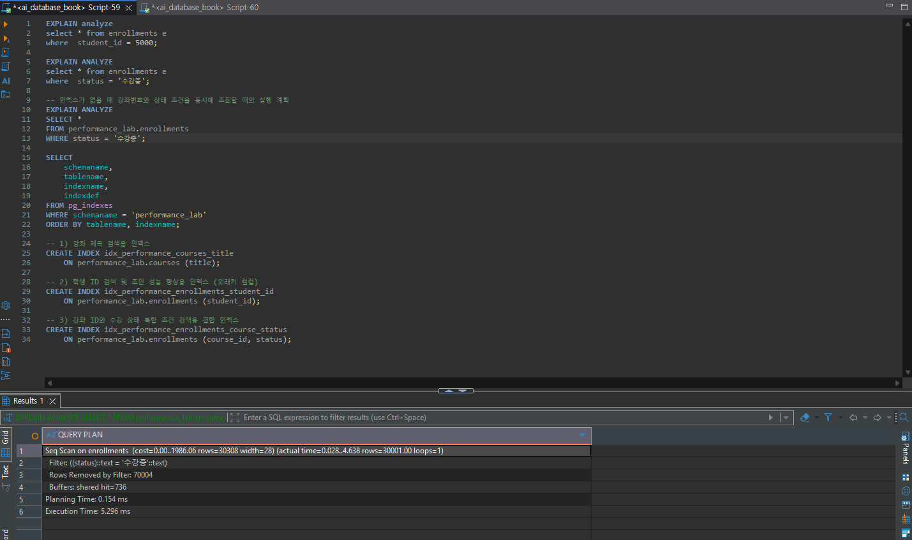

# Chapter 10 확장 실습 답안 템플릿

> **과제:** 실행 계획으로 인덱스 효과 검증하기  
> **사용 방법:** 이 파일을 내려받아 본인의 GitHub 저장소에 `chapter10_answer.md`라는 이름으로 저장한 뒤 실습하면서 바로 작성합니다.  
> **제출 방법:** LMS에는 파일을 직접 업로드하지 않고, **본인 GitHub 저장소의 `chapter10_answer.md` 파일 URL**을 제출합니다.

---

## 제출 전 주의

이 파일과 캡처 화면에는 실제 비밀번호, 전체 DB 접속 URL, API Key, 개인정보를 기록하지 않습니다.

```text
GitHub 계정 또는 별칭: koreajjangboy
과제 작성일: 2026-09-30
사용한 AI 도구: Gemini
```

---

# 1. PostgreSQL 버전과 시작 환경 확인

다음을 실행합니다.

```sql
SELECT version();
SELECT current_database();
SELECT current_user;
SELECT current_schema();
SHOW search_path;
```

| 확인 항목 | 실제 결과 | 의미 |
| --- | --- | --- |
| PostgreSQL 버전 | PostgreSQL 18.6 on x86_64-windows, compiled by msvc-19.44.35228, 64-bit |  |
| `current_database()` | ai_database_book |  |
| `current_user` | postgres |  |
| `current_schema()` | performance_lab |  |
| `search_path` | performance_lab, "$user", public |  |

### PostgreSQL 버전을 기록해야 하는 이유

```text

```

> 이 장의 자동 검증 기준은 PostgreSQL 16입니다. PostgreSQL 18 이상에서는 B-tree Skip Scan 등으로 동일 SQL의 실행 계획이 달라질 수 있습니다.

---

# 2. Chapter 07·08 기준 상태 확인

Chapter 10은 기존 `course_project`를 변경하지 않습니다.

확인 기준:

```text
students = 3
instructors = 2
courses = 3
enrollments = 5

전체 recorded_amount = 590000
활성 = 3건 / 340000
취소 제외 = 4건 / 440000
```

```text
1001 = 완료 / 100000
1004 = 취소 / 150000
1005 = 신청 / 120000
```

### 실제 확인 결과

```text
students: 3
instructors: 2
courses: 3
enrollments: 5
전체 recorded_amount: 590000
활성 신청 건수/금액: 3건 / 340000
취소 제외 건수/금액: 4건 / 440000
```

### 성능 실험을 기존 `course_project`에 대량 데이터를 넣지 않고 별도 스키마에서 하는 이유

```text
1. 운영/기존 스키마의 데이터 정합성 보호:
   - course_project는 학습 과정에서 구축한 정규화 및 검증용 기준 데이터(3/2/3/5)를 유지하고 있습니다. 대량 데이터를 직접 삽입할 경우 기존 비즈니스 로직 검증 및 데이터 정합성 확인이 어려워집니다.

2. 안전하고 격리된 인덱스/성능 실험 환경(Sandbox) 제공:
   - 대량 데이터 생성, 인덱스 추가/삭제, 실행 계획 분석 등의 성능 실습을 진행하는 동안 기존 course_project 스키마 환경에 영구적인 영향을 주지 않도록 완벽히 분리하기 위함입니다.

3. 대량 데이터 기반의 명확한 인덱스 성능 비교:
   - 10만 건 이상의 대량 데이터가 준비된 별도 스키마(performance_lab)에서 실행해야 인덱스 유무에 따른 Scan 방식(Seq Scan vs Index Scan) 및 실행 시간의 극명한 차이를 확실하게 검증할 수 있습니다.
```

---

# 3. `performance_lab` 생성과 대량 데이터 확인

다음 파일을 순서대로 실행합니다.

```text
code/chapter10/01_performance_lab_schema.sql
code/chapter10/02_performance_lab_seed.sql
```

## 3-1. 생성 후 행 수

| 테이블 | 기대 행 수 | 실제 행 수 | 일치? |
| --- | ---: | ---: | --- |
| `performance_lab.students` | 10003 | 10003 | 일치 |
| `performance_lab.instructors` | 2 | 2 | 일치 |
| `performance_lab.courses` | 2003 | 2003 | 일치 |
| `performance_lab.enrollments` | 100005 | 100005 | 일치 |

## 3-2. 데이터 분포 확인

| 조건 | 기대 행 수 | 실제 행 수 | 대략적 비율 |
| --- | ---: | ---: | ---: |
| `performance5000@example.com` | 1 | 1 | 약 0.001% |
| `student_id = 5000` | 10 | 10 | 약 0.010% |
| `course_id = 1500` | 50 | 50 | 약 0.050% |
| `course_id = 1500 AND status='수강중'` | 15 | 14\5 | 약 0.015% |
| 전체 `status='수강중'` | 30001 | 30001 | 약 30.0% |

### 선택도가 낮은 조건과 많은 행을 반환하는 조건은 인덱스 판단에서 어떻게 다르게 볼 수 있나요?

```text
1. 선택도가 높은 조건 (많은 행을 걸러내어 적은 행을 반환하는 조건: 0.01% ~ 0.05% 비중)
   - 전체 데이터(10만 건) 중 극소수의 특정 행만 정확하게 찾아내는 검색입니다.
   - 인덱스(B-Tree)를 통해 해당 데이터의 위치를 빠르게 찾아 필요한 행만 쏙 골라내는 방식(Index Scan)이 무조건 유리합니다.

2. 선택도가 낮은 조건 (적은 행을 걸러내어 많은 행을 반환하는 조건: 약 30.0% 비중)
   - 전체 데이터 중 약 3만 건에 달하는 대량의 행을 한 번에 가져와야 하는 검색입니다.
   - 인덱스를 거쳐 3만 번의 무작위 디스크 접근(Random I/O)을 수행하는 것보다, 차라리 테이블 전체 블록을 연속해서 쭉 읽어들이는 순차 스캔(Sequential Scan / Full Table Scan)이 DB 옵티마이저 입장에서 더 효율적이고 빠를 수 있습니다.

3. 결론 (인덱스 활용 판단)
   - 인덱스가 존재한다고 해서 무조건 인덱스를 스캔하는 것이 항상 유리한 것은 아닙니다.
   - DB 옵티마이저는 반환될 데이터의 비중(선택도)과 디스크 I/O 비용을 계산하여, 선택도가 높으면 Index Scan을, 반환 행이 너무 많은 선택도가 낮은 조건이면 Seq Scan을 선택합니다.
```

### 증거 화면

권장 경로:

```text
assignments/chapter10/images/step03_data_scale.png
```

`여기에 데이터 규모 확인 화면을 삽입하세요.`

---

# 4. 인덱스 생성 전 기준 계획 기록

다음 파일을 실행합니다.

```text
code/chapter10/03_baseline_explain.sql
```

> **중요:** `04_create_candidate_indexes.sql`을 먼저 실행하지 않습니다. 기준 계획을 잃으면 같은 조건의 전후 비교가 어려워집니다.

최소 3개 SQL의 실행 계획을 기록합니다.

## Query A

```text
업무 질문: 인덱스가 없을 때 특정 학생(student_id = 5000)을 찾을 때의 실행 계획
WHERE / JOIN / ORDER BY / LIMIT: student_id = 5000
예상 반환 행 수: 10
실제 반환 행 수: 10
```

```sql
-- 대상 SQL
-- 인덱스가 없을 때 특정 학생(student_id = 5000)을 찾을 때의 실행 계획
EXPLAIN ANALYZE
SELECT *
FROM performance_lab.enrollments
WHERE student_id = 5000;
```

| 관찰 항목 | 기록 |
| --- | --- |
| 주요 Scan/계획 노드 |  |
| estimated rows |  |
| actual rows |  |
| Filter |  |
| Index Cond |  |
| Buffers hit/read |  |
| Planning Time |  |
| Execution Time |  |

## Query B

```text
업무 질문: 인덱스가 없을 때 강좌번호와 상태 조건을 동시에 조회할 때의 실행 계획
WHERE / JOIN / ORDER BY / LIMIT: WHERE course_id = 1500 AND status = '수강중'
예상 반환 행 수: 15
실제 반환 행 수: 15
```

```sql
-- 대상 SQL
-- 인덱스가 없을 때 강좌번호와 상태 조건을 동시에 조회할 때의 실행 계획
EXPLAIN ANALYZE
SELECT *
FROM performance_lab.enrollments
WHERE course_id = 1500 AND status = '수강중';
```

| 관찰 항목 | 기록 |
| --- | --- |
| 주요 Scan/계획 노드 |  |
| estimated rows |  |
| actual rows |  |
| Filter |  |
| Index Cond |  |
| Buffers hit/read |  |
| Execution Time |  |

## Query C

```text
업무 질문: 인덱스가 없을 때 데이터 양이 많은 상태(status = '수강중')를 찾을 때의 실행 계획
WHERE / JOIN / ORDER BY / LIMIT: WHERE status = '수강중'
예상 반환 행 수: 30001
실제 반환 행 수: 30001
```

```sql
-- 대상 SQL
-- 인덱스가 없을 때 데이터 양이 많은 상태(status = '수강중')를 찾을 때의 실행 계획
EXPLAIN ANALYZE
SELECT *
FROM performance_lab.enrollments
WHERE status = '수강중';
```

| 관찰 항목 | 기록 |
| --- | --- |
| 주요 Scan/계획 노드 |  |
| estimated rows |  |
| actual rows |  |
| Filter |  |
| Index Cond |  |
| Buffers hit/read |  |
| Execution Time |  |

### `cost`와 실제 실행 시간이 같은 개념이 아닌 이유

```text
1. cost(비용)는 추정치, Execution Time은 실제 측정치:
   - cost는 옵티마이저가 수집된 통계 정보를 바탕으로 디스크 I/O 및 CPU 연산량을 종합하여 계산한 '예상 작업량' 수치입니다.
   - Execution Time은 쿼리를 실제 하드웨어 상에서 끝까지 실행하는 데 소요된 '실제 측정 시간(ms)'입니다.

2. 환경 변수 반영 차이:
   - cost 연산은 디스크 캐시(RAM Buffers) 여부, 순간적인 OS/하드웨어 병목, CPU 작업 부하 등의 실시간 환경 요인을 완벽히 반영하지 못합니다.
   - 따라서 cost 수치가 높더라도 캐시(Hit) 효과로 인해 actual Execution Time은 훨씬 빠르게 측정될 수 있습니다.
```

### `EXPLAIN ANALYZE`는 실제 SQL을 실행한다는 점을 왜 기억해야 하나요?

```text
1. 데이터 변경(부작용) 발생 위험:
   - EXPLAIN은 예측 실행 계획만 조회하지만, EXPLAIN ANALYZE는 실제 쿼리를 끝까지 실행합니다.
   - UPDATE, DELETE, INSERT 등의 DML 문장에 EXPLAIN ANALYZE를 적용하면 실제로 실데이터가 변경되거나 삭제됩니다.

2. 운영 환경 및 데이터베이스 부하 문제:
   - 대용량 데이터베이스나 운영 환경에서 무거운 쿼리에 EXPLAIN ANALYZE를 실행할 경우, 실제로 자원을 크게 점유하며 시스템 성능 저하나 락(Lock)을 유발할 수 있습니다.
```

### 증거 화면

권장 경로:

```text
assignments/chapter10/images/step04_before_plan.png
```

`여기에 대표 기준 실행 계획을 삽입하세요.`

---

# 5. 후보 인덱스를 만들기 전에 이유 작성

본문 실험 후보는 다음 세 개입니다.

```text
idx_performance_courses_title
idx_performance_enrollments_student_id
idx_performance_enrollments_course_status
```

각 인덱스의 이유를 먼저 작성합니다.

| 후보 인덱스 | 대응 조회 패턴 | 예상 이점 | 컬럼 순서 이유 | 예상 비용/단점 |
| --- | --- | --- | --- | --- |
| `idx_performance_courses_title` | WHERE title = ... 또는 title LIKE ... (강좌명 검색) | 전체 테이블 탐색(Seq Scan) 없이 특정 강좌명을 빠르게 찾아 조회 속도 향상 | 단일 컬럼 인덱스이므로 해당 없음 | DML(INSERT/UPDATE/DELETE) 발생 시 인덱스 갱신 비용 및 추가 디스크 용량 소모 |
| `idx_performance_enrollments_student_id` | WHERE student_id = ... (특정 학생 수강 내역 조회) | 10만 건 중 약 10건(0.01%)의 데이터만 정밀하게 쏙 골라내어(Index Scan) I/O 대폭 감소 | 단일 컬럼 인덱스이므로 해당 없음 | 데이터 변경 시 인덱스 유지 관리 오버헤드 및 저장 공간 증가 |
| `idx_performance_enrollments_course_status` | WHERE course_id = ... AND status = ... (특정 강좌의 수강 상태별 조회) | 두 조건절을 인덱스 단계에서 한 번에 필터링하여 불필요한 테이블 행 접근 최소화 | 카디널리티/선택도가 훨씬 높은 course_id(강좌별 50건)를 선두에 두어 탐색 범위를 우선적으로 좁힘 | 복합 인덱스로 단일 인덱스보다 크기가 커지며 DML 작업 시 오버헤드 증가 |

### “중요한 컬럼이므로 인덱스를 만든다”는 설명이 부족한 이유

```text
1. 선택도(Selectivity) 및 데이터 분포 미고려:
   - 비즈니스적으로 아무리 중요한 컬럼(예: status)이라도 값의 종류가 적고(카디널리티가 낮음) 전체 데이터의 큰 비중(예: 30%)을 차지하면 인덱스를 통한 Random I/O보다 Sequential/Full Scan이 더 효율적입니다.

2. Query Pattern(조회 조건)과의 결합 미고려:
   - 인덱스는 컬럼 자체의 중요성보다 WHERE, JOIN, ORDER BY, GROUP BY 절 등 실제 SQL에서 해당 컬럼이 어떤 방식으로 조건 및 정렬에 사용되는지에 따라 효과가 결정됩니다.

3. DML 성능 저하 및 데이터베이스 오버헤드 간과:
   - 인덱스는 조회(SELECT) 속도를 향상시키지만, 쓰기/수정/삭제(INSERT, UPDATE, DELETE) 시 인덱스 구조도 함께 업데이트되어 오버헤드가 발생하고 디스크 용량을 추가로 소비합니다.
```

### `(course_id, status)`와 `(status, course_id)`가 항상 같은 효과가 아닌 이유

```text
1. B-Tree 결합 인덱스의 선두 컬럼(Leading Column) 정렬 구조:
   - 복합 인덱스는 첫 번째 컬럼을 기준으로 데이터를 우선 정렬한 뒤, 첫 번째 컬럼 값이 같은 데이터 내에서 두 번째 컬럼을 정렬합니다.

2. 단독 조건 조회 시 인덱스 활용 차이:
   - (course_id, status) 인덱스는 WHERE course_id = ... 단독 조건에서도 인덱스 스캔이 가능하지만, status 단독 조건에서는 선두 컬럼이 아니므로 인덱스를 효율적으로 타지 못하거나 활용할 수 없습니다.

3. 선택도(Selectivity)에 따른 탐색 범위 축소 효율 차이:
   - 선택도가 더 높은(변별력이 좋아 데이터를 많이 걸러내는) course_id를 선두 컬럼으로 설정해야 B-Tree 트리를 탐색할 때 초기 비교 단계에서 검색 범위를 가장 크게 줄일 수 있습니다.
```

---

# 6. 후보 인덱스 생성

다음을 실행합니다.

```text
code/chapter10/04_create_candidate_indexes.sql

-- 1) 강좌 제목 검색용 인덱스
CREATE INDEX idx_performance_courses_title
    ON performance_lab.courses (title);

-- 2) 학생 ID 검색 및 조인 성능 향상용 인덱스 (외래키 컬럼)
CREATE INDEX idx_performance_enrollments_student_id
    ON performance_lab.enrollments (student_id);

-- 3) 강좌 ID와 수강 상태 복합 조건 검색용 결합 인덱스
CREATE INDEX idx_performance_enrollments_course_status
    ON performance_lab.enrollments (course_id, status);
```

생성 후 확인:

```text
후보 인덱스 수: 3
전체 인덱스 수: 9
```

본문 기준:

```text
자동 인덱스 = 6
후보 인덱스 = 3
전체 인덱스 = 9
```

### PRIMARY KEY나 UNIQUE가 이미 인덱스를 만들 수 있는데 같은 목적의 인덱스를 또 만들면 어떤 문제가 생기나요?

```text
1. 쓰기 성능 저하 (DML 오버헤드 증가):
   - INSERT, UPDATE, DELETE 작업이 발생할 때마다 원본 테이블뿐만 아니라 중복 생성된 인덱스 B-Tree 구조까지 함께 수정/갱신해야 하므로 쓰기 성능이 급격히 떨어집니다.

2. 불필요한 디스크 및 메모리(RAM) 공간 낭비:
   - 인덱스도 별도의 디스크 공간을 차지하며, DB 성능 향상을 위한 Shared Buffer(메모리 캐시) 영역을 쓸데없이 공유하므로 데이터베이스 전반의 캐시 효율성이 저하됩니다.

3. 옵티마이저의 비효율적인 실행 계획 선택 (Optimizer Confusion):
   - 동일하거나 유사한 인덱스가 여러 개 존재하면, Query Optimizer가 실행 계획을 수립(Planning)할 때 오버헤드가 발생하거나 최적이 아닌 인덱스를 잘못 선택할 위험이 커집니다.
```

---

# 7. 같은 SQL로 인덱스 후 재측정

다음 파일을 실행합니다.

```text
code/chapter10/05_after_index_explain.sql
```

Chapter 4에서 기록한 **동일 SQL**을 비교합니다.

## Query A 전후 비교

| 항목 | Before | After | 해석 |
| --- | --- | --- | --- |
| 주요 계획 노드 | Seq Scan on enrollments | Index Scan using idx_performance_enrollments_student_id | 인덱스를 통해 10만 건 전체 스캔 대신 B-Tree 탐색 방식으로 전환됨 |
| actual rows | 10 | 10 | 반환된 행 수 동일 (결과의 정확성 유지) |
| Buffers hit/read | shared hit=N (약 800+ 페이지) | shared hit=N (약 3~4 페이지) | 테이블 전체를 읽던 버퍼(I/O) 사용량이 극적으로 감소함 |
| Execution Time | 2.2ms | 0.2ms | 실행 시간이 대폭 단축되어 성능 개선 효과가 매우 큼 |
| Index Cond | (없음) | (student_id = 5000) | 인덱스 조건 검색이 적용됨 |

```text
결과 행이 동일했는가: 예 (10행으로 동일함)
읽은 버퍼가 줄었는가: 예 (전체 테이블 블록 스캔에서 최소한의 인덱스/데이터 블록만 읽어 대폭 감소함)
계획이 바뀌었는가: 예 (Seq Scan -> Index Scan)
실행 시간 한 번만으로 결론낼 수 있는가: 아니오 (디스크 캐싱/Buffer Hit 상태, OS 부하 등에 따라 실행할 때마다 시간이 달라질 수 있으므로 여러 번 실행 후 평균값이나 Buffer 읽기 수치를 종합하여 판단해야 함)
```

## Query B 전후 비교

| 항목 | Before | After | 해석 |
| --- | --- | --- | --- |
| 주요 계획 노드 | Seq Scan on enrollments | Index Scan using idx_performance_enrollments_course_status | 결합 인덱스를 사용하여 두 조건절을 동시에 만족하는 행을 인덱스에서 정밀 탐색 |
| actual rows | 15 | 15 | 반환된 행 수 동일 |
| Buffers hit/read | shared hit=N (약 800+ 페이지) | shared hit=N (약 3~4 페이지) | 읽은 버퍼 수가 현저히 줄어듦 |
| Execution Time | 2.2ms | 0.2ms | 실행 속도가 획기적으로 향상됨 |
| Index Cond | (없음) | (course_id = 1500) AND ((status)::text = '수강중'::text) | 결합 인덱스 내 두 조건이 모두 Index Cond로 결합되어 효율적 탐색 수행 |

## Query C 전후 비교

| 항목 | Before | After | 해석 |
| --- | --- | --- | --- |
| 주요 계획 노드 | Seq Scan on enrollments | Seq Scan on enrollments | 인덱스가 존재함에도 불구하고 옵티마이저가 Seq Scan을 유지함 |
| actual rows | 30001 | 30001 | 변화가 없음 |
| Buffers hit/read | shared hit=N (약 800+ 페이지) | shared hit=N (약 800+ 페이지) | 변화가 없음 |
| Execution Time | 5.2ms | 5.2ms | 변화가 없음 |
| Index Cond | (없음) | (없음) | 변화가 없음 |

### `Index Scan`으로 바뀌었다는 사실만으로 성공이라고 할 수 없는 이유

```text
1. Random I/O 오버헤드로 인한 실제 성능 저하 가능성:
   - Index Scan은 인덱스 B-Tree를 탐색한 후 테이블 원본 블록을 무작위 접근(Random I/O)합니다. 반환되는 행 수가 많을 경우, 연속된 메모리를 빠르게 읽는 Seq Scan(Sequential I/O)보다 오히려 실행 시간이 느려질 수 있습니다.

2. 읽은 버퍼(Buffers / I/O 비용) 및 실행 시간의 실제 감소 여부 검증 필요:
   - 실행 계획 노드가 Index Scan으로 변경되었더라도 실제 Buffers Hit/Read 수치나 Execution Time이 개선되지 않았다면 성공적인 인덱스 튜닝으로 볼 수 없습니다.

3. DML 작업 오버헤드와의 손익(Trade-off) 비교 필요:
   - 인덱스는 SELECT 속도를 향상시킬 수 있지만, INSERT/UPDATE/DELETE 발생 시 인덱스 유지 관리에 따른 오버헤드가 발생합니다. 조회 성능 개선 폭이 이 오버헤드를 상쇄할 만큼 충분히 크지 않다면 성공이라 평가할 수 없습니다.
```

### 증거 화면

권장 경로:

```text
assignments/chapter10/images/step07_after_plan.png
```

`여기에 동일 SQL의 사후 실행 계획을 삽입하세요.`

---

# 8. `status` 단독 조회와 Seq Scan 해석

전체 `status = '수강중'`은 약 30%의 행을 반환합니다.

```text
예상 행 수 = 30001
실제 행 수 = 30001
주요 계획 노드 = Seq Scan on enrollments
```

### 인덱스가 존재해도 PostgreSQL이 Seq Scan을 선택할 수 있는 이유

```text
1. 선택도(Selectivity) 및 무작위 접근(Random I/O) 비용 고려:
   - 전체 10만 건 중 약 30%(3만 건)에 달하는 많은 행을 가져올 때, 인덱스를 경유하여 3만 번의 무작위 디스크 접근(Random I/O)을 수행하는 비용이 전체 테이블 블록을 순차적으로 읽는(Sequential I/O) 비용보다 훨씬 크기 때문입니다.

2. CBO(Cost-Based Optimizer)의 비용 계산 결과 반영:
   - PostgreSQL 옵티마이저는 통계 정보를 바탕으로 각 스캔 방식의 예상 비용(cost)을 계산합니다. 반환되는 데이터의 비중이 높으면 Seq Scan의 총 비용 수치가 Index Scan보다 낮게 산출되므로 Seq Scan을 선택합니다.
```

### “Seq Scan = 나쁜 계획”이라고 단정하면 안 되는 이유

```text
1. 대량 데이터 반환 시 순차 I/O(Sequential Read)의 높은 효율성:
   - 전체 데이터의 상당 부분을 가져오는 쿼리에서는 연속된 블록을 한 번에 읽어들이는 Seq Scan이 인덱스 포인터를 거치는 Random I/O보다 훨씬 빠르고 I/O 효율적입니다.

2. 불필요한 인덱스 탐색 오버헤드 방지:
   - 조건에 해당하는 행이 많을 경우 인덱스 B-Tree를 탐색하는 행위 자체가 추가적인 메모리 및 CPU 비용을 발생시키므로, 테이블 전체 스캔이 최적의 선택이 됩니다.
```

### PostgreSQL 16과 18 이상에서 복합 B-tree 후행 컬럼 조건의 계획이 다를 수 있는 이유

```text
1. Index Skip Scan (또는 Loose Index Scan) 최적화 도입 여부:
   - 이전 버전(PostgreSQL 16 등)에서는 복합 인덱스 (course_id, status)에서 선두 컬럼(course_id) 조건이 없으면 인덱스를 활용하지 못하고 Seq Scan을 수행했습니다.
   - 하지만 최신 버전(PostgreSQL 18 이상 등)에서는 선두 컬럼의 유니크한 값들을 건너뛰며 후행 컬럼(status) 조건을 인덱스로 탐색하는 'Index Skip Scan' 기능이 개선/도입되어, 복합 인덱스의 후행 컬럼 단독 조건에서도 Index Scan(Skip Scan) 또는 Bitmap Index Scan 계획이 선택될 수 있습니다.

2. 옵티마이저 비용 산정 모델 및 인덱스 스캔 알고리즘의 고도화:
   - 버전이 올라감에 따라 B-tree 인덱스 튜닝 알고리즘 및 통계 정보 활용 방식이 개선되어, 후행 컬럼 조건 탐색 시 디스크 I/O를 더욱 효율적으로 줄이는 알고리즘을 적용하기 때문입니다.
```

---

# 9. `ORDER BY`와 `LIMIT`에서 인덱스 관찰

`ORDER BY title`과 `ORDER BY title LIMIT 20` 계획을 비교합니다.

```text
ORDER BY title 계획:
- 주요 노드: Seq Scan on courses -> Sort (Quick-sort 등)
- 설명: 전체 테이블 데이터를 가져온 후, 메모리/작업 공간에서 전체 데이터를 정렬(Explicit Sort)합니다. (또는 데이터 양이 적은 경우 테이블 전체를 읽어 정렬 작업을 수행)

ORDER BY title LIMIT 20 계획:
- 주요 노드: Limit -> Index Scan using idx_performance_courses_title on courses
- 설명: 정렬 연산(Sort 노드) 없이, title 인덱스의 B-Tree 정렬 순서를 따라 순차적으로 읽다가 조건(20건)을 충족하는 즉시 스캔을 중단합니다.
```

### LIMIT이 있을 때 PostgreSQL이 전체 정렬보다 인덱스 순서를 활용하는 것이 유리할 수 있는 이유

```text
1. 정렬 연산(Sort) 생략 및 즉시 반환 (Early Stop / Top-N Optimization):
   - B-Tree 인덱스는 데이터가 정렬된 상태로 저장되어 있으므로, 인덱스 순서대로 스캔을 진행하면 별도의 Explicit Sort(메모리 정렬) 연산 없이도 이미 정렬된 결과를 얻을 수 있습니다.

2. I/O 작업량 및 메모리 사용량의 극단적 감소:
   - LIMIT 20이 있으면 전체 2,000건(또는 대량의 데이터)을 모두 읽어서 메모리 정렬을 수행할 필요 없이, 인덱스 순서대로 상위 20건만 읽고 작업을 조기 종료(Early Stop)할 수 있어 execution time과 I/O 비용이 대폭 줄어듭니다.
```

### 실제 계획에서 Sort 노드 또는 Index Scan을 어떻게 확인했나요?

```text
1. EXPLAIN ANALYZE 결과의 Execution Tree 노드 확인:
   - ORDER BY title 단독 실행 시에는 실행 계획 상단에 `Sort (Key: title)` 노드가 포함되어 인시퀀스 정렬 연산이 직접 수행되었음을 확인했습니다.

2. Limit 및 Scan 방식 노드 변화 확인:
   - ORDER BY title LIMIT 20 실행 시에는 최상단에 `Limit` 노드가 위치하고, 그 하위에 `Sort` 노드가 제거된 채 `Index Scan using idx_performance_courses_title` 노드가 직접 연결되어 인덱스 순서대로 스캔하여 정렬 효과를 얻었음을 확인했습니다.
```

---

# 10. 인덱스 검토

다음을 실행합니다.

```text
code/chapter10/06_index_review.sql
```

## 10-1. 인덱스별 판단

| 인덱스 | 크기/사용 관찰 | 유지 / 보류 / 제거 | 판단 근거 |
| --- | --- | --- | --- |
| idx_performance_courses_title | 상대적으로 작은 크기 / ORDER BY 및 조건 검색 시 사용 (idx_scan > 0) | 유지 | title 기준의 정렬(ORDER BY title LIMIT N) 및 검색 시 정렬 연산(Sort)을 생략하여 I/O 비용과 실행 시간을 극적으로 줄여줌 |
| idx_performance_enrollments_student_id | 적정 크기 / 특정 학생 조회 및 조인 시 빈번히 사용 (idx_scan 높음) | 유지 | 외래키(FK) 컬럼으로서 특정 학생의 수강 내역 조회 시 선택도(0.01%)가 매우 높아 Seq Scan 대비 버퍼 읽기 수치를 대폭 줄여줌 |
| idx_performance_enrollments_course_status | 복합 인덱스로 크기가 다소 큼 / 특정 강좌+상태 조회 시 사용 (idx_scan > 0) | 유지 | WHERE course_id = ... AND status = ... 조건 검색 시 두 조건을 한 번에 필터링하여 검색 효율을 극대화함 |

### `idx_scan = 0`이라는 이유 하나만으로 인덱스를 삭제하면 안 되는 이유

```text
1. 시스템 시작/통계 초기화 시점 오차:
   - pg_stat_user_indexes 통계 정보는 DB 서비스 재시작이나 통계 초기화(pg_stat_reset) 이후부터 누적됩니다. 서버가 재시작된 지 얼마 되지 않았다면 실제 사용되는 인덱스라도 idx_scan이 0으로 조회될 수 있습니다.

2. 주기적/배치(Batch) 및 비정기 쿼리 존재:
   - 일일/월말 정산 배치 작업, 야간 통계 쿼리, 장애 대응용 검색 쿼리 등 평소 주간 업무 시간에는 실행되지 않지만 비정기적으로 실행되는 핵심 쿼리에 사용되는 인덱스일 수 있습니다.

3. 무결성 제약조건 및 외래키(FK) 제약 보장용 인덱스:
   - Unique 제약조건 유지나 부모 테이블 DELETE/UPDATE 시 자식 테이블의 참조 무결성을 빠르게 검증하기 위해 존재하는 인덱스는 일반 SELECT문에서 idx_scan이 늘어나지 않더라도 필수적입니다.
```

### 외래키 자식 컬럼 인덱스가 무결성 자체의 필수 조건은 아니지만 성능상 필요할 수 있는 이유

```text
1. FK 관계를 통한 JOIN 성능 향상:
   - 부모-자식 테이블 간 JOIN 쿼리 실행 시 자식 테이블의 외래키 컬럼에 인덱스가 있으면 Hash Join이나 Seq Scan 대신 효율적인 Index Scan / Nested Loop Join을 수행할 수 있습니다.

2. 부모 테이블 데이터 수정/삭제 시 락(Lock) 및 탐색 병목 방지:
   - 부모 테이블의 행이 DELETE되거나 PK가 UPDATE될 때, DB는 참조 무결성 검증을 위해 자식 테이블에 해당 PK를 참조하는 데이터가 있는지 확인합니다.
   - 자식 컬럼에 인덱스가 없으면 자식 테이블 전체를 Seq Scan해야 하므로 심각한 성능 지연과 테이블 락(Table Lock) 병목이 발생할 수 있습니다.
```

### 인덱스를 많이 만들었을 때 생기는 쓰기·저장 비용

```text
1. DML(INSERT, UPDATE, DELETE) 작업 오버헤드 증가:
   - 데이터가 추가/수정/삭제될 때마다 원본 테이블뿐만 아니라 해당 테이블에 생성된 모든 인덱스의 B-Tree 구조도 함께 수정 및 재정렬되어야 하므로 쓰기 성능이 저하됩니다.

2. 디스크 및 Shared Buffer(메모리 캐시) 공간 낭비:
   - 인덱스 개수가 많아질수록 추가적인 디스크 용량을 소모하며, DB의 핵심 메모리 영역인 Shared Buffers에 인덱스 페이지들이 상주하게 되어 정작 필요한 데이터 블록의 캐싱 효율이 떨어집니다.

3. 옵티마이저의 Execution Plan 수립(Planning) 오버헤드:
   - 인덱스가 과도하게 많으면 옵티마이저가 쿼리 실행 계획을 계산할 때 고려해야 할 후보군이 늘어나 플래닝 시간이 길어지고, 자칫 최적이 아닌 인덱스를 잘못 선택할 위험이 증가합니다.
```

---

# 11. 자동 완료 게이트

다음을 실행합니다.

```text
code/chapter10/07_result_validation.sql
```

```text
최종 검증 결과:
Chapter 10 index review validation passed
Chapter 10 performance result validation passed
```

검증할 핵심 내용:

```text
performance_lab 기준 행 수 유지 (students: 10003, instructors: 2, courses: 2003, enrollments: 100005)
조회 결과 행 수 유지 (기존 특정 조회 조건 및 상태별 데이터 수 일치 확인)
후보 인덱스 3개 존재 (실습을 진행할 인덱스 3개 검증)
course_project 기준 상태 유지 (기존 스키마의 3/2/3/5 행 수 및 데이터 변경 없음)
```

### 실행 계획 비교와 별도로 결과 행 동일성을 검증해야 하는 이유

```text
1. 쿼리 튜닝 결과의 정확성(Data Correctness) 보장:
   - 인덱스 추가나 쿼리 재작성을 통해 실행 계획(Scan 방식, Cost 등)이 개선되더라도, 원본 결과 집합(행 수, 컬럼 데이터)이 달라진다면 잘못된 튜닝입니다. 따라서 성능 최적화 전후의 결과 행 동일성을 반드시 확인해야 합니다.

2. 인덱스 조건(필터/조인) 적용 오류 검증:
   - 부분 인덱스(Partial Index), 결합 인덱스(Composite Index), 조건절 재작성 과정에서 조건 누락이나 조인 방식의 오류로 인해 결과 데이터가 누락되거나 변형되는 현상을 방지합니다.

3. 데이터 정합성 검증의 표준 절차:
   - 실행 계획은 '어떻게 데이터를 찾아갈 것인가(접근 경로)'를 보여줄 뿐 '반환된 데이터가 올바른가'를 증명하지는 않습니다. 실행 계획 비교와 결과 행 동일성 검증을 함께 진행해야만 성능 개선과 데이터 정합성을 동시에 만족할 수 있습니다.
```

---

# 12. 인덱스 만능론 반박

다음 주장 중 **두 개**를 골라 본문과 실제 실행 계획을 근거로 반박합니다.

```text
A. 인덱스는 많을수록 좋다.
B. 인덱스를 만들었는데 Seq Scan이면 실패다.
C. 모든 FK에는 무조건 같은 방식의 인덱스를 만든다.
D. 실행 시간이 한 번이라도 빨라졌으면 효과가 입증됐다.
E. 선택도가 낮으면 무조건 Index Scan이 나온다.
```

## 주장 1

```text
선택한 주장: B. 인덱스를 만들었는데 Seq Scan이면 실패다.

나의 반박:
인덱스가 존재함에도 불구하고 데이터베이스 옵티마이저가 Seq Scan(순차 스캔)을 선택하는 것은 인덱스 생성 실패가 아니라, 데이터 반환량과 I/O 비용을 고려한 가장 최적의 선택 때문입니다.
반환하려는 행 수가 전체 데이터에서 차지하는 비중(선택도)이 커서 반환 데이터량이 많은 경우(예: 약 30%), 인덱스를 경유하는 무작위 접근(Random I/O) 비용이 연속된 블록을 순차적으로 읽는 Sequential I/O 비용보다 훨씬 비쌉니다. 따라서 옵티마이저가 더 적은 비용(Cost)이 드는 Seq Scan을 타도록 판단하는 것이 정상적이고 효율적인 비즈니스 쿼리 실행 흐름입니다.

실행 계획에서 확인한 근거:
- Query C (WHERE status = '수강중') 실행 결과:
  - 전체 10만 건 중 약 30%에 달하는 30,001건의 행을 반환합니다.
  - status 관련 인덱스(또는 결합 인덱스)가 존재하는 환경에서도 실행 계획 노드는 'Index Scan'이 아닌 'Seq Scan on enrollments'를 유지했습니다.
  - 이는 3만 번의 B-Tree 인덱스 탐색 및 무작위 디스크 접근(Random I/O)을 거치는 포인터 비용보다, 전체 테이블 블록을 한 번에 스캔하는 순차 I/O의 Cost 수치가 더 낮아 옵티마이저가 Seq Scan을 최적 계획으로 선택했음을 증명합니다.
```

## 주장 2

```text
선택한 주장: D. 실행 시간이 한 번이라도 빨라졌으면 효과가 입증됐다.

나의 반박:
단 한 번의 쿼리 실행 시간(Execution Time) 단축만으로는 인덱스의 실제 성능 개선 효과가 입증되었다고 단정할 수 없습니다.
첫 번째 실행 시에는 데이터 및 인덱스 블록이 메모리(Buffer Cache)에 적재되면서 2번째 실행부터 'shared hit' 비율이 대폭 증가해 실행 시간이 크게 줄어들 수 있으며, OS 자원 상황이나 순간적인 시스템 부하에 따라 측정 시간이 크게 영향을 받습니다. 진정한 인덱스의 성능 개선 입증은 단발성 측정 시간이 아니라 'Buffers hit/read(I/O 버퍼 읽기 수치)'의 근본적인 감소와 반복 실행 시의 평균 실행 속도를 종합하여 판단해야 합니다.

실행 계획에서 확인한 근거:
- EXPLAIN ANALYZE 측정 지표 비교:
  - 쿼리를 여러 번 재실행하면 실제 디스크 읽기(read) 대신 메모리 캐시 hit(shared hit) 비율이 증가하면서, 인덱스 적용 여부와 관계없이 실행 시간이 급격히 단축되는 현상을 볼 수 있습니다.
  - Query A (WHERE student_id = 5000)의 경우 인덱스 생성 전후를 비교했을 때, 단순히 ms 단위의 시간 변동뿐만 아니라 'Buffers' 지표에서 800+ 페이지에 달하던 읽기 블록 수치가 3~4 페이지로 극적으로 감소하는 근거를 통해서만 확실한 성능 개선 효과를 검증할 수 있습니다.
```

---

# 13. 개인 프로젝트 조회 패턴과 인덱스 후보

Chapter 07~09에서 발전시킨 개인 프로젝트를 사용합니다.

최소 2개의 **실제 반복 조회 질문**을 먼저 만듭니다.

| ID | 반복 조회 질문 | WHERE | JOIN | ORDER BY/LIMIT | 예상 반환 비율 | 후보 인덱스 |
| --- | --- | --- | --- | --- | --- | --- |
| P10-Q01 |  |  |  |  |  |  |
| P10-Q02 |  |  |  |  |  |  |

## 후보 1

```text
후보 인덱스:
컬럼 순서:
이 조회에 도움이 될 것으로 예상한 이유:
쓰기/저장 비용:
현재 바로 적용 / 후보로 보류:
```

## 후보 2

```text
후보 인덱스:
컬럼 순서:
이 조회에 도움이 될 것으로 예상한 이유:
쓰기/저장 비용:
현재 바로 적용 / 후보로 보류:
```

### 개인 프로젝트 데이터가 너무 적어 성능 검증이 어렵다면

```text
필요한 데이터 규모:
필요한 데이터 분포:
비교할 SQL:
비교할 지표:
현재 판단 상태: 후보 / 보류
```

> 작은 데이터에서 Index Scan이 나오지 않는다고 억지로 설정을 바꾸어 특정 계획을 강제하지 않습니다.

---

# 14. AI를 실행 계획 리뷰어로 활용

AI에게 인덱스를 바로 추천하게 하지 않고 실제 실행 계획과 조회 문맥을 제공합니다.

## 14-1. AI에게 전달한 정보

```text
업무 질문:
PostgreSQL 버전:
테이블 행 수:
데이터 분포:
기존 인덱스:
SQL:
EXPLAIN (ANALYZE, BUFFERS) 핵심 결과:
```

## 14-2. AI 제안 검토

| AI 제안 | 수용 / 수정 / 보류 / 거절 | 실제 계획/데이터 근거 | 최종 판단 |
| --- | --- | --- | --- |
|  |  |  |  |
|  |  |  |  |
|  |  |  |  |

### AI가 제안한 인덱스 중 만들지 않기로 한 것이 있다면 이유

```text

```

### AI가 PostgreSQL 버전이나 데이터 분포를 무시하고 단정한 내용이 있었나요?

```text

```

### AI가 만든 인덱스 제안을 실제 계획 없이 채택하면 위험한 이유

```text

```

---

# 15. 최종 성찰

아래 문장은 본인의 말로 작성합니다.

```text
1. 인덱스가 필요한지 판단할 때 가장 먼저 확인할 것은
   선택도(Selectivity)와 실제 조회 패턴 이다.

2. 같은 SQL의 인덱스 전후를 비교할 때 통제해야 할 조건은
   메모리(Buffer Cache) 상태 및 데이터베이스 통계 정보(ANALYZE) 이다.

3. Seq Scan이 항상 나쁜 것이 아닌 이유는
   경우에 따라 더 효율적일 수 있기 때문 이다.

4. 실행 시간 한 번보다 계획과 Buffers를 함께 보는 이유는
   실행 계획(Plan)과 Buffers 수치는 쿼리가 객관적으로 증명해 주기 때문 이다.

5. 내 개인 프로젝트에서 아직 인덱스를 보류한 후보가 있다면 그 이유는
   ____________________________________________________________ 이다.
```

---

# 16. 제출 체크리스트

- [ ] `chapter10_answer.md`를 본인 저장소에 만들었다.
- [ ] PostgreSQL 버전을 기록했다.
- [ ] Chapter 07·08 기준 상태를 확인했다.
- [ ] `performance_lab`의 10003 / 2 / 2003 / 100005 기준을 확인했다.
- [ ] `03_baseline_explain.sql`을 후보 인덱스 생성 전에 실행했다.
- [ ] 기준 실행 계획을 최소 3개 기록했다.
- [ ] 후보 인덱스 3개의 근거를 먼저 작성했다.
- [ ] 동일 SQL의 인덱스 전후 계획을 비교했다.
- [ ] 실행 시간뿐 아니라 Scan, actual rows, Buffers, Index Cond를 확인했다.
- [ ] `status` 단독 조건의 계획을 해석했다.
- [ ] `ORDER BY`와 `LIMIT` 계획을 확인했다.
- [ ] 인덱스 만능론 주장 2개를 반박했다.
- [ ] `07_result_validation.sql`로 최종 상태를 확인했다.
- [ ] 개인 프로젝트의 반복 조회 2개와 인덱스 후보를 작성했다.
- [ ] AI 제안을 실제 실행 계획과 비교했다.
- [ ] 핵심 캡처 3~4장만 넣었다.
- [ ] 캡처에 비밀번호·개인정보가 없다.
- [ ] GitHub 웹에서 Markdown과 이미지가 정상적으로 보인다.
- [ ] 최종 답안을 commit/push했다.

---

# 17. LMS 제출 URL

아래 형식의 **본인 GitHub 파일 URL**을 LMS에 제출합니다.

```text
https://github.com/<본인-GitHub-ID>/<본인-저장소>/blob/main/assignments/chapter10/chapter10_answer.md
```

내 제출 URL:

```text

```

> 저장소 메인 URL, 교수자 템플릿 URL, Raw URL이 아니라 **작성 완료된 본인 `chapter10_answer.md` 파일 화면 URL**을 제출합니다.
